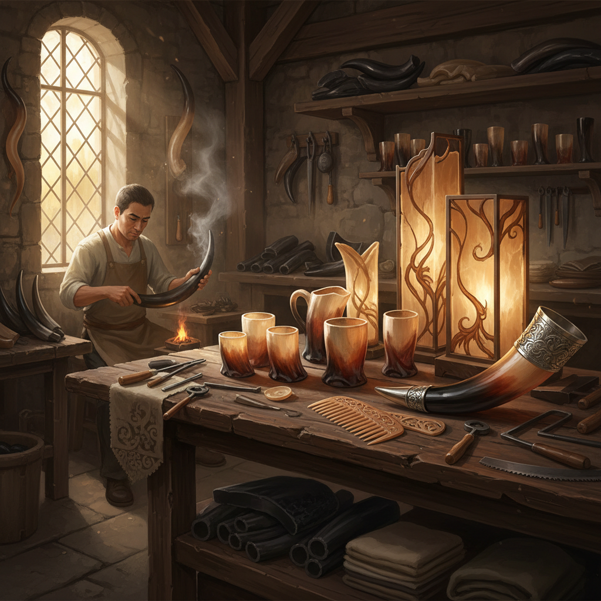

# Horn Art 角雕艺术

> "Horn is a material of paradox — it is hard yet can be softened by heat, opaque yet can be made translucent, rigid yet can be bent into curves. It grows from the living animal in layers, like tree rings, recording time in its structure. When an artisan works horn, they are negotiating with these properties, coaxing the material into forms it seems to resist, discovering beauty in its natural striations and color variations." — Unknown

## 概述

角雕艺术（Horn Art）是以动物角（牛角、羊角、鹿角、犀牛角等）为材料进行艺术创作的实践。角是一种独特的天然材料——由角蛋白组成，可以通过加热软化、弯曲、压制和雕刻，具有天然的半透明性和美丽的纹理。

角雕艺术的实践包括：1）角雕——在角上进行精细雕刻；2）角制器皿——用角制作杯、碗、勺等器皿；3）角梳——用角制作的梳子（中国传统工艺）；4）角灯——利用角的半透明性制作灯罩；5）角首饰——用角制作的首饰和装饰品；6）鹿角艺术——用鹿角创作的雕塑和装饰品；7）角弓——用角制作的复合弓（功能性艺术）。

## 核心特征

| 特征 | 描述 |
|------|------|
| 半透明 | 天然的半透明性 |
| 可塑 | 加热后可塑形 |
| 纹理 | 天然的层状纹理 |
| 温润 | 温润的手感 |
| 耐久 | 极其耐用 |
| 多变 | 颜色纹理多变 |

## 视觉特征

- **琥珀色**：角的天然色泽从黑到琥珀
- **半透明**：薄处的半透明效果
- **纹理**：天然的层状纹理
- **光泽**：打磨后的温润光泽
- **曲线**：角的天然曲线
- **渐变**：从深到浅的色彩渐变

## 代表作品

| 作品 | 艺术家 | 年代 | 意义 |
|------|--------|------|------|
| *Horn lanterns* | 欧洲传统 | 中世纪 | 角灯（玻璃替代品） |
| *Horn combs* | 中国传统 | 古代至今 | 角梳工艺 |
| *Antler chandeliers* | 欧洲传统 | 16世纪至今 | 鹿角吊灯 |
| *Horn vessels* | 维京传统 | 8-11世纪 | 角制饮器 |
| *Contemporary horn art* | Various | 当代 | 当代角艺术 |

## 历史时间线

| 时期 | 事件 |
|------|------|
| 史前 | 角作为工具和装饰 |
| 中世纪 | 角灯和角窗（玻璃替代品） |
| 17-18世纪 | 角制品的工业化生产 |
| 19世纪 | 塑料出现前角的广泛使用 |
| 当代 | 角作为可持续艺术材料 |

## 中国语境

角雕艺术在中国有深厚的文化传统。中国的角梳制作是一项著名的传统工艺——常州梳篦、福州角梳等都是国家级非物质文化遗产。中国传统认为角梳有保健功能，角梳制作融合了实用性和艺术性。中国传统的犀角雕刻（犀角杯）是极其珍贵的艺术品——明清时期的犀角杯以其精湛的雕工和文人审美著称。中国的水牛角雕刻也有悠久传统，广东、浙江等地的角雕工艺精湛。中国当代的角雕艺术家在探索角材料的当代表达：将传统角梳工艺与现代设计结合、用鹿角创作当代雕塑、以及将角的半透明性用于当代灯具设计。

## AI生成概念图

## 与其他风格的关系

- **Bone Carving Art** → 骨雕艺术
- **Shell Art** → 贝壳艺术
- **Amber Art** → 琥珀艺术
- **Leather Art** → 皮革艺术
- **Jewelry Art** → 首饰艺术
- **Functional Art** → 功能性艺术

---

*浮光艺志 | Chronicle of Artistry*
