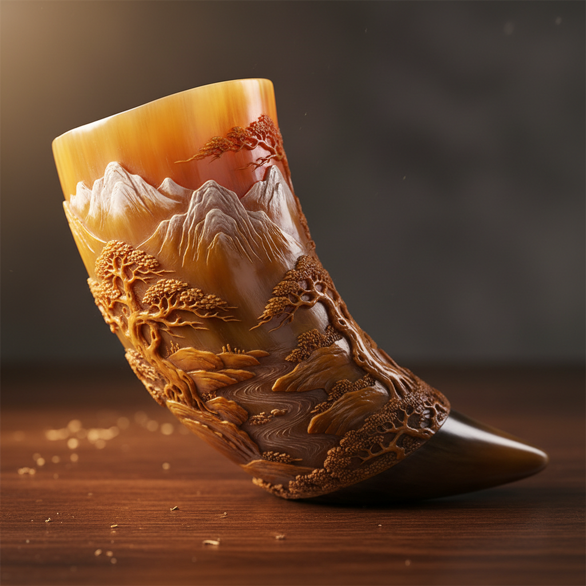

# Horn Carving Art 角雕艺术

> "Horn carving is the art of transforming animal horn — a material that is at once translucent and opaque, flexible and rigid — into objects of beauty and utility. The carver must understand the horn's layered structure, its grain and its willingness to be heated, bent, pressed, and polished into forms that range from delicate combs and snuff boxes to elaborate drinking vessels and decorative sculptures. Horn is nature's thermoplastic, moldable when warm and permanent when cool." — Unknown

## 概述

角雕艺术（Horn Carving Art）是使用动物角（主要是牛角、水牛角、羊角等）进行雕刻、塑形和装饰的传统工艺——利用角的天然纹理、半透明性和可热塑性创造各种实用和装饰品。角雕是人类最古老的工艺之一，在世界各地的文化中都有悠久的传统。

角雕艺术的实践包括：1）雕刻——在角上雕刻图案和造型；2）热塑——加热后弯曲和压制成型；3）压制——将角压成薄片用于各种用途；4）镶嵌——将角片镶嵌在其他材料上；5）抛光——将角打磨至光滑透明；6）染色——对角进行染色处理；7）当代角雕——将传统技法与现代设计结合的创作。

## 核心特征

| 特征 | 描述 |
|------|------|
| 天然 | 天然材料的美感 |
| 透明 | 半透明的光学效果 |
| 可塑 | 加热后可塑形 |
| 纹理 | 独特的天然纹理 |
| 古老 | 最古老的工艺之一 |
| 实用 | 实用与装饰结合 |

## 视觉特征

- **透明**：半透明的光学效果
- **纹理**：天然的层状纹理
- **光泽**：抛光后的温润光泽
- **色彩**：从黑到金的自然色彩
- **温暖**：温暖的材质感
- **有机**：有机的自然形态

## 代表作品

| 作品 | 艺术家/文化 | 年代 | 意义 |
|------|-------------|------|------|
| *Viking drinking horns* | 北欧 | 中世纪 | 维京饮角 |
| *Chinese rhinoceros cups* | 中国 | 明清 | 犀角杯 |
| *Scottish horn spoons* | 苏格兰 | 传统 | 苏格兰角匙 |
| *African horn carvings* | 非洲 | 传统 | 非洲角雕 |
| *Contemporary horn art* | 当代 | 当代 | 当代角雕 |

## 历史时间线

| 时期 | 事件 |
|------|------|
| 史前 | 角作为工具和装饰的使用 |
| 古代 | 角雕工艺的发展 |
| 中世纪 | 欧洲角制品行会的建立 |
| 明清 | 中国犀角雕刻的巅峰 |
| 当代 | 角雕的可持续发展和创新 |

## 中国语境

角雕艺术在中国有极其悠久和辉煌的传统。中国的犀角雕刻是世界上最精美的角雕传统之一——明清时期的犀角杯是中国工艺美术的巅峰之作。中国的水牛角雕刻在多个地区有传统——浙江乐清的黄杨木雕师也兼做角雕。中国传统的角梳制作是重要的日用工艺——常州、福州等地有悠久的角梳传统。中国的中药传统中，角（特别是犀角和鹿角）有重要的药用价值——虽然犀角贸易现已被禁止。中国当代的角雕艺术家使用合法的牛角和水牛角——创造精美的雕刻作品。中国的非物质文化遗产保护中，一些地方的角雕技法被列为保护项目——传承这一古老的手工艺传统。

## AI生成概念图

## 与其他风格的关系

- **Bone Carving** → 骨雕
- **Ivory Carving** → 牙雕
- **Wood Carving** → 木雕
- **Amber Carving** → 琥珀雕刻
- **Sculpture** → 雕塑
- **Decorative Art** → 装饰艺术

---

*浮光艺志 | Chronicle of Artistry*
