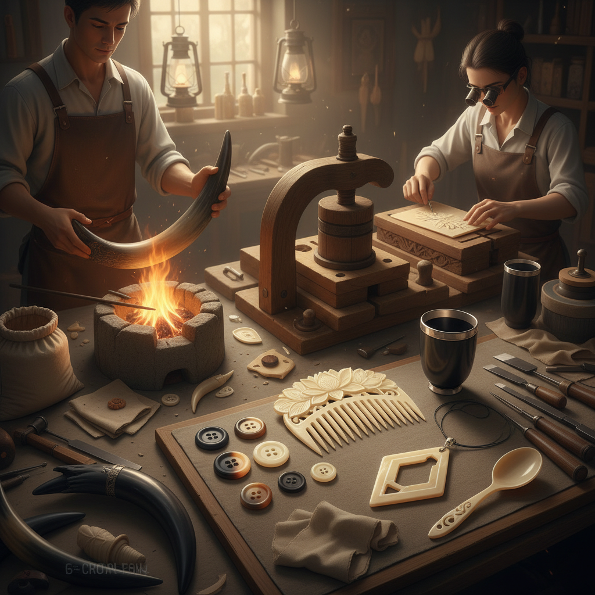

# Horn Carving 角雕

> "Horn carving is the art of persuasion — heat and patience coax the stubborn keratin into flowing curves and translucent sheets that glow like amber when held to the light." — Unknown

## 概述

角雕（Horn Carving）是对动物角（主要是牛角、水牛角、羊角等）进行雕刻、塑形和加工的工艺。角（horn）是由角蛋白（keratin）构成的——与指甲和头发的成分相同。角的独特性质在于：它可以通过加热变软，然后弯曲、压平、塑形，冷却后保持新的形状。这种热塑性使角成为一种极其灵活的材料。

角雕的技法包括：雕刻（carving）、热压成型（heat molding）、车削（turning）、抛光（polishing）和拼接。角的天然色泽从深黑到浅黄、从不透明到半透明——这种丰富的色彩变化使角雕作品具有独特的美感。角雕作品包括：梳子、杯子、勺子、首饰、按钮、眼镜框、装饰品、乐器部件等。

## 核心特征

| 特征 | 描述 |
|------|------|
| 角蛋白 | 角蛋白材料 |
| 热塑 | 可加热塑形 |
| 半透明 | 可呈半透明 |
| 色彩 | 丰富的天然色彩 |
| 耐用 | 坚固耐用 |
| 多用 | 用途极其广泛 |

## 视觉特征

- **半透明**：薄处呈半透明
- **色彩**：从黑到黄的渐变
- **光泽**：抛光后的光泽
- **纹理**：天然的层状纹理
- **温润**：温润的触感
- **有机**：有机的形态

## 代表作品

| 作品 | 艺术家 | 年代 | 意义 |
|------|--------|------|------|
| *Horn combs* | 匿名 | 传统 | 角梳 |
| *Horn drinking vessels* | 匿名 | 中世纪 | 角杯 |
| *Horn snuff boxes* | 匿名 | 18-19世纪 | 角鼻烟壶 |
| *Horn buttons and buckles* | 匿名 | 传统 | 角纽扣和扣环 |
| *Contemporary horn jewelry* | Various | 当代 | 当代角饰 |

## 历史时间线

| 时期 | 事件 |
|------|------|
| 史前 | 角作为工具和容器 |
| 古代 | 各文明的角加工传统 |
| 中世纪 | 角窗（horn windows）的使用 |
| 17-18世纪 | 角梳和角器的精致化 |
| 工业革命 | 塑料对角制品的替代 |
| 当代 | 角雕作为可持续材料的复兴 |

## 中国语境

角雕在中国有着悠久的传统——中国的角雕主要使用水牛角和黄牛角。中国最著名的角制品是角梳——常州梳篦（角梳和木梳）是中国传统名产，历史悠久。中国传统的角雕还包括：犀角杯（历史上的珍贵文物）、角雕摆件、角雕首饰等。中国的一些地方保留了传统的角雕技艺——如福建、浙江等地的角雕工坊。当代中国的角雕艺术家将传统技艺与现代设计结合，创作出既有传统韵味又有当代感的作品。

## AI生成概念图

## 与其他风格的关系

- **Bone Carving** → 骨雕
- **Wood Carving** → 木雕
- **Comb Making** → 制梳
- **Button Making** → 制扣
- **Jewelry Making** → 首饰制作
- **Sustainable Craft** → 可持续工艺

---

*浮光艺志 | Chronicle of Artistry*
