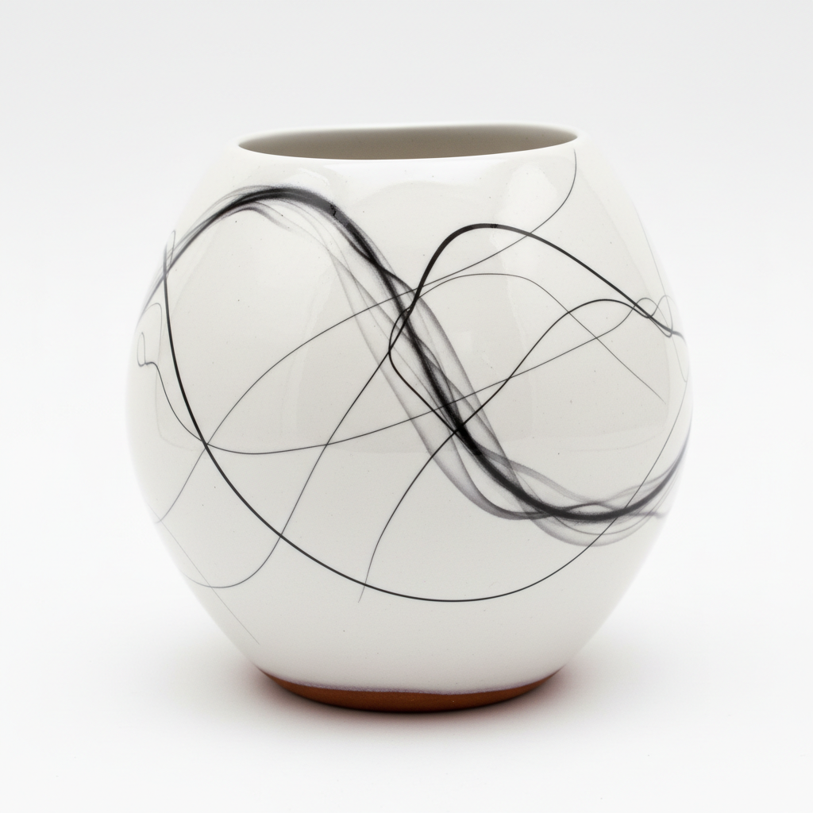

# Horsehair Pottery Art 马毛陶艺术

> "Horsehair pottery is drawing with fire and hair — strands of horsehair laid upon a pot fresh from the kiln at 1000 degrees, each hair instantly carbonizing into a delicate black line that dances and curls across the white surface like calligraphy written by smoke, the protein burning away to leave only its carbon ghost, a portrait of the hair's last living gesture preserved forever in clay." — Unknown

## 概述

马毛陶艺术（Horsehair Pottery Art）是一种将马毛（或其他动物毛发）放置在刚从窑中取出的高温陶器表面，利用毛发瞬间碳化在器物上留下精细黑色线条的装饰技法。马毛在接触高温陶面的瞬间燃烧碳化，留下如书法般优美的随机线条——每根毛发的卷曲、弯折和断裂都形成独特的图案，使每件作品都不可复制。

马毛陶艺术的核心要素包括：1）高温取出——从窑中取出约1000°C的陶器；2）马毛放置——将马毛放在热陶器表面；3）瞬间碳化——毛发在高温下立即碳化；4）碳线图案——碳化留下的精细黑色线条；5）白色坯体——通常使用白色或浅色粘土；6）随机美——完全不可预测的线条走向；7）抛光表面——烧制前通常进行抛光处理。

## 核心特征

| 特征 | 描述 |
|------|------|
| 碳化线条 | 马毛碳化形成的精细黑线 |
| 随机图案 | 不可预测的线条走向 |
| 白色底色 | 浅色坯体衬托黑色线条 |
| 瞬间完成 | 几秒内完成的装饰 |
| 书法感 | 如书法般的线条美感 |
| 独一无二 | 每件作品完全不同 |

## 视觉特征

- **精细黑线**：如发丝般细的碳化线条
- **卷曲图案**：毛发卷曲形成的螺旋
- **白色背景**：洁白光滑的陶面
- **烟熏痕迹**：毛发燃烧的淡烟痕
- **有机线条**：自然流动的曲线
- **极简美感**：黑白对比的简洁

## 代表作品

| 作品 | 艺术家/文化 | 年代 | 意义 |
|------|-------------|------|------|
| *Native American horsehair pottery* | 美国原住民 | 传统 | 传统马毛陶 |
| *Tom Vail horsehair vessels* | Tom Vail | 当代 | 当代马毛陶大师 |
| *Navajo horsehair pottery* | 纳瓦霍 | 当代 | 纳瓦霍传统 |
| *Contemporary horsehair raku* | 各地陶艺家 | 当代 | 现代马毛陶创作 |
| *Large horsehair vessels* | 当代陶艺家 | 当代 | 大型马毛陶器 |

## 历史时间线

| 时期 | 事件 |
|------|------|
| 传统时期 | 美国原住民发展马毛陶技法 |
| 20世纪中期 | 工作室陶艺中马毛陶的探索 |
| 1970年代 | 马毛陶在美国陶艺界流行 |
| 2000年代 | 马毛陶在国际陶艺中传播 |
| 当代 | 马毛陶成为替代装饰技法的经典 |

## 中国语境

马毛陶技法在中国是相对新颖的引入，但其"以火作画"的理念与中国传统的烙画（火笔画）有精神上的相通。中国当代陶艺工作坊中，马毛陶作为一种即兴性强、效果独特的装饰技法受到欢迎。它的随机线条美感与中国书法中的"飞白"和水墨画中的"泼墨"有异曲同工之妙——都是在控制与偶然之间寻找美的平衡。中国陶艺教育中，马毛陶常作为替代烧制技法的入门课程。

## AI生成概念图

## 与其他风格的关系

- **Raku** → 乐烧
- **Obvara** → 奥布瓦拉
- **Smoke Firing** → 熏烧
- **Naked Raku** → 裸乐烧
- **Calligraphy** → 书法
- **Chance Art** → 偶然性艺术

---

*浮光艺志 | Chronicle of Artistry*
