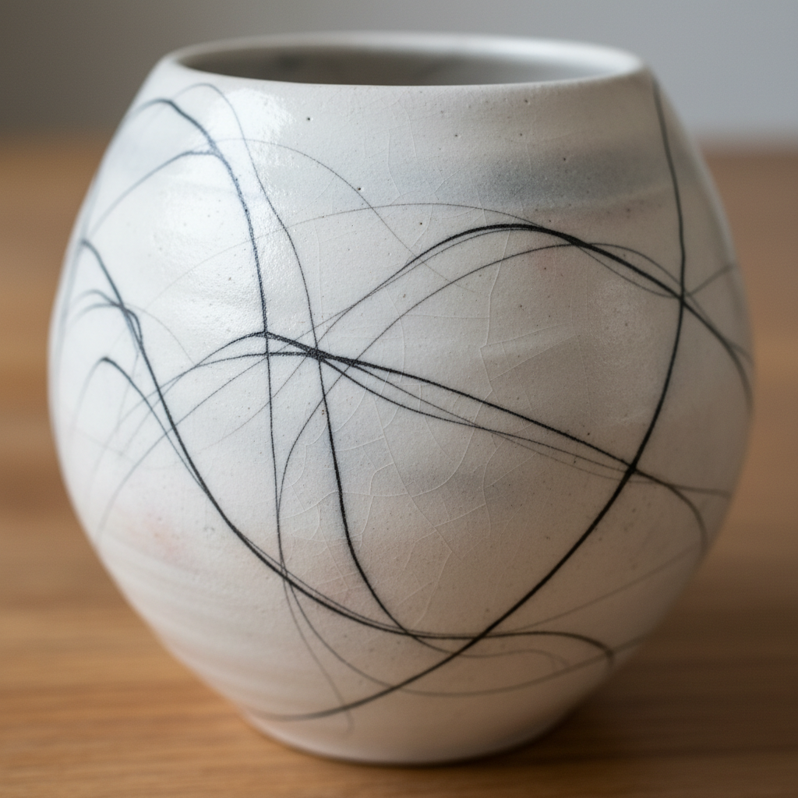

# Horsehair Raku Art 马毛乐烧艺术

> "When horsehair touches hot clay, it dances one last time — leaving behind a calligraphy of smoke." — Contemporary raku tradition

## 概述

马毛乐烧艺术（Horsehair Raku Art）是一种将马毛、羽毛或其他有机纤维放置在刚出窑的高温陶器表面，利用瞬间碳化产生精细线条装饰的当代陶瓷技法。马毛乐烧是乐烧（raku）家族中最具戏剧性和诗意的变体——当细细的马毛接触到约900°C的陶器表面时，它会瞬间碳化并在白色的陶器表面留下精细的黑色线条，如同书法或素描般的痕迹。

马毛乐烧是20世纪后半叶在美国发展起来的技法——它结合了日本乐烧的出窑技术和西方对偶然性、过程性艺术的追求。陶艺家将未施釉的白色陶器烧至高温后取出，立即将马毛、羽毛或细线放置在表面——有机物瞬间碳化，碳粒渗入陶器表面的微小孔隙中，形成永久性的黑色线条。这些线条的形态完全不可预测——每一根马毛都会以独特的方式卷曲、弹跳和碳化。

马毛乐烧艺术的核心要素包括：1）瞬间碳化——有机物在高温表面的瞬间碳化；2）线条美学——如书法般的精细黑色线条；3）不可预测性——每次结果的完全随机性；4）表演性——出窑和放置马毛的戏剧性过程；5）白与黑——白色陶体与黑色碳线的对比；6）有机痕迹——自然材料留下的自然痕迹；7）当代发明——20世纪后半叶的创新技法。

## 核心特征

| 特征 | 描述 |
|------|------|
| 瞬间碳化 | 有机物高温表面瞬间碳化 |
| 线条美学 | 如书法般精细黑色线条 |
| 不可预测性 | 每次结果完全随机 |
| 表演性 | 出窑放置马毛的戏剧过程 |
| 白与黑 | 白色陶体黑色碳线对比 |
| 当代发明 | 20世纪后半叶创新 |

## 视觉特征

- **精细线条**：如发丝般的精细黑色线条
- **白色底色**：纯白或米白的陶器表面
- **卷曲形态**：马毛碳化时的卷曲痕迹
- **书法感**：如同东方书法的笔触
- **烟熏晕染**：线条周围的轻微烟熏
- **极简美学**：大面积留白与少量线条

## 代表作品

| 作品 | 年代 | 意义 |
|------|------|------|
| *早期马毛乐烧实验* | 1970年代 | 技法起源 |
| *马毛乐烧花瓶* | 当代 | 经典形式 |
| *羽毛乐烧* | 当代 | 材料变体 |
| *糖烧* (Sugar firing) | 当代 | 技法延伸 |
| *马毛乐烧雕塑* | 当代 | 雕塑应用 |
| *大型马毛乐烧装置* | 21世纪 | 当代艺术 |

## 历史时间线

| 时期 | 事件 |
|------|------|
| 16世纪 | 日本乐烧传统确立 |
| 1960年代 | 美国乐烧运动兴起 |
| 1970年代 | 马毛乐烧技法发明 |
| 1980年代 | 技法传播和发展 |
| 1990年代 | 成为流行的工作坊技法 |
| 当代 | 持续创新和艺术化 |

## 中国语境

马毛乐烧的线条美学与中国书法和水墨画有着深刻的精神联系。马毛碳化在白色陶面上留下的线条——自由、流动、不可预测——与中国书法中"飞白"的美学理想有异曲同工之妙。中国传统美学中"计白当黑"的理念——大面积留白与少量墨迹的对比——在马毛乐烧中得到了完美的体现。这种技法虽然是西方当代的发明，但其美学精神与东方传统有着深层的共鸣。当代中国陶艺家也开始探索马毛乐烧——将这种西方技法与中国水墨美学相结合，创造出独特的东方马毛乐烧风格。

## 概念图

## 与其他风格的关系

- **Raku** → 乐烧（母体传统）
- **Pit-Fired** → 坑烧（碳化原理）
- **Saggar-Fired** → 匣钵烧（表面效果）
- **Calligraphy** → 书法（线条美学）
- **Ink Painting** → 水墨画（黑白美学）
- **Process Art** → 过程艺术（偶然性）

---

*浮光艺志 | Chronicle of Artistry*
