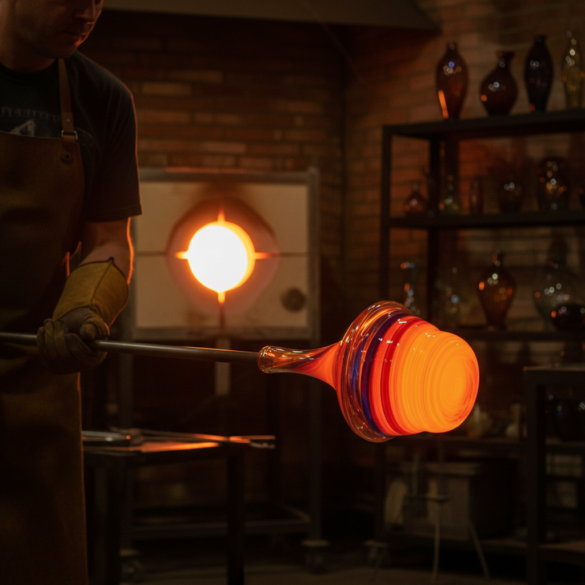

# Hot Glass Art 热玻璃艺术

> "Hot glass is a dance with gravity and time — at 2000 degrees the material flows like thick honey on the end of a blowpipe, responding to every tilt, spin, and breath of the glassblower in real time, demanding decisions made in seconds that become permanent in minutes, a performance art where the medium itself is alive with heat and light." — Unknown

## 概述

热玻璃艺术（Hot Glass Art）是一种在高温状态下直接操作熔融玻璃的艺术形式的总称——包括吹制（blowing）、实心加工（solid working）、拉伸（pulling）和热塑（hot sculpting）等技法。热玻璃艺术强调艺术家与熔融材料之间的即时互动，是一种结合了体力、技巧和艺术判断的表演性创作过程。

热玻璃艺术的实践包括：1）吹制——通过吹管将空气吹入熔融玻璃；2）实心加工——不吹制，直接塑形实心玻璃；3）热塑——在热态下用工具塑造形态；4）团队协作——大型作品需要团队配合；5）即兴创作——利用材料的流动性即兴创作；6）表演性——热玻璃创作的表演性质；7）当代热玻璃——将传统技法与当代艺术理念结合。

## 核心特征

| 特征 | 描述 |
|------|------|
| 高温 | 在高温下操作 |
| 即时 | 即时的决策和塑形 |
| 流动 | 材料的流动性 |
| 表演 | 创作过程的表演性 |
| 团队 | 常需要团队协作 |
| 技巧 | 高度的身体技巧 |

## 视觉特征

- **流动**：熔融玻璃的流动痕迹
- **光泽**：高温成型的光滑表面
- **有机**：有机的自然形态
- **透明**：玻璃的透明和折射
- **色彩**：丰富的玻璃色彩
- **动感**：凝固的动态感

## 代表作品

| 作品 | 艺术家/文化 | 年代 | 意义 |
|------|-------------|------|------|
| *Dale Chihuly installations* | 美国 | 20世纪 | 奇胡利装置 |
| *Lino Tagliapietra vessels* | 意大利/美国 | 当代 | 塔利亚皮耶特拉器皿 |
| *Dante Marioni forms* | 美国 | 当代 | 但丁·马里奥尼造型 |
| *William Morris totems* | 美国 | 当代 | 威廉·莫里斯图腾 |
| *Contemporary hot glass* | 国际 | 当代 | 当代热玻璃 |

## 历史时间线

| 时期 | 事件 |
|------|------|
| 公元前1世纪 | 玻璃吹制的发明 |
| 中世纪 | 威尼斯穆拉诺的发展 |
| 1962年 | 美国工作室玻璃运动开始 |
| 1970-80年代 | 热玻璃艺术的全球扩展 |
| 当代 | 热玻璃的多元化发展 |

## 中国语境

热玻璃在中国有快速发展的趋势。中国的传统琉璃吹制——在博山等地有悠久的历史。中国当代的热玻璃艺术——在各大美术院校中蓬勃发展。中国的玻璃艺术工作室——在上海、北京、杭州等城市逐渐增多。中国的国际玻璃艺术节——邀请国际热玻璃大师进行现场表演和教学。中国的公共艺术中，热玻璃作品——在博物馆和公共空间中展示。中国的玻璃艺术教育——清华美院、中国美院等院校建立了热玻璃工作室。中国的热玻璃艺术家——在国际展览中越来越活跃。

## AI生成概念图

## 与其他风格的关系

- **Glassblowing** → 吹制玻璃
- **Murano Glass** → 穆拉诺玻璃
- **Studio Glass** → 工作室玻璃
- **Flamework** → 灯工玻璃
- **Performance Art** → 表演艺术
- **Sculpture** → 雕塑

---

*浮光艺志 | Chronicle of Artistry*
