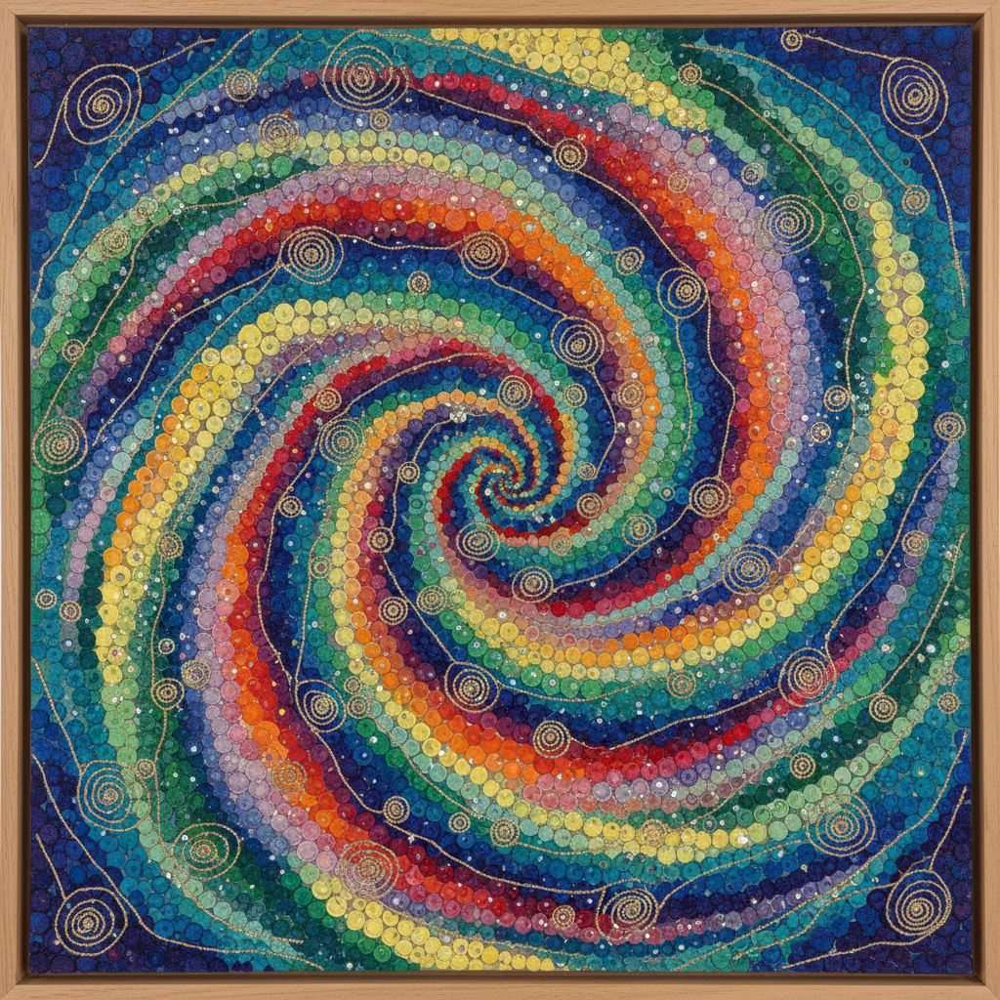

# Howardena Pindell 霍华德娜·平德尔

> **时期：** 1943–至今  
> **关键词：** 打孔圆点、过程抽象、身体政治、多层拼贴

## 概述

Howardena Pindell 是美国画家和策展人，以独创的"打孔圆点"技法闻名——她用打孔器从画布上打出数千个小圆片，再将它们重新粘贴、编号和上色，创造出密集的、近乎冥想性的表面。1979年的一场车祸导致记忆丧失后，她的作品转向更加直接的政治表达。

## 风格特征

- **打孔圆点**：标志性的手工打孔纸片密集覆盖画面，创造出点彩般的效果
- **过程导向**：重复性的手工劳动（打孔、编号、粘贴）本身即是作品的意义
- **多层拼贴**：画布、纸片、线、亮片、香料等多种材料层层叠加
- **身体记忆**：车祸后的作品融入身体经验、疤痕和康复的隐喻
- **编号系统**：早期作品中每个圆点都被编号，暗示系统性和强迫性

## 代表作品

- *Untitled #20*（1974）
- *Free, White and 21*（1980）
- *Autobiography: Water/Ancestors/Middle Passage/Family Ghosts*（1988）
- *Memory Test*（1979–1980）

## 历史意义

Pindell 在MoMA担任策展人期间同时揭露了艺术机构的种族歧视，她的录像作品《Free, White and 21》是最早直面艺术界白人特权的作品之一。她的打孔技法将极简主义的重复性与身体劳动和种族经验结合，开创了独特的抽象语言。

## 概念图

