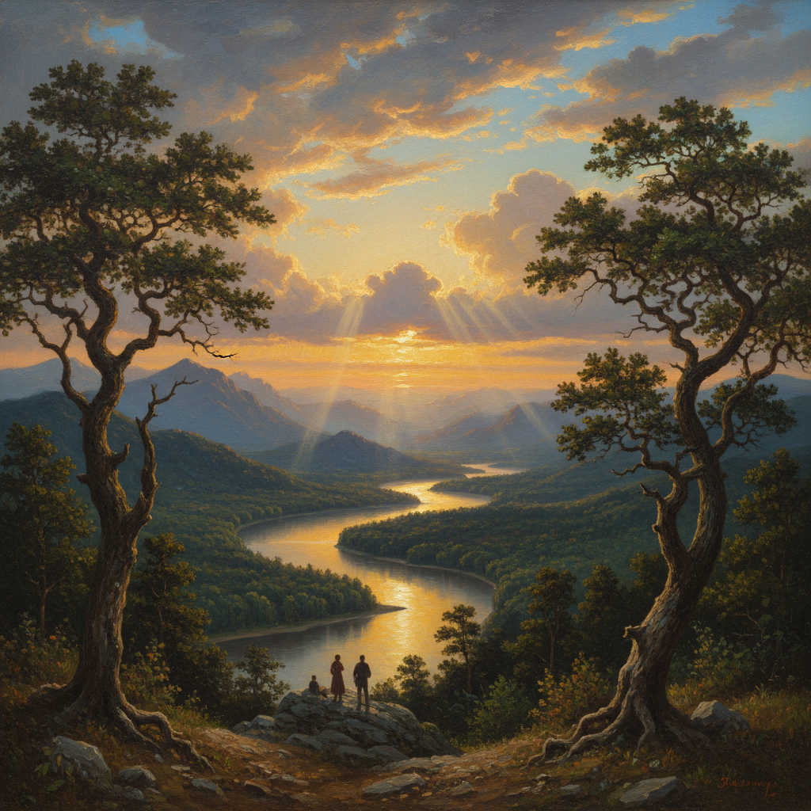

# Hudson River School 哈德逊河画派

> "The river! The river! The Hudson forever!" — Thomas Cole

## 概述

哈德逊河画派（Hudson River School）是19世纪中期（约1825–1875）美国第一个真正意义上的本土艺术运动，由一群风景画家组成，他们以浪漫主义的视角描绘美国东部的自然风光——尤其是哈德逊河谷、卡茨基尔山脉、新英格兰和美国西部的壮丽景观。

这一画派的核心理念是将美国荒野视为伊甸园般的神圣之地，通过精细的光线处理和宏大的构图传达对自然的敬畏与崇拜。

## 核心特征

| 特征 | 描述 |
|------|------|
| 光线处理 | 戏剧性的金色光芒（Luminism），常表现日出日落时分 |
| 构图规模 | 大尺幅画布，展现全景式风景 |
| 细节精确 | 对植被、岩石、水面的精确描绘 |
| 精神内涵 | 自然即神性的超验主义思想 |
| 叙事性 | 常包含微小人物，强调人在自然面前的渺小 |
| 季节与天气 | 偏爱秋季金叶、暴风雨前的天空、晨雾 |

## 视觉特征

- **色调**：温暖的金色、琥珀色为主，辅以深绿和湛蓝
- **天空**：占据画面1/2至2/3，云层层次丰富
- **水面**：镜面般的湖泊或奔腾的瀑布
- **植被**：精确到树种的细致描绘
- **远景**：层层递退的山脉，营造深远空间感
- **人物**：极小的点景人物或印第安人形象

## 代表人物

| 画家 | 代表作 | 特点 |
|------|--------|------|
| Thomas Cole | *The Oxbow* (1836) | 画派创始人，哲学性风景 |
| Frederic Edwin Church | *Heart of the Andes* (1859) | 南美热带风景，极致细节 |
| Albert Bierstadt | *Among the Sierra Nevada* (1868) | 美国西部壮丽山景 |
| Asher B. Durand | *Kindred Spirits* (1849) | 诗意的林间风景 |
| Jasper Francis Cropsey | *Autumn—On the Hudson River* (1860) | 秋色大师 |
| Sanford Robinson Gifford | *Hunter Mountain, Twilight* (1866) | 光辉主义代表 |

## 历史背景

1. **1825年**：Thomas Cole 沿哈德逊河写生，开创画派
2. **1830-40年代**：第一代画家确立风格，Cole 创作《帝国的进程》系列
3. **1850-60年代**：第二代画家（Church、Bierstadt）将视野扩展到南美和西部
4. **1870年代后**：随着巴比松画派和印象派的影响，画派逐渐式微

## 与其他风格的关系

- **浪漫主义** → 直接继承其崇高美学和自然崇拜
- **Luminism 光辉主义** → 画派内部的光线极致分支
- **Tonalism 色调主义** → 画派衰落后的继承者
- **Barbizon School** → 法国对应物，同样关注自然风景
- **Pre-Raphaelite** → 共享对细节的执着追求

## 概念图

---

*浮光艺志 | Chronicle of Artistry*
