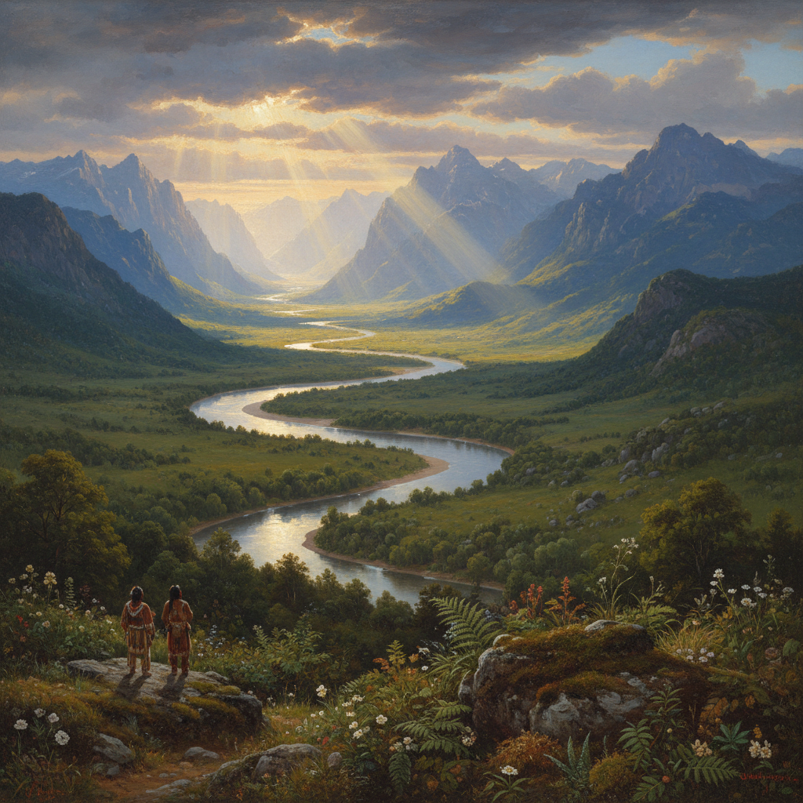

# Hudson River School 哈德逊河画派

> "The wilderness is yet a fitting place to speak of God." — Thomas Cole

## 概述

哈德逊河画派（Hudson River School）是19世纪中期（约1825–1875）美国第一个真正的本土艺术运动。画家们以纽约州哈德逊河谷、卡茨基尔山脉和新英格兰的壮丽荒野为题材，创造了一种将自然崇拜、国家认同和宗教情感融为一体的美国风景画传统。

这一运动体现了美国"天命昭昭"（Manifest Destiny）时代对未开发荒野的敬畏和自豪——在欧洲有古老的教堂和城堡，美国有上帝创造的原始荒野。

## 核心特征

| 特征 | 描述 |
|------|------|
| 荒野崇拜 | 对美国原始荒野的敬畏和神圣化 |
| 巨幅画作 | 大尺寸画布展现自然的壮丽 |
| 精确细节 | 对地质、植物、大气的科学精确描绘 |
| 戏剧光线 | 金色的"上帝之光"穿透云层 |
| 国家认同 | 美国风景 = 美国精神 |
| 崇高美学 | 自然的壮丽引发敬畏感 |

## 视觉特征

- **尺幅**：巨大的画布（常超过2米宽）
- **光线**：金色的、戏剧性的"神圣光线"
- **空间**：深远的全景视角
- **细节**：前景的精确植物学描绘
- **色彩**：金色、深绿、天蓝的壮丽组合
- **人物**：极小的人物衬托自然的巨大

## 代表人物

| 画家 | 代表作 | 特点 |
|------|--------|------|
| Thomas Cole | *The Oxbow*, *The Course of Empire* | 画派创始人 |
| Frederic Edwin Church | *Niagara*, *Heart of the Andes* | 最壮观的全景 |
| Albert Bierstadt | *Among the Sierra Nevada* | 美国西部的壮丽 |
| Asher B. Durand | *Kindred Spirits* | 最抒情的成员 |
| Thomas Moran | *Grand Canyon of the Yellowstone* | 促成了国家公园的建立 |
| Sanford Robinson Gifford | 光线主义风景 | Luminism 的代表 |

## 历史背景

1. **1825年**：Thomas Cole 首次沿哈德逊河写生
2. **1830–40年代**：画派形成，Cole 为精神领袖
3. **1850–60年代**：鼎盛期——Church 和 Bierstadt 的巨幅全景
4. **1860年代后**：Luminism（光线主义）分支发展
5. **1870年代**：印象派和巴比松影响下逐渐式微

## 与其他风格的关系

- **Romanticism** → 美国浪漫主义的视觉表达
- **Düsseldorf School** → Bierstadt 等人在杜塞尔多夫受训
- **Luminism** → 画派内部的光线主义分支
- **Barbizon School** → 后期受巴比松画派影响
- **Sublime** → 伯克崇高美学的美国实践
- **National Parks** → Moran 的画直接促成了国家公园运动

## 概念图

---

*浮光艺志 | Chronicle of Artistry*
