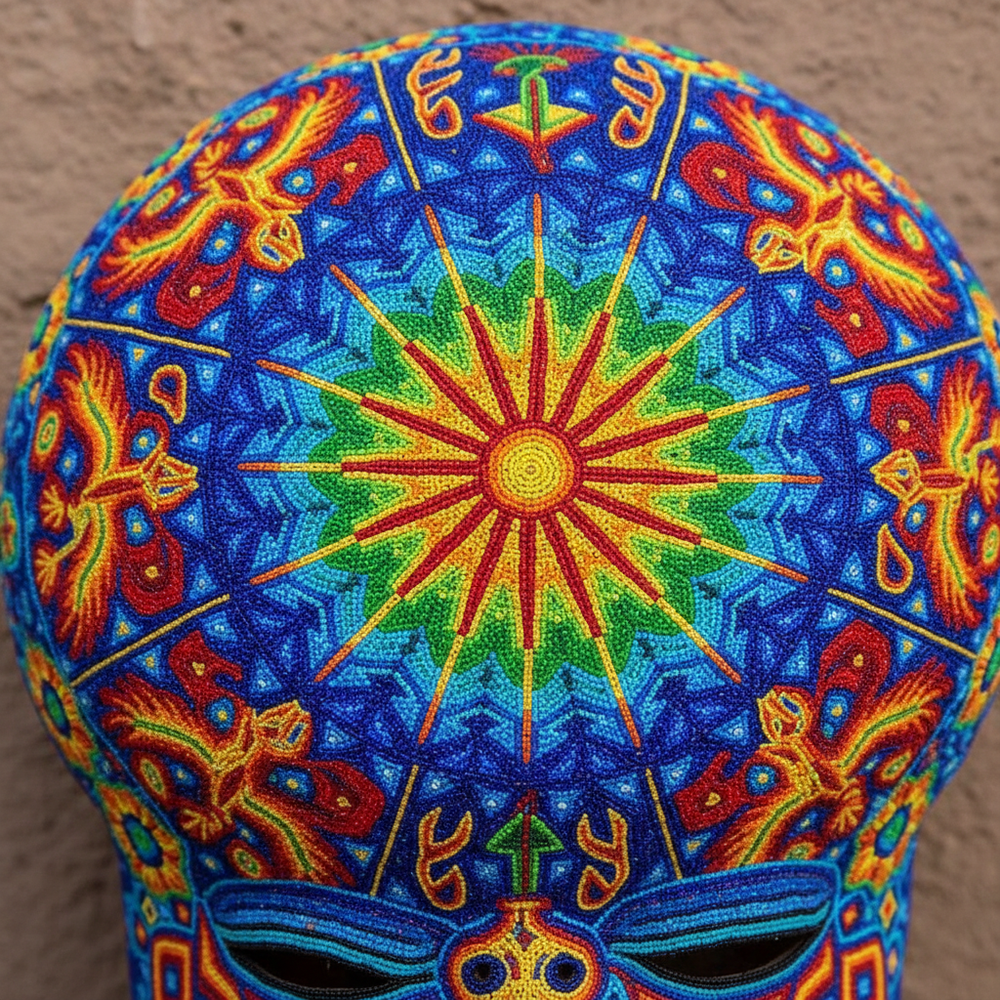

# Huichol Art 维乔尔艺术 | Arte Wixárika

> **"用数千颗珠子拼出神圣的幻象——佩奥特仙人掌带来的色彩宇宙。"**

## 概述

维乔尔艺术（Huichol Art / Arte Wixárika）是墨西哥西部维乔尔族（Wixáritari/Huichol）的传统视觉艺术，以其极其精细的珠饰（chaquira）和纱线画（nierika）闻名。这种艺术深深根植于维乔尔人的萨满信仰和佩奥特仙人掌（peyote）仪式——艺术家将仪式中看到的幻象转化为密集的、色彩饱和的几何和有机图案。每一颗珠子都被逐一粘贴在蜡涂覆的表面上，创造出令人目眩的视觉效果。

## 主要形式

| 形式 | 特征 |
|------|------|
| 珠饰 Chaquira | 微小玻璃珠逐颗粘贴在蜡面上 |
| 纱线画 Nierika | 彩色纱线压入蜡面形成图案 |
| 面具 | 珠饰覆盖的木质面具 |
| 动物雕塑 | 珠饰覆盖的木雕动物 |
| 葫芦碗 Jícara | 珠饰装饰的仪式用葫芦碗 |

## 核心象征

| 象征 | 含义 |
|------|------|
| 佩奥特 Peyote | 神圣仙人掌，精神之门 |
| 鹿 Maxa | 精神向导，佩奥特的化身 |
| 鹰 Werika | 太阳的使者 |
| 蛇 | 雨和水的象征 |
| 太阳 Tau | 生命之源 |
| 玉米 Iku | 生存和丰饶 |
| 眼睛 Nierika | 精神视觉之门 |

## 视觉特征

- 极其密集的微小珠子或纱线覆盖
- 高度饱和的鲜艳色彩（荧光色常见）
- 对称的放射状构图
- 几何与有机形式的融合
- 万花筒般的视觉效果
- 每一寸表面都被完全覆盖

## 色彩体系

- 鲜艳的蓝、红、黄、绿、橙、紫
- 荧光色和高饱和度
- 黑色轮廓分隔色块
- 色彩组合反映佩奥特幻象体验
- 无灰色调——一切都是纯色

## 与其他风格的关系

| 风格 | 关系 |
|------|------|
| 迷幻艺术 | 共享幻觉体验的视觉化 |
| 澳大利亚原住民点画 | 共享密集点状技法和精神主题 |
| 中美洲艺术 | 共享墨西哥原住民传统 |
| Op Art | 共享密集图案的视觉震撼 |
| 当代街头艺术 | 维乔尔图案影响墨西哥当代设计 |

## 概念图

---

*浮光艺志 | Chronicle of Artistry*
