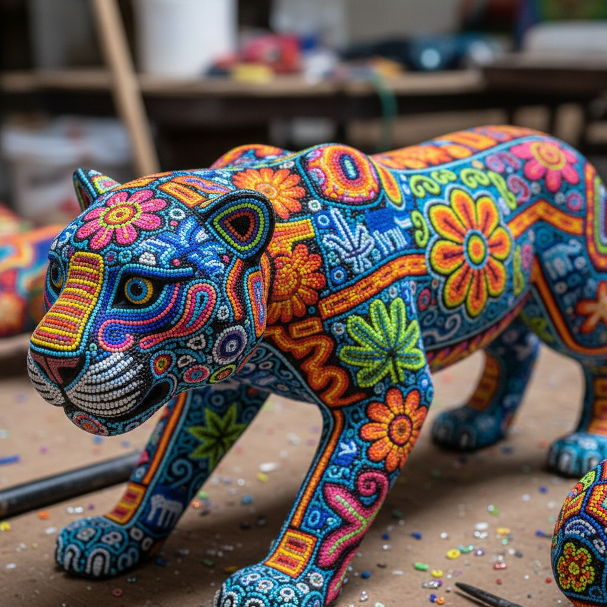

# Huichol Beadwork 维乔尔族珠饰 | Arte Huichol / Wixárika

> **"每一颗珠子都是一个祈祷——墨西哥维乔尔族用数万颗彩珠编织出佩奥特仙人掌的幻象。"**

## 概述

维乔尔族珠饰（Huichol Beadwork / Arte Huichol / Wixárika）是墨西哥西部维乔尔族（Wixáritari）的传统装饰艺术，用数千至数万颗微小的玻璃珠（chaquira）逐颗粘贴在蜡涂层的木雕或葫芦表面上，形成极度鲜艳的几何和象征图案。这种艺术与维乔尔族的佩奥特仙人掌（Peyote）仪式密切相关——许多图案再现了萨满在佩奥特致幻状态下看到的幻象。传统上也使用毛线（Nierika毛线画），但珠饰已成为最具辨识度的形式。

## 核心特征

- **微珠镶嵌**：数万颗玻璃珠逐颗粘贴
- **蜡基底**：蜂蜡和松脂混合的粘合层
- **极度鲜艳**：饱和的多色组合
- **佩奥特图案**：仙人掌花的放射图案
- **萨满幻象**：致幻体验的视觉化
- **立体载体**：覆盖在雕塑和器物上

## 常见符号

| 符号 | 含义 |
|------|------|
| 佩奥特花 | 神圣仙人掌，精神之门 |
| 鹿 | Kauyumari——精神向导 |
| 鹰 | 太阳的使者 |
| 蛇 | 雨和水 |
| 太阳 | Tayaupá——生命之源 |
| 玉米 | 生命和丰饶 |

## 视觉特征

- 极度鲜艳的多色珠饰
- 密集的珠子覆盖每一寸表面
- 放射状的佩奥特花图案
- 迷幻的色彩组合
- 立体雕塑的完整覆盖
- 萨满幻象的视觉力量

## 与其他风格的关系

| 风格 | 关系 |
|------|------|
| Alebrije | 共享墨西哥民间艺术 |
| 迷幻艺术 Psychedelic | 共享致幻体验的视觉化 |
| Aboriginal Dot Painting | 共享点状构成 |
| 当代装置艺术 | Huichol的全球影响 |
| Papel Picado | 共享墨西哥装饰传统 |

## 概念图

---

*浮光艺志 | Chronicle of Artistry*
