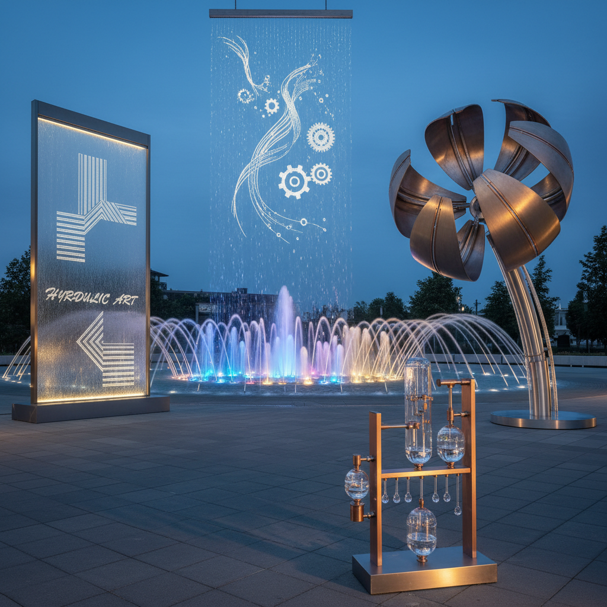

# Hydraulic Art 水力艺术

> "Water is the oldest engineer — it carved the Grand Canyon, powered the first mills, and taught humanity that patience and persistence can move mountains. Hydraulic art harnesses this ancient force: fountains that dance to music, water walls that write with falling droplets, turbines that spin sculptures, and channels that carry color through gardens. It is art powered by gravity and pressure, by the simple truth that water always finds its way." — Unknown

## 概述

水力艺术（Hydraulic Art）是利用水的流动、压力和动力进行艺术创作的艺术形式——包括利用水力驱动的动态雕塑、水景装置、喷泉艺术、水幕投影和各种以水的物理特性为核心的艺术表达。水力艺术将工程学与美学相结合，创造出动态的、不断变化的艺术体验。

水力艺术的实践包括：1）喷泉艺术——艺术性的喷泉设计；2）水力雕塑——水力驱动的动态雕塑；3）水幕艺术——利用水幕进行投影或文字显示；4）水景装置——大型水景艺术装置；5）水钟——利用水流计时的艺术装置；6）水力音乐——利用水力产生声音的装置；7）数字水帘——计算机控制的精确水滴装置。

## 核心特征

| 特征 | 描述 |
|------|------|
| 动态 | 持续运动的动态效果 |
| 水力 | 利用水的压力和流动 |
| 声音 | 水流产生的声音 |
| 光影 | 水与光的互动 |
| 工程 | 工程与艺术的结合 |
| 自然 | 利用自然力量 |

## 视觉特征

- **流动**：水的流动形态
- **喷射**：喷泉的喷射效果
- **反射**：水面的光线反射
- **透明**：水的透明质感
- **雾气**：水雾的朦胧效果
- **彩虹**：水雾中的彩虹

## 代表作品

| 作品 | 艺术家/地点 | 年代 | 意义 |
|------|-------------|------|------|
| *Bellagio Fountains* | WET Design | 1998 | 音乐喷泉经典 |
| *Digital Water Curtain* | Various | 当代 | 数字水帘 |
| *Water sculptures* | Various | 当代 | 水力雕塑 |
| *Versailles fountains* | André Le Nôtre | 17世纪 | 古典喷泉艺术 |
| *Rain Room* | Random International | 2012 | 互动水装置 |

## 历史时间线

| 时期 | 事件 |
|------|------|
| 古代 | 古罗马的喷泉和水渠 |
| 文艺复兴 | 意大利花园喷泉的黄金时代 |
| 17世纪 | 凡尔赛宫喷泉 |
| 20世纪 | 现代音乐喷泉 |
| 当代 | 数字控制水力装置和互动水艺术 |

## 中国语境

水力艺术在中国有悠久的历史和当代的蓬勃发展。中国古代就有精巧的水力装置——如水力驱动的天文仪器（浑天仪）和水力纺织机。中国的古典园林中，水是最重要的造景元素之一——虽然中国园林更强调静水之美，但也有流水和瀑布的设计。中国当代的音乐喷泉建设规模巨大——许多城市广场都建有大型音乐喷泉，如西安大雁塔音乐喷泉是亚洲最大的音乐喷泉之一。中国的一些当代艺术家利用水力创作装置艺术——探索水的物理特性和文化象征意义。中国的水幕电影和数字水帘技术也在快速发展——用于商业展示和公共艺术。中国的一些主题公园和景区大量使用水力艺术——创造壮观的水景表演。

## AI生成概念图

## 与其他风格的关系

- **Kinetic Art** → 动态艺术
- **Fountain Art** → 喷泉艺术
- **Installation Art** → 装置艺术
- **Sound Art** → 声音艺术
- **Light Art** → 光艺术
- **Engineering Art** → 工程艺术

---

*浮光艺志 | Chronicle of Artistry*
