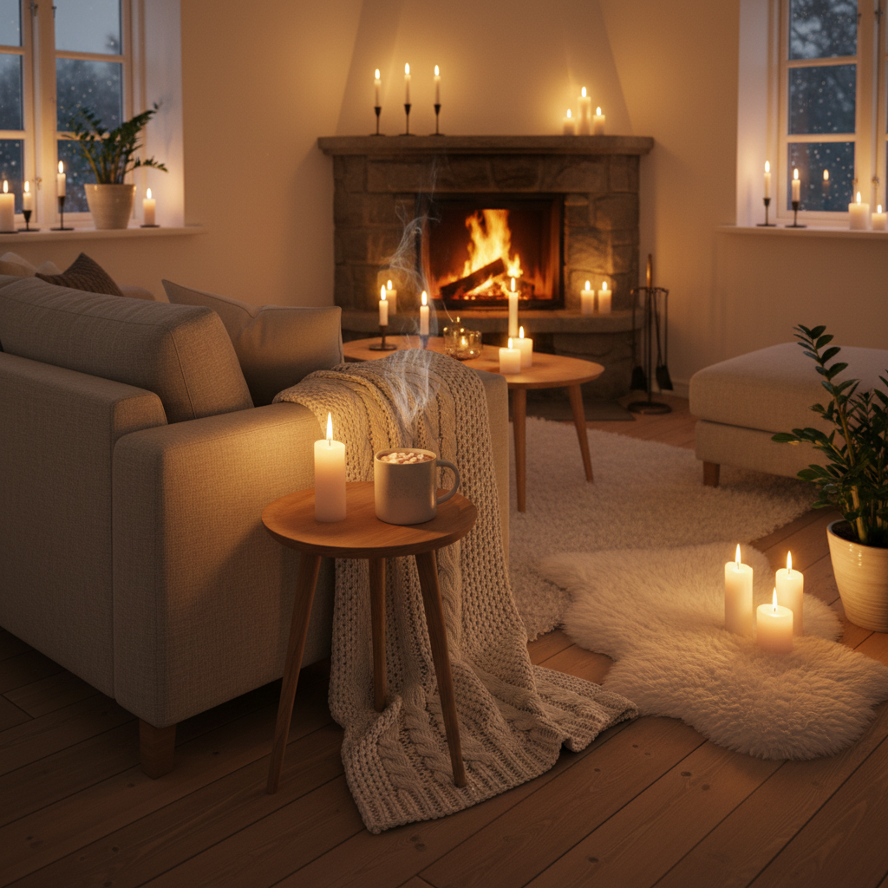

# Hygge 丹麦舒适哲学



> **"蜡烛、毛毯、热可可——把'舒适'变成一种生活艺术。"**

## 概述

| 维度 | 描述 |
|------|------|
| 时期 | 丹麦传统 / 2016 全球流行 |
| 别名 | Hygge, Danish Cozy, Cozy Living |
| 核心色彩 | 暖白、米色、棕色、金色（烛光）、深灰 |
| 关键元素 | 蜡烛、针织毛毯、热饮、壁炉、木头 |
| 代表人物 | Meik Wiking（《Hygge的艺术》作者） |
| 关联风格 | Cabincore, Scandinavian Minimalism, Cottagecore |

---

## 历史脉络

| 年份 | 事件 |
|------|------|
| 1800s | Hygge 作为丹麦文化概念存在 |
| 2016 | 《The Little Book of Hygge》全球畅销 |
| 2017 | Hygge 成为年度流行词 |
| 2020 | 疫情居家——Hygge 再次流行 |
| 2022 | 与 Cabincore、Cozy 美学持续融合 |

### 核心哲学

Hygge 的精神是**"幸福不在远方——就在这杯热可可里"**：
- 舒适 = 幸福（不需要大事件）
- 当下 = 一切（"此刻就是最好的时刻"）
- 简单 = 奢侈（蜡烛比钻石更 Hygge）
- 陪伴 = 核心（和爱的人在一起）
- "没有什么是一杯热可可解决不了的"

---

## 视觉语法

### 色彩系统

```
主色：
  暖白 (#FAF0E6) — 蜡烛光、亚麻
  米色 (#F5F5DC) — 羊毛、木头
  棕色 (#8B7355) — 咖啡、巧克力
  金色 (#DAA520) — 烛光、蜂蜜
  深灰 (#4A4A4A) — 冬天、毛衣

辅色：
  深绿 (#2E4E2E) — 松枝
  暗红 (#8B0000) — 红酒、浆果
  蓝灰 (#6B7B8D) — 北欧天空

质感：
  针织 — 毛毯、袜子、毛衣
  木头 — 地板、家具、托盘
  陶瓷 — 杯子、碗
  蜡 — 蜡烛（大量蜡烛）
  羊毛 — 地毯、抱枕
```

### 标志性元素

| 类别 | 元素 |
|------|------|
| 光线 | 蜡烛（核心！）、壁炉、暖色灯 |
| 饮品 | 热可可、咖啡、红酒、热苹果酒 |
| 织物 | 针织毛毯、羊毛袜、厚毛衣 |
| 空间 | 壁炉旁、窗台、沙发角落 |
| 活动 | 阅读、烘焙、聊天、看电影 |
| 态度 | 舒适、满足、感恩、当下 |

---

## 与千禧怀旧的关系

### 对"忙碌文化"的反叛
- 2010s "hustle culture" = 永远在工作
- Hygge = "停下来，享受此刻"
- 从"生产力"到"幸福感"的转变
- "不做任何事也是一种成就"

### 与北欧设计的关系
- 北欧极简 = 功能性、简洁
- Hygge = 在极简中加入"温暖"
- 两者共享"少即是多"
- Hygge 更偏"情感"，极简更偏"理性"

---

## 中国语境

- 与中国"小确幸"概念的对应
- "围炉煮茶"= 中国版 Hygge
- 与中国"慢生活"运动的交叉
- 小红书上的"氛围感"/"仪式感"
- 冬天的"窝在家里"文化

---

## 设计应用

| 场景 | 应用方式 |
|------|----------|
| 空间 | 暖色光+蜡烛+木材+织物+舒适 |
| 品牌 | 温暖+简单+舒适+手工+自然 |
| 餐饮 | 热饮+烘焙+木质+陶瓷+温暖 |
| 数字 | 暖色调+圆角+柔和+舒适感 |

---

## 相关风格

← [Cabincore 木屋核](cabincore.md) | [Japandi 日式北欧](japandi.md) →

↑ [返回千禧怀旧目录](README.md) | [返回总目录](../README.md)
