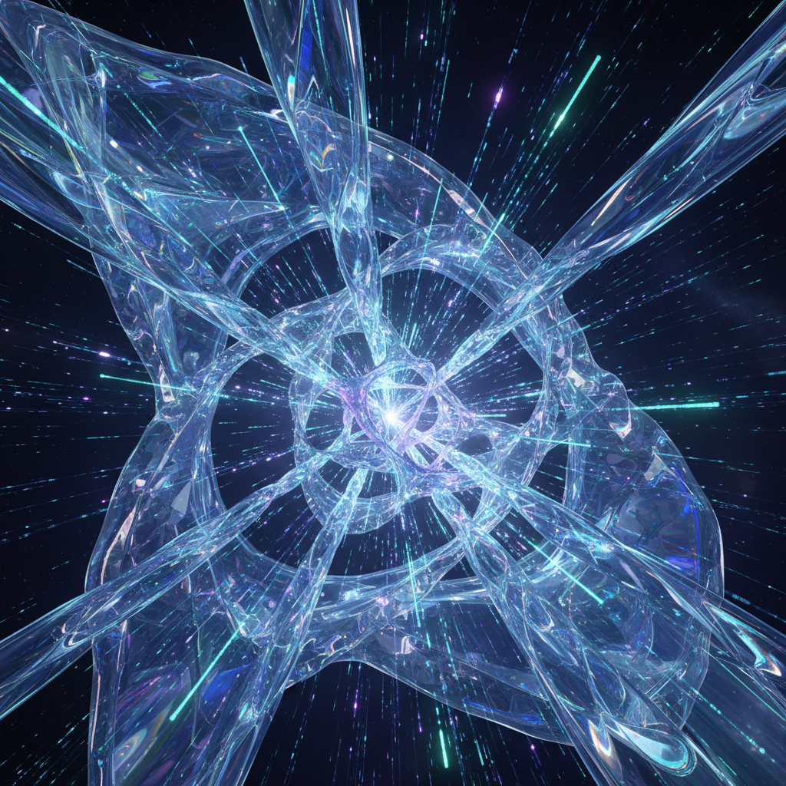

# Hypermodernism 超现代主义

> **时期：** 2000年代–至今  
> **关键词：** 过度现代、加速美学、液态社会、即时性、超连接

## 概述

Hypermodernism（超现代主义）是法国哲学家吉尔·利波维茨基提出的文化概念，描述后现代之后的当代状态——不是对现代性的否定，而是现代性的极端加速。在视觉艺术和设计中，它表现为对速度、流动性、透明度和即时性的极致追求——一切都更快、更轻、更连接、更短暂。

## 风格特征

- **流动形态**：液态、气态的非固定形式
- **透明材质**：玻璃、光、数据流的视觉化
- **加速感**：运动模糊、速度线、动态构图
- **超连接**：网络、节点、数据可视化
- **即时性**：瞬间、碎片、快照的美学

## 代表人物与作品

- 扎哈·哈迪德（流动建筑）
- 奥拉维尔·埃利亚松（光与感知装置）
- Refik Anadol（数据雕塑）
- teamLab（沉浸式数字艺术）

## 概念图

