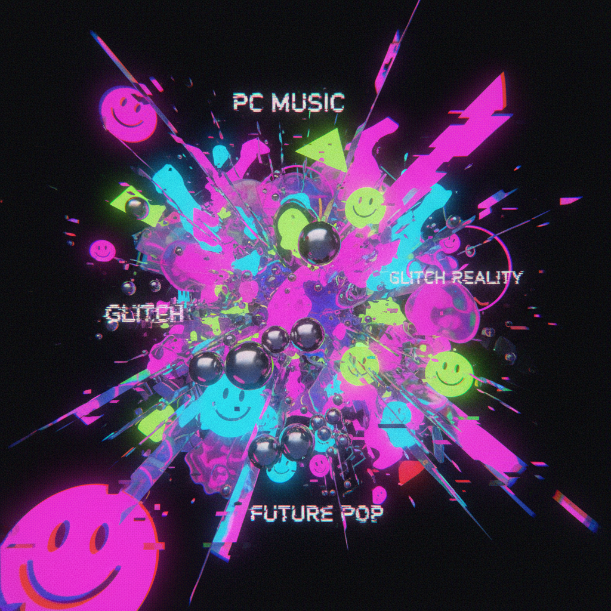
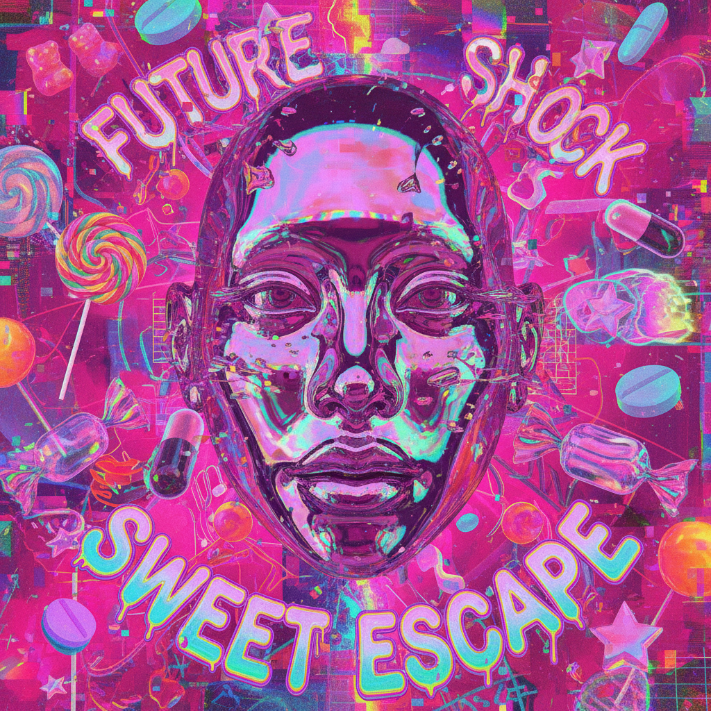

# Hyperpop Visual（超流行视觉）

> **别名**：Hyperpop Aesthetic, PC Music Visual, Glitchcore, Digicore  
> **活跃年代**：2015 – 至今  
> **起源**：PC Music 厂牌（伦敦）→ SoundCloud/Spotify 全球化

---

## 一句话定义

Hyperpop Visual 是与 Hyperpop 音乐运动伴生的视觉美学——将流行文化的视觉符号**推向极端**：过度饱和的色彩、故障艺术、3D 渲染的超现实物体、极端的数字处理，创造出一种"流行音乐吃了迷幻药"的视觉体验。

---

## 视觉语言

| 元素 | 描述 |
|------|------|
| 色彩 | 极端饱和、荧光色、不自然的色彩组合 |
| 3D 渲染 | 光滑的塑料/金属物体、超现实场景 |
| 故障效果 | 像素化、色彩通道分离、数据损坏模拟 |
| 字体 | 极端变形、液态、膨胀、不可读 |
| 人物 | 数字化处理的面孔、非人类比例、虚拟形象 |
| 品牌 | 对商业品牌 logo 的扭曲和戏仿 |
| 质感 | 塑料、凝胶、液态金属、充气物 |

### 视觉逻辑：一切推向极端

Hyperpop Visual 的核心逻辑是**将流行文化的任何元素推到荒谬的极端**：
- 流行音乐的甜美 → 甜到令人不适
- 商业设计的光滑 → 光滑到超现实
- 数字处理的精致 → 精致到崩溃（故障）
- 性别表达的流动 → 流动到无法分类

---

## 历史时间线

| 时期 | 事件 |
|------|------|
| 2013 | A.G. Cook 创立 PC Music 厂牌（伦敦） |
| 2014 | SOPHIE 发行 *BIPP*；PC Music 的视觉风格开始形成 |
| 2015-2016 | PC Music 建立了完整的视觉语言：光滑3D、超现实、戏仿商业 |
| 2016 | Charli XCX 与 PC Music 合作，将风格带入更大受众 |
| 2018 | SOPHIE *Oil of Every Pearl's Un-Insides*——Hyperpop 视觉的里程碑 |
| 2019 | 100 gecs *1000 gecs* 发行——定义了"混乱"版 Hyperpop |
| 2019.08 | Spotify 创建 "Hyperpop" 播放列表，正式命名这个流派 |
| 2020-2021 | TikTok 推动 Hyperpop 进入主流；Charli XCX *how i'm feeling now* |
| 2021.01 | SOPHIE 去世——社区哀悼，风格遗产被重新审视 |
| 2022-2023 | Hyperpop 影响渗透主流流行音乐（Doja Cat、Ice Spice） |
| 2024+ | 风格分化：一部分走向更极端的实验，一部分融入主流 |

---

## 文化内核

### 对流行文化的加速主义

Hyperpop 的核心策略是**加速主义**（Accelerationism）——不是反对流行文化，而是将它推到极端以暴露其荒谬性：
- 不反对 Auto-Tune → 把 Auto-Tune 开到最大
- 不反对商业包装 → 把包装做到超现实
- 不反对数字处理 → 把处理做到崩溃

### 性别与身体的流动性

Hyperpop 社区是当代最具性别流动性的音乐/视觉社区之一：
- SOPHIE（跨性别女性）是风格奠基人
- 大量非二元和跨性别创作者
- 视觉上模糊/超越性别二元
- 虚拟形象（avatar）取代真实身体

### 互联网原生的"坏品味"

Hyperpop Visual 刻意拥抱"坏品味"：
- 过度饱和 = "俗气"
- 故障效果 = "损坏"
- 极端字体 = "不可读"
- 3D 渲染 = "廉价"

但这种"坏品味"是**刻意的、批判性的**——它质疑"好品味"的标准本身。

---

## 子类型

| 子类型 | 特征 | 代表 |
|--------|------|------|
| **PC Music Clean** | 光滑3D、商业戏仿、极简 | A.G. Cook, Hannah Diamond |
| **Glitchcore** | 故障效果为主、混乱、噪音 | 100 gecs, Drain Gang |
| **Digicore** | SoundCloud 地下、更 lo-fi | osquinn, d0llywood1 |
| **Bubblegum Bass** | SOPHIE 式的极端合成器音色 | SOPHIE, Arca |
| **Nightcore Visual** | 加速动漫封面的进化版 | 与 Nightcore 音乐社区重叠 |

---

## 与其他风格的关系

| 风格 | 关系 |
|------|------|
| **Acid Graphics** | 共享扭曲视觉和极端处理，但 Hyperpop 更"甜" |
| **Vaporwave** | 都戏仿商业文化，但方向相反——Vaporwave 减速，Hyperpop 加速 |
| **Y2K** | Hyperpop 大量引用 Y2K 视觉元素（充气、塑料、光泽） |
| **Kidcore** | 共享极端色彩和"拒绝成熟"的态度 |
| **Emo** | Hyperpop 继承了 Emo 的情感强度，但用电子手段表达 |
| **Seapunk** | 都是互联网原生美学运动 |

---

## 代表性视觉参考

- SOPHIE *Oil of Every Pearl's Un-Insides* 专辑美术
- PC Music 厂牌视觉（Danny L Harle、Hannah Diamond）
- 100 gecs 专辑封面和 MV
- Charli XCX *how i'm feeling now* 视觉
- Drain Gang / Bladee 视觉美术

---

## 延伸阅读

- [Aesthetics Wiki - Hyperpop](https://aesthetics.fandom.com/wiki/Hyperpop)
- *"Glitch Feminism"*（Legacy Russell, 2020）
- 本项目相关：[Acid Graphics](acid-graphics.md) | [Vaporwave](vaporwave.md) | [Y2K](y2k.md) | [Seapunk](seapunk.md)
