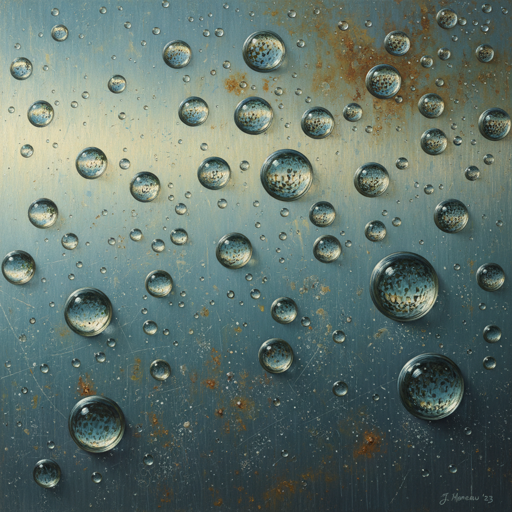

# Hyperrealism Painting 超写实主义绘画

> **时期：** 2000年代–至今  
> **关键词：** 超越照片、极致细节、情感深度、数字时代、技术极限

## 概述

Hyperrealism（超写实主义）是照相写实主义的进化——不仅复制照片的精确度，更超越照片所能捕捉的细节和情感深度。在数字时代，当照片无处不在时，超写实画家用数百小时的手工劳动证明：人眼和人手仍然能看到和表现相机看不到的东西——皮肤下的血管、眼睛中的光芒、物体表面微妙的质感变化。

## 风格特征

- **超越照片**：比照片更清晰的细节
- **极致技法**：数百小时的精密绘制
- **情感深度**：不仅精确，更有灵魂
- **大尺幅**：放大后仍然完美的细节
- **当代主题**：日常生活的诗意放大

## 代表人物与作品

- 罗恩·穆克 巨型人物雕塑
- 拉尔夫·戈因斯 美国日常
- 佩德罗·坎波斯 玻璃与金属
- 杰森·德·格拉夫 水滴与反射

## 概念图

