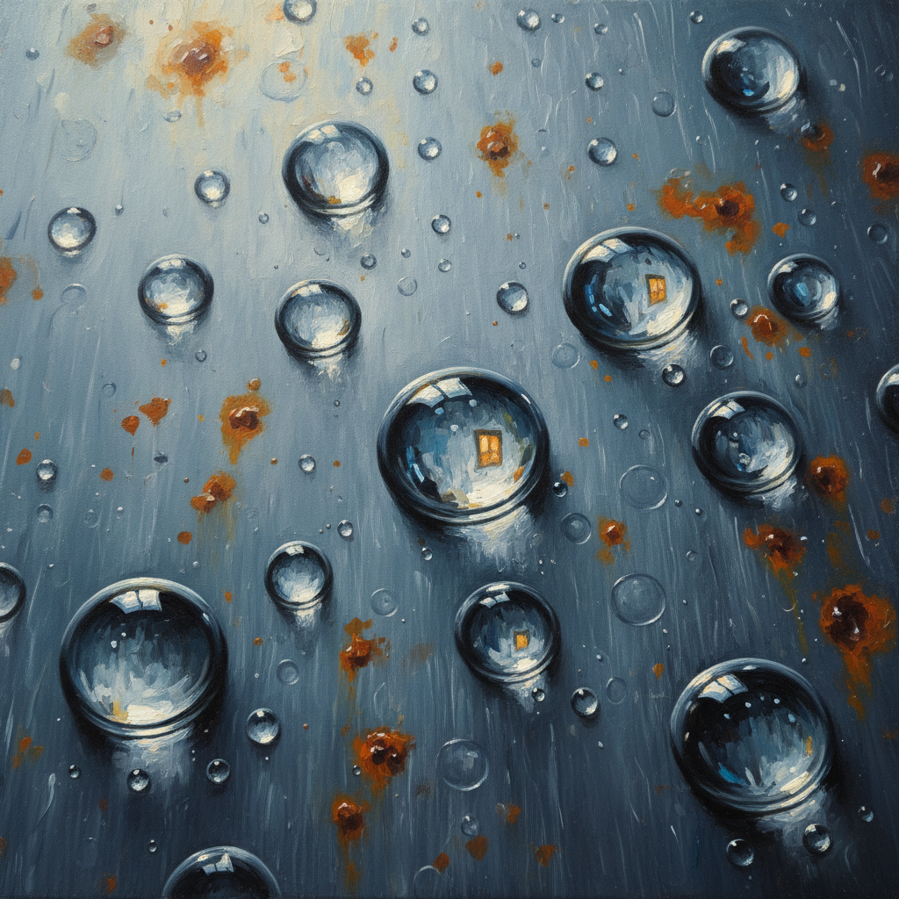

# Hyperrealism 超写实主义

> **流派**: 超写实主义 · 当代绘画/雕塑  
> **时期**: 2000s–至今  
> **关键词**: 超越照片、极致细节、硅胶雕塑、数字精度

## 概述

超写实主义是照相写实主义的进化——它不满足于复制照片的精度，而是追求超越人眼所见的细节。超写实主义画家描绘毛孔、血管、水滴的每一个微观细节，创造出一种"比真实更真实"的视觉体验。在雕塑领域，硅胶和树脂材料让人体复制达到了令人不安的逼真程度。

## 视觉特征

- **超越照片**: 细节精度超过任何相机能捕捉的程度
- **微观聚焦**: 皮肤纹理、水珠折射、布料纤维
- **大尺幅**: 巨大的画面让微观细节变得可见
- **硅胶雕塑**: 用硅胶、树脂和真人毛发制作的人像
- **日常主题**: 普通人、普通场景的非凡再现

## 代表作品

- Ron Mueck 《男孩》(1999)
- Gottfried Helnwein 肖像系列
- Roberto Bernardi 静物系列
- Duane Hanson 《超市购物者》(1970)

## 历史影响

超写实主义挑战了"为什么还要画画"这个问题——当照片无处不在时，极致的手工再现本身就成为一种哲学声明。它影响了3D渲染、数字人和虚拟现实中的视觉标准。

## 相关风格

- [Photorealism 照相写实主义](photorealism.md)
- [Chuck Close 查克·克洛斯](chuck-close.md)
- [Digital Art 数字艺术](digital-art.md)
