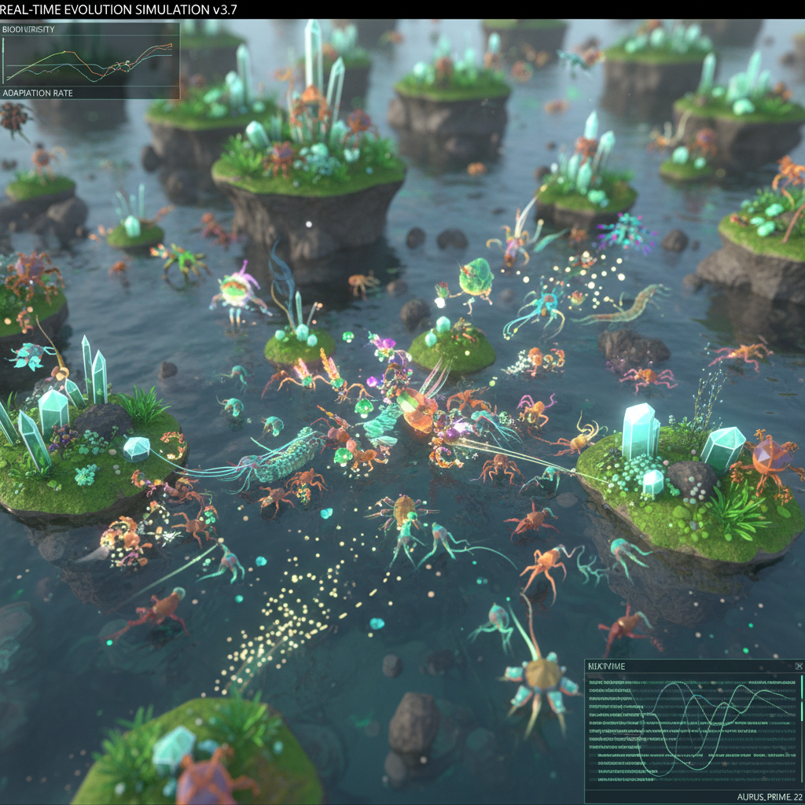

# Ian Cheng 郑曦然

> **时期：** 1984–至今  
> **关键词：** 实时模拟、人工生命、无限游戏、涌现叙事

## 概述

Ian Cheng 是美国艺术家，以创造实时运行的人工生命模拟而闻名。他的作品是永不重复的"活模拟"——虚拟生物在算法驱动下自主行动、进化和互动，没有剧本、没有结局，如同一个永远在发生的数字生态系统。

## 风格特征

- **实时模拟**：作品是持续运行的程序，非预录视频
- **涌现行为**：复杂行为从简单规则中自发产生
- **无限持续**：没有开始和结束，永远在变化
- **游戏引擎**：使用Unity等游戏引擎作为创作工具
- **人工生命**：虚拟生物具有自主意志和学习能力

## 代表作品

- *Emissaries*三部曲（2015–2017）
- *BOB (Bag of Beliefs)*（2018–2019）
- *Life After BOB*（2021）
- *3FACE*（2022）

## 概念图

