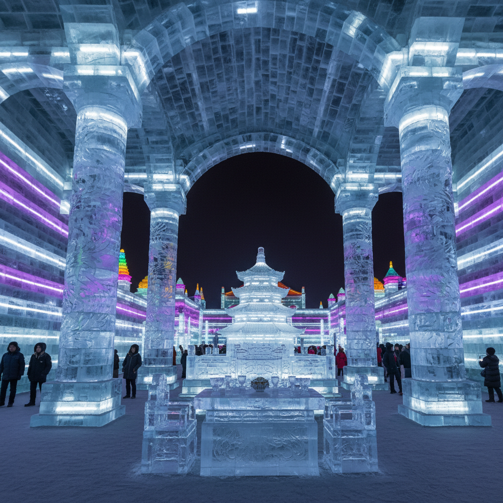

# Ice Art 冰雕艺术

> "Ice art is the most honest of all art forms — it never pretends to be permanent, never claims to transcend time, never asks to be preserved in a museum. From the moment of its creation, it is already melting, already returning to water, already on its way back to the clouds. Every ice sculpture is a countdown, a memento mori carved in frozen water, a reminder that beauty does not need to last forever to be real." — Unknown

## 概述

冰雕艺术（Ice Art）是以冰——固态水——为主要材料的雕塑和建筑艺术。冰雕利用冰的独特物理特性：透明度、折射光线的能力、可以被雕刻和焊接的可塑性，以及最重要的——它的临时性，在温度升高时必然融化消失。

冰雕艺术的实践包括：1）传统冰雕——用链锯、凿子和熨斗雕刻大型冰块；2）冰建筑——用冰砖建造可进入的建筑空间（冰旅馆、冰教堂）；3）冰灯——在冰雕内部放置灯光创造发光效果；4）速度冰雕——在限定时间内完成的竞赛性冰雕；5）自然冰艺术——利用自然冻结过程创作（冰瀑布、冰泡）；6）冰行为艺术——以冰的融化过程作为行为艺术的时间框架。

## 核心特征

| 特征 | 描述 |
|------|------|
| 临时 | 必然融化消失 |
| 透明 | 冰的透明性 |
| 光 | 折射和反射光线 |
| 寒冷 | 需要低温环境 |
| 技术 | 高超的雕刻技术 |
| 季节 | 季节性创作 |

## 视觉特征

- **透明**：冰的晶莹透明
- **蓝色**：厚冰的蓝色调
- **光线**：光线穿透冰体
- **锐利**：锐利的边缘和细节
- **融化**：融化过程的美感
- **巨大**：大型冰雕的震撼

## 代表作品

| 作品 | 艺术家 | 年代 | 意义 |
|------|--------|------|------|
| *哈尔滨冰雪大世界* | 集体创作 | 1999至今 | 世界最大冰雪主题公园 |
| *Ice Hotel* | Jukkasjärvi | 1989至今 | 瑞典冰旅馆 |
| *Ice sculptures* | Junichi Nakamura | 2000年代 | 精细冰雕 |
| *Ice Watch* | Olafur Eliasson | 2014 | 冰川冰块融化装置 |
| *Sapporo Snow Festival* | 集体创作 | 1950至今 | 札幌雪祭 |

## 历史时间线

| 时期 | 事件 |
|------|------|
| 17世纪 | 俄罗斯冰宫传统 |
| 1740 | 圣彼得堡冰宫 |
| 1950 | 札幌雪祭开始 |
| 1963 | 哈尔滨冰灯游园会 |
| 1999 | 哈尔滨冰雪大世界 |
| 当代 | 冰雕与气候变化的对话 |

## 中国语境

冰雕艺术在中国有极其重要的地位——中国是世界冰雕艺术的重要中心之一。哈尔滨冰雪大世界是全球最大的冰雪主题公园，每年使用超过18万立方米的冰和15万立方米的雪，建造出令人叹为观止的冰建筑群。中国的冰灯传统可追溯到清代——松花江畔的渔民在冬夜用冰壳做灯笼照明。中国东北的冰雕传统已发展为一个完整的产业和文化现象，哈尔滨国际冰雪节是世界四大冰雪节之一。中国当代的冰雕艺术家在技术和规模上都处于世界领先水平，同时也在探索冰雕与当代艺术的结合——用冰的融化来表达气候变化、用冰雕的临时性来探讨存在与消逝。

## AI生成概念图

## 与其他风格的关系

- **Ephemeral Art** → 短暂艺术
- **Sculpture** → 雕塑
- **Light Art** → 光艺术
- **Land Art** → 大地艺术
- **Architecture** → 建筑
- **Weather Art** → 气象艺术

---

*浮光艺志 | Chronicle of Artistry*
