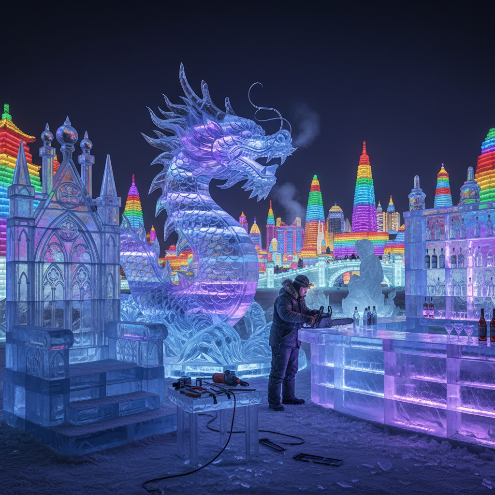

# Ice Sculpture Art 冰雕艺术

> "Ice sculpture is art against time — from the moment the chisel first bites into the frozen block, the clock is ticking. The sculptor works knowing that their creation is already dying, that warmth is the enemy, that every minute brings the piece closer to its inevitable return to water. This impermanence is not a flaw but the very essence of ice art — it teaches us that beauty does not need to last forever to be profound." — Unknown

## 概述

冰雕艺术（Ice Sculpture Art）是以冰为主要材料进行雕塑创作的艺术形式——利用冰的透明性、折射性和可雕刻性创造短暂而壮观的艺术品。冰雕艺术是最具戏剧性的短暂艺术形式之一，作品从诞生之刻就开始融化。

冰雕艺术的实践包括：1）单块冰雕——从单一冰块雕刻出造型；2）多块组合冰雕——将多块冰组合成大型作品；3）冰建筑——用冰块建造的建筑（如冰旅馆）；4）冰灯——内部照明的冰雕作品；5）速度冰雕——限时冰雕比赛；6）功能性冰雕——用于宴会和活动的装饰冰雕；7）冰雕节——大型冰雕展览和节日。

## 核心特征

| 特征 | 描述 |
|------|------|
| 透明 | 冰的透明和折射 |
| 短暂 | 必然融化的短暂性 |
| 壮观 | 视觉上的壮观效果 |
| 寒冷 | 需要低温环境 |
| 速度 | 需要快速创作 |
| 光影 | 与光线的互动 |

## 视觉特征

- **透明**：冰的晶莹透明
- **蓝色**：厚冰的天然蓝色
- **折射**：光线的折射效果
- **光影**：内部照明的光影
- **锋利**：雕刻的锋利边缘
- **壮观**：大型冰雕的壮观感

## 代表作品

| 作品 | 艺术家 | 年代 | 意义 |
|------|--------|------|------|
| *Harbin Ice Festival* | Various | 1963至今 | 哈尔滨冰雪大世界 |
| *Sapporo Snow Festival* | Various | 1950至今 | 札幌雪祭 |
| *Ice Hotel* | Various | 1990至今 | 瑞典冰旅馆 |
| *World Ice Art Championships* | Various | 1990至今 | 世界冰雕锦标赛 |
| *Ice Music Festival* | Various | 当代 | 冰乐器音乐节 |

## 历史时间线

| 时期 | 事件 |
|------|------|
| 古代 | 北方民族的冰雪利用 |
| 18世纪 | 俄罗斯冰宫 |
| 1950 | 札幌雪祭开始 |
| 1963 | 哈尔滨冰灯节开始 |
| 当代 | 冰雕作为国际艺术形式 |

## 中国语境

冰雕艺术在中国有极其重要的地位。中国哈尔滨国际冰雪节是世界上最大的冰雪艺术节——每年吸引数百万游客，展出数千件冰雕和雪雕作品。哈尔滨冰雪大世界用数十万立方米的冰块建造出完整的冰城市，包括冰建筑、冰滑梯、冰迷宫等。中国的冰灯艺术——在冰块内部放置彩色灯光——是中国独特的冰雕形式，起源于东北民间的"穷棒子灯"（在冰碗中放蜡烛）。中国的冰雕艺术家在国际冰雕比赛中屡获大奖。中国北方的许多城市（如长春、沈阳、呼伦贝尔）都有自己的冰雪节。中国的冰雕技艺已成为重要的文化旅游资源。

## AI生成概念图

## 与其他风格的关系

- **Snow Art** → 雪雕艺术
- **Ephemeral Art** → 短暂艺术
- **Light Art** → 光艺术
- **Sculpture** → 雕塑
- **Crystal Art** → 水晶艺术
- **Performance Art** → 表演艺术

---

*浮光艺志 | Chronicle of Artistry*
