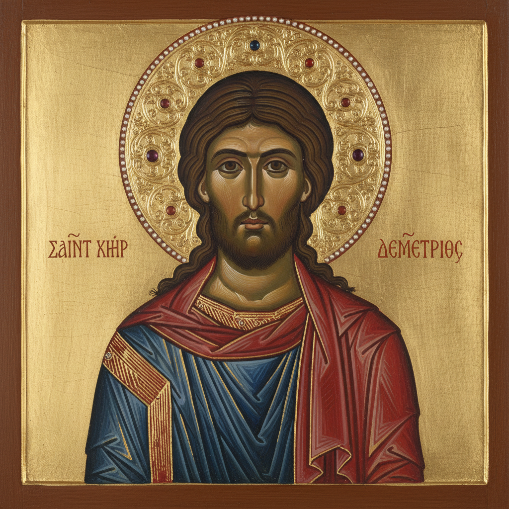

# Icon Painting 圣像画

> **时期：** 6世纪–至今  
> **关键词：** 拜占庭、金箔背景、宗教图像、蛋彩、神圣程式

## 概述

Icon Painting（圣像画）是东正教传统中以宗教人物为主题的神圣绘画形式。圣像不是普通的肖像画，而是被视为通往神圣世界的"窗口"。金色背景象征天国之光，正面性构图传达永恒与庄严，严格的图像程式代代相传——每一笔都是祈祷，每一幅圣像都是神学的视觉表达。

## 风格特征

- **金箔背景**：象征神圣之光和永恒
- **正面性**：人物面向观者的庄严构图
- **反透视**：空间向观者展开而非后退
- **程式化面容**：大眼睛、细长鼻、小嘴
- **蛋彩技法**：在木板上用蛋黄调和颜料

## 代表人物与作品

- 安德烈·鲁布廖夫《三位一体》
- 西奈山圣凯瑟琳修道院圣像
- 费奥凡·格列克 诺夫哥罗德壁画
- 当代：Aidan Hart

## 概念图

