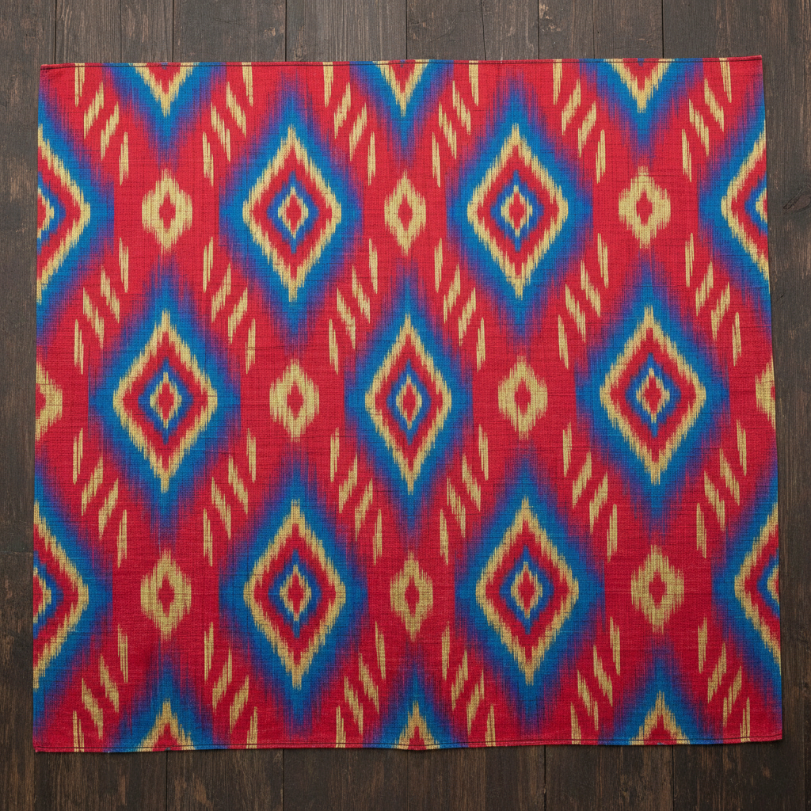

# Ikat Art 经纬扎染艺术

> "Ikat is prophecy woven into cloth — the threads are dyed before weaving, bound and resist-dyed in precise patterns so that when they are finally placed on the loom and interlaced, the pre-planned design emerges in the finished fabric. It requires the weaver to see the final pattern in reverse, in fragments, distributed across hundreds of individual threads that will only make sense when brought together on the loom." — Unknown

## 概述

经纬扎染艺术（Ikat Art）是一种在织造之前对经线和/或纬线进行扎染的传统纺织技法——通过在织造前将纱线按照预定图案绑扎并染色，使最终织出的布料呈现出特有的模糊边缘图案。Ikat（源自马来语"mengikat"，意为"绑扎"）是一种全球性的纺织传统，在东南亚、中亚、日本、印度和拉丁美洲都有独立发展。

经纬扎染艺术的实践包括：1）经线扎染（Warp Ikat）——只对经线进行扎染；2）纬线扎染（Weft Ikat）——只对纬线进行扎染；3）双面扎染（Double Ikat）——同时对经纬线扎染；4）绑扎——按图案精确绑扎纱线；5）多次染色——分多次染不同颜色；6）对齐织造——在织机上精确对齐纱线；7）当代经纬扎染——将传统技法与现代设计结合的创作。

## 核心特征

| 特征 | 描述 |
|------|------|
| 预染 | 织造前染色 |
| 模糊 | 特有的模糊边缘 |
| 精确 | 需要极高的精确度 |
| 全球 | 全球性的传统 |
| 复杂 | 双面扎染极其复杂 |
| 预见 | 需要预见最终效果 |

## 视觉特征

- **模糊**：图案边缘的特有模糊
- **几何**：几何图案为主
- **色彩**：丰富的色彩组合
- **重复**：规律性的重复图案
- **层次**：多次染色的层次
- **民族**：浓郁的民族风格

## 代表作品

| 作品 | 艺术家/文化 | 年代 | 意义 |
|------|-------------|------|------|
| *Patola double ikat* | 印度古吉拉特 | 古代至今 | 帕托拉双面扎染 |
| *Geringsing* | 印尼巴厘 | 传统 | 巴厘双面扎染 |
| *Kasuri* | 日本 | 传统 | 日本絣织 |
| *Uzbek atlas* | 乌兹别克 | 传统 | 中亚经纬扎染 |
| *Contemporary ikat* | 国际 | 当代 | 当代经纬扎染 |

## 历史时间线

| 时期 | 事件 |
|------|------|
| 古代 | 多个文明独立发展经纬扎染 |
| 中世纪 | 丝绸之路传播经纬扎染技法 |
| 17-19世纪 | 东南亚和中亚的黄金时代 |
| 20世纪 | 工业化对传统的冲击 |
| 当代 | 经纬扎染的全球复兴 |

## 中国语境

经纬扎染在中国有重要的传统和当代发展。中国的经纬扎染传统主要体现在少数民族纺织中——如海南黎族的经线扎染和贵州苗族的纺织传统。中国云南的傣族和景颇族也有经纬扎染的传统——使用天然染料创造独特的民族图案。中国的丝绸之路是经纬扎染技法传播的重要通道——连接了中亚和东亚的纺织传统。中国当代的纺织设计师将经纬扎染与现代时装结合——在国际时装周上展示中国民族纺织的魅力。中国的非物质文化遗产保护中，多项经纬扎染技艺被列入保护名录——如黎族传统纺染织绣技艺。中国的美术院校中，经纬扎染作为纤维艺术的重要课程——培养学生对传统纺织工艺的理解。

## AI生成概念图

## 与其他风格的关系

- **Shibori** → 绞缬染色
- **Batik** → 蜡染
- **Weaving** → 织造艺术
- **Textile Art** → 纺织艺术
- **Resist Dyeing** → 防染技法
- **Pattern Design** → 图案设计

---

*浮光艺志 | Chronicle of Artistry*
