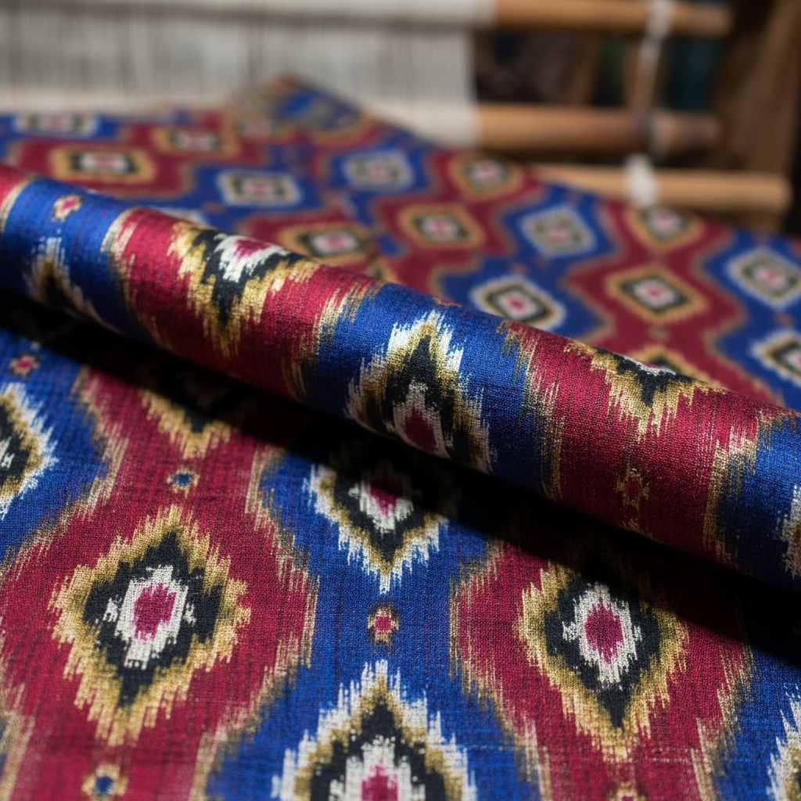

# Ikat 伊卡特 | 经纬扎染

> **"在织造之前就已染色——丝线上的模糊边缘是时间和耐心的签名。"**

## 概述

Ikat（伊卡特 / 经纬扎染）是一种古老的纺织防染技法，在织造之前先将经线或纬线（或两者）按照设计图案进行绑扎防染，然后再上织机织造。"Ikat"源自马来-印尼语"mengikat"（绑扎）。这种技法独立发展于世界多个文明——印度尼西亚、印度、日本（絣/kasuri）、中亚（乌兹别克斯坦）、危地马拉、西非等地。Ikat的标志性特征是图案边缘的柔和模糊效果（"出血"），这是因为绑扎的丝线在染色时无法做到完全精确的防染。

## 主要传统

| 地区 | 名称 | 特征 |
|------|------|------|
| 印尼 | Ikat | 经线ikat，动物和几何图案 |
| 乌兹别克斯坦 | Adras/Atlas | 经线ikat，鲜艳丝绸 |
| 印度 | Patola/Pochampally | 双面ikat，极精密 |
| 日本 | 絣 Kasuri | 经纬ikat，蓝白为主 |
| 危地马拉 | Jaspe | 纬线ikat，玛雅传统 |
| 马略卡 | Roba de Llengües | "舌头布"，地中海传统 |

## 三种类型

| 类型 | 特征 |
|------|------|
| 经线Ikat (Warp) | 只绑扎经线，较常见 |
| 纬线Ikat (Weft) | 只绑扎纬线 |
| 双面Ikat (Double) | 经纬线都绑扎，最难，极稀有 |

## 核心特征

- **织前染色**：在织造之前完成防染
- **模糊边缘**：图案边缘的柔和"出血"效果
- **绑扎防染**：用线绑扎丝线阻止染料渗透
- **精确计算**：需要精确计算图案位置
- **多次染色**：复杂图案需要多次绑扎和染色
- **全球分布**：独立发展于多个文明

## 视觉特征

- 图案边缘的柔和模糊
- 几何和有机图案的结合
- 丝绸的光泽质感
- 鲜艳或素雅的色彩
- 重复的图案单元
- 织物的精细纹理

## 与其他风格的关系

| 风格 | 关系 |
|------|------|
| Shibori绞染 | 共享防染原理（布vs线） |
| 印尼Batik | 共享印尼纺织传统 |
| 中亚丝绸之路 | Ikat是丝路贸易品 |
| 当代时装 | Ikat图案广泛用于时装 |
| 室内设计 | Ikat是流行的装饰面料 |

## 概念图

---

*浮光艺志 | Chronicle of Artistry*
