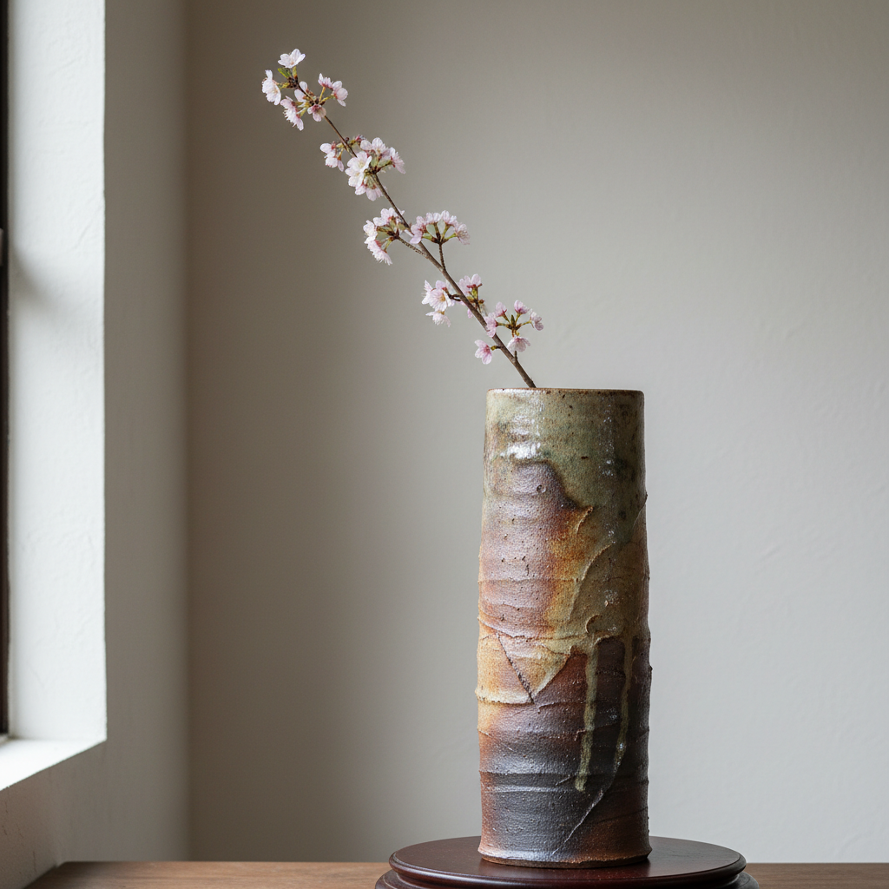

# Ikebana Vessel Art 花器艺术

> "The ikebana vessel is emptiness waiting to be completed — a ceramic form designed not for its own beauty but for the beauty it will hold, its mouth shaped to grip a single stem or release a cascade of branches, its weight calculated to anchor tall arrangements against gravity, its color chosen to recede behind petals, the vessel and the flowers together creating a moment of arranged nature that neither could achieve alone." — Unknown

## 概述

花器艺术（Ikebana Vessel Art）是一种专门为插花艺术（特别是日本花道/生け花）创作陶瓷容器的艺术形式。花器不仅是盛水的容器，更是插花构图的基础和框架——花器的造型、色彩、质感直接影响整个插花作品的气质和方向。好的花器应当与花材形成对话——有时衬托花的娇艳，有时与枯枝形成对比，有时本身就是构图的主角。

花器艺术的核心要素包括：1）口部设计——适合不同插花方式的口部；2）重心稳定——能承托高大花材的重量；3）色彩协调——与花材色彩的协调；4）质感选择——与花材质感的对比或呼应；5）造型多样——从传统到现代的多种器形；6）季节感——不同季节使用不同花器；7）留白精神——为花材留出表现空间。

## 核心特征

| 特征 | 描述 |
|------|------|
| 口部设计 | 适合插花的口部造型 |
| 重心稳定 | 承托花材的稳定性 |
| 色彩协调 | 与花材的色彩对话 |
| 季节感 | 不同季节的选择 |
| 留白精神 | 为花材留出空间 |
| 对话关系 | 器与花的对话 |

## 视觉特征

- **口部变化**：各种口部造型设计
- **素雅色调**：不抢夺花材注意力的色彩
- **质感丰富**：从光滑到粗糙的质感
- **造型多样**：瓶、盘、钵、筒等多种形态
- **重心低稳**：稳定的重心设计
- **自然质感**：与自然花材呼应的质感

## 代表作品

| 作品 | 艺术家/文化 | 年代 | 意义 |
|------|-------------|------|------|
| *备前烧花器* | 日本备前 | 各时期 | 质朴的花器美学 |
| *信乐烧花器* | 日本信乐 | 各时期 | 自然灰釉花器 |
| *中国瓶花器* | 中国 | 宋代起 | 中国瓶花传统 |
| *当代花器* | 各地陶艺家 | 当代 | 花器的当代创作 |
| *野口勇花器* | 野口勇 | 20世纪 | 现代雕塑花器 |

## 历史时间线

| 时期 | 事件 |
|------|------|
| 6世纪 | 日本花道的起源 |
| 宋代 | 中国瓶花艺术的发展 |
| 15世纪 | 日本花道流派的形成 |
| 20世纪 | 现代花器设计的发展 |
| 当代 | 花器作为独立艺术品类 |

## 中国语境

中国的花器传统与"瓶花"文化密切相关——宋代文人将插花视为重要的生活艺术，催生了大量精美的花器创作。中国传统花器以瓶为主——从梅瓶到玉壶春瓶，从胆瓶到蒜头瓶，中国的花瓶造型极为丰富。中国文人对花器有特殊的审美要求——"花器以铜瓷为上"，强调花器的材质和造型应与花材的气质相配。中国当代花艺正在经历复兴——越来越多的人开始学习中国传统插花和日本花道，带动了花器创作的繁荣。中国陶艺家将传统花器造型与当代审美结合，创造出既有古意又有新意的花器作品。

## AI生成概念图

## 与其他风格的关系

- **Ikebana** → 花道
- **Bizen Ware** → 备前烧
- **Vase Art** → 花瓶艺术
- **Tea Ceremony** → 茶道
- **Wabi-Sabi** → 侘寂美学
- **Garden Art** → 园林艺术

---

*浮光艺志 | Chronicle of Artistry*
