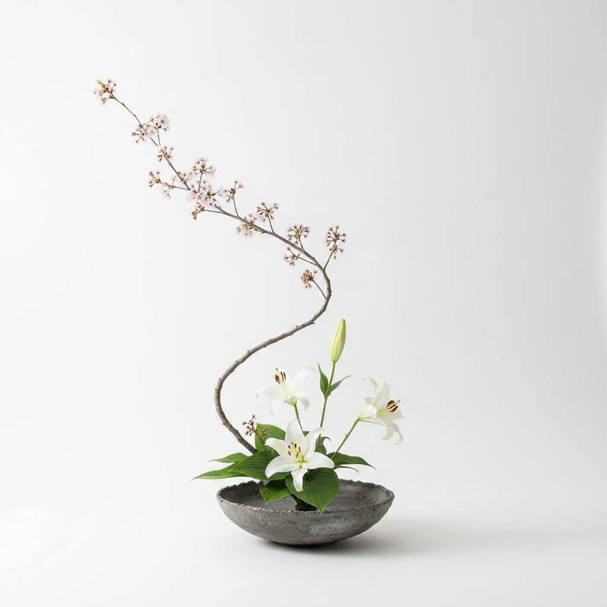

# Ikebana 花道

> "In ikebana, we do not arrange flowers — we reveal their spirit." — Sofu Teshigahara

## 概述

花道（Ikebana/生け花）是日本传统的插花艺术——不是简单地将花朵放入花瓶，而是通过精心选择和安排花材、枝条和叶片来表达自然的本质、季节的变化和生命的哲学。花道强调线条、空间和形态的和谐，追求"少即是多"的极简美学。从室町时代的立花到现代的自由花，花道已发展成为一种独立的艺术形式。

花道的哲学在于：空间与花材同样重要——留白不是空虚，而是呼吸的空间。

## 核心特征

| 特征 | 描述 |
|------|------|
| 线条 | 强调枝条的线条美 |
| 空间 | 重视空间和留白 |
| 极简 | 少量花材的精心安排 |
| 季节 | 表达季节的变化 |
| 哲学 | 蕴含深刻的哲学思想 |
| 三维 | 三维空间的构成 |

## 视觉特征

- **线条**：枝条创造的优美线条
- **空间**：大量的留白和空间
- **不对称**：有意的不对称平衡
- **自然**：尊重植物的自然形态
- **极简**：少量花材的精确安排
- **容器**：花器与花材的和谐

## 代表作品

| 作品 | 艺术家 | 年代 | 意义 |
|------|--------|------|------|
| *Rikka arrangements* | 池坊 | 15世纪+ | 立花——花道的起源 |
| *Sogetsu school works* | 勅使河原蒼風 | 1927+ | 草月流——现代花道 |
| *Ohara school works* | 小原雲心 | 1895+ | 小原流——盛花 |
| *Contemporary ikebana* | Various | 2000s+ | 当代花道艺术 |
| *Installation ikebana* | Various | 2010s+ | 大型花道装置 |

## 历史时间线

| 时期 | 事件 |
|------|------|
| 6世纪 | 佛教供花传入日本 |
| 15世纪 | 池坊——花道的正式确立 |
| 16世纪 | 茶道与花道的结合 |
| 1895 | 小原流——盛花的创始 |
| 1927 | 草月流——现代花道 |
| 当代 | 花道的国际化和当代化 |

## 中国语境

花道与中国的插花艺术有深厚的历史渊源——日本花道的源头可追溯到中国唐代的佛教供花和宋代的文人插花。中国传统插花强调"意境"和"诗意"，与日本花道的哲学性相通。近年来，中国传统插花（中华花艺）经历了强烈的复兴，与日本花道形成了有趣的对话。

## AI生成概念图

## 与其他风格的关系

- **Wabi-sabi** → 侘寂美学是花道的精神基础
- **Minimalism** → 极简主义与花道有精神相通
- **Sculpture** → 花道是活的雕塑
- **Installation Art** → 大型花道接近装置艺术
- **Botanical Art** → 植物艺术的立体形式
- **Zen Art** → 禅宗艺术的生活实践

---

*浮光艺志 | Chronicle of Artistry*
