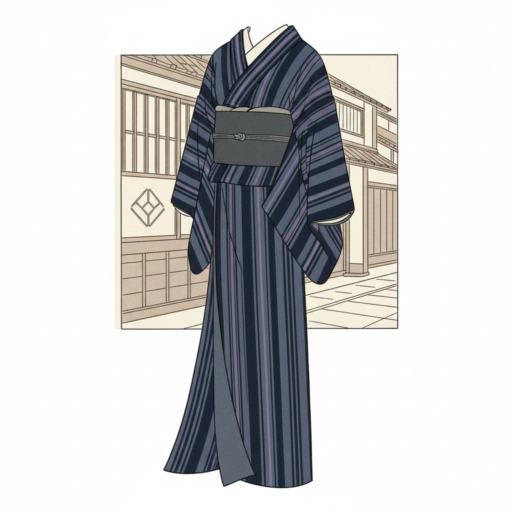

# Iki 粹



> **"江户町人的洒脱——不媚俗、不执着，用简洁线条演绎都市优雅。"**

## 概述

粹（いき / Iki）是江户时代（1603–1868）町人文化中诞生的独特美学概念，代表一种洒脱、风流、不执着的都市审美态度。它既非华丽也非朴素，而是在两者之间找到的恰到好处的"帅气"。

## 时代背景

| 维度 | 内容 |
|------|------|
| 时间 | 江户时代中后期（18–19世纪） |
| 地点 | 江户（东京）町人社会 |
| 阶层 | 商人、艺人、花街文化 |
| 理论化 | 九鬼周造《"粹"的构造》（1930） |

## 视觉特征

- **条纹与格子**：细密的竖条纹（縞）是粹的标志
- **低调色彩**：藏青、鼠色、茶色、江户紫
- **简洁线条**：不多余的装饰，恰到好处
- **素肌感**：露出手腕、脚踝的微妙色气
- **反光泽**：哑光质感优于闪亮
- **不对称**：微妙的不规则打破单调

## 核心理念（九鬼周造的三要素）

### 1. 媚態（びたい）
色气、风情——源自异性间的紧张关系，但不是直白的诱惑，而是含蓄的暗示。

### 2. 意気地（いきじ）
骨气、傲气——不卑不亢，不为金钱或权力折腰的精神独立。

### 3. 諦め（あきらめ）
达观、放下——源自佛教的无执着，对世事看开的洒脱态度。

## 粹 vs 野暮（やぼ）

| 粹（いき） | 野暮（やぼ） |
|------|------|
| 含蓄暗示 | 直白露骨 |
| 简洁利落 | 繁复堆砌 |
| 洒脱不执 | 执着纠缠 |
| 恰到好处 | 过犹不及 |
| 都市感 | 乡土气 |

## 代表领域

| 领域 | 粹的体现 |
|------|------|
| 和服 | 细条纹、暗色系、里地（衬里）用华丽色 |
| 浮世绘 | 歌麿笔下的美人画 |
| 建筑 | 料亭的简素外观与精致内部 |
| 言行 | 江户っ子的爽快口调 |
| 食文化 | 寿司的简洁、荞麦面的利落 |

## 与其他日本美学的关系

```
物哀(平安贵族) → 幽玄(中世武士/僧侣) → 侘寂(茶人)
                                              ↓
                                    粹(江户町人) ← 独立发展
                                              ↓
                                    当代日本设计的"帅气简洁"
```

## 当代影响

- 无印良品的"恰到好处"设计哲学
- 日本男装品牌的简洁利落感
- 寿司文化中的极简美学
- 日本平面设计的留白与节制
- "Less but better"设计理念的东方根源

## 多语言名称

| 语言 | 名称 |
|------|------|
| 日语 | 粋（いき） |
| 英语 | Iki / Urban Chic / Stylish Restraint |
| 中文 | 粹 / 意气 |
| 韩语 | 이키 |

## 延伸阅读

- 九鬼周造《「いき」の構造》（1930）
- 矢田部英正《日本人の坐り方》
- 杉浦日向子《江戸へようこそ》

---

*最后更新：2026-07-26*
