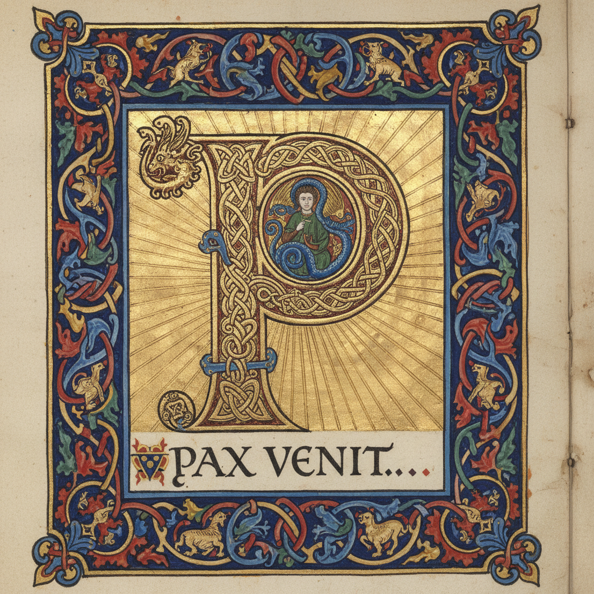

# Illuminated Manuscript 泥金手抄本 | Enluminure

> **"修道院的寂静中，僧侣用金箔和矿物颜料为上帝的话语穿上华服。"**

## 概述

泥金手抄本（Illuminated Manuscript / Enluminure）是中世纪欧洲的手工书籍装饰艺术，在羊皮纸或犊皮纸上用金箔、银箔和矿物颜料绘制精美的装饰字母（Initials）、边框（Borders）和微型画（Miniatures）。"Illuminated"源自拉丁语"illuminare"（照亮），指金箔在光线下的闪耀效果。这种艺术从5世纪延续到15世纪印刷术发明，主要在修道院的缮写室（Scriptorium）中由僧侣创作。代表作包括《凯尔经》（Book of Kells）、《贝里公爵的豪华时祷书》（Très Riches Heures）。

## 主要传统

| 传统 | 时期 | 特征 |
|------|------|------|
| 岛屿风格 | 6-9世纪 | 凯尔特结、螺旋纹（凯尔经） |
| 加洛林 | 8-9世纪 | 古典复兴，清晰字体 |
| 奥托 | 10-11世纪 | 金色背景，庄严 |
| 罗马式 | 11-12世纪 | 程式化人物，几何 |
| 哥特式 | 13-15世纪 | 精细写实，自然主义 |
| 波斯/伊斯兰 | 7-17世纪 | 几何花纹，书法 |

## 核心特征

- **金箔**：贴金和描金产生光辉
- **装饰字母**：首字母的华丽装饰
- **边框装饰**：藤蔓、花卉、怪兽
- **微型画**：叙事性的小型绘画
- **手工制作**：每一本都是独一无二的
- **珍贵材料**：金、银、青金石、朱砂

## 常见元素

| 元素 | 功能 |
|------|------|
| Historiated Initial | 含叙事场景的首字母 |
| Drollery | 边框中的幽默怪兽 |
| Acanthus | 茛苕叶装饰 |
| Carpet Page | 全页几何装饰 |
| Calendar | 月份劳作场景 |
| Bas-de-page | 页底装饰场景 |

## 视觉特征

- 金箔的神圣光辉
- 极精细的笔触
- 鲜艳的矿物颜料
- 华丽的边框装饰
- 程式化的人物造型
- 文字与图像的完美融合

## 与其他风格的关系

| 风格 | 关系 |
|------|------|
| Celtic Knotwork | 岛屿手抄本的核心装饰 |
| 波斯细密画 | 共享手抄本装饰传统 |
| 哥特建筑 | 共享中世纪美学 |
| Typography | 手抄本是字体设计的源头 |
| William Morris | Arts & Crafts复兴手抄本美学 |

## 概念图

---

*浮光艺志 | Chronicle of Artistry*
