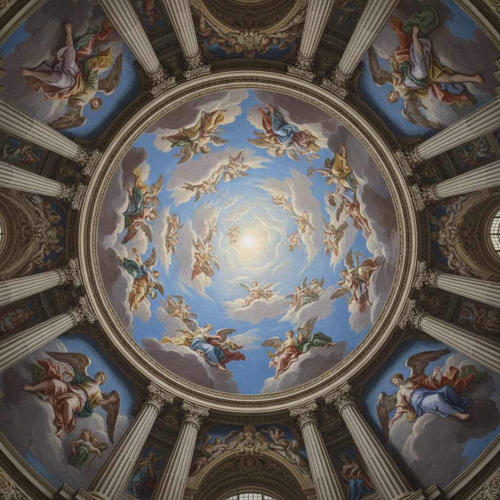

# Illusionism Painting 幻觉主义绘画

> **时期：** 古希腊–至今  
> **关键词：** 空间幻觉、建筑绘画、天顶壁画、视觉魔术、感知欺骗

## 概述

Illusionism Painting（幻觉主义绘画）是通过绘画技法创造空间深度和三维幻觉的广泛传统。从古希腊画家宙克西斯画出让鸟啄食的葡萄，到巴洛克时期安德烈亚·波佐将教堂天顶"打开"成无限天空——幻觉主义追求的是让绘画突破平面的物理限制，创造出观者可以"走入"的虚拟空间。

## 风格特征

- **建筑延伸**：用绘画延续真实建筑空间
- **天顶开放**：将封闭穹顶变为无限天空
- **精确透视**：从特定视点观看时完美无缺
- **光影一致**：绘画光源与真实光源统一
- **尺度游戏**：近大远小的极致运用

## 代表人物与作品

- 安德烈亚·波佐 圣伊格纳齐奥教堂天顶
- 安德烈亚·曼特尼亚 婚房天顶
- 乔瓦尼·巴蒂斯塔·提埃波罗 宫殿壁画
- 科雷乔 帕尔马大教堂穹顶

## 概念图

