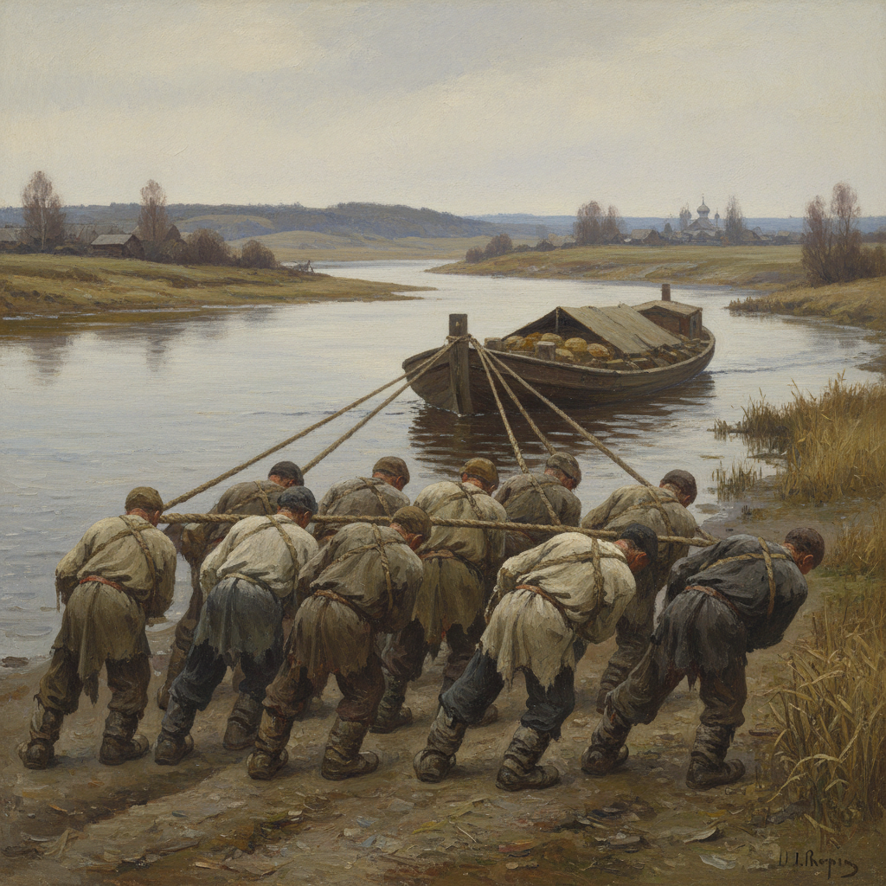

# Ilya Repin 列宾

> "I do not understand the separation of art from life." — Ilya Repin

## 概述

伊利亚·列宾（Ilya Repin，1844–1930）是俄国最伟大的现实主义画家，巡回展览画派的核心人物。他以描绘俄国社会各阶层的生活闻名——从伏尔加河上的纤夫到沙皇宫廷，用深刻的心理洞察和精湛的技巧揭示人物的内心世界，被誉为"俄国绘画的良心"。

## 核心特征

| 特征 | 描述 |
|------|------|
| 社会批判 | 揭示俄国社会的不公 |
| 心理深度 | 人物内心世界的精准捕捉 |
| 群像叙事 | 多人物场景的戏剧张力 |
| 历史画 | 俄国历史的关键时刻 |
| 肖像大师 | 托尔斯泰等名人肖像 |
| 技巧精湛 | 学院训练与自由笔触的结合 |

## 代表作品

| 作品 | 年代 | 意义 |
|------|------|------|
| *Barge Haulers on the Volga* | 1870–73 | 俄国现实主义的标志 |
| *Reply of the Zaporozhian Cossacks* | 1880–91 | 群像叙事的巅峰 |
| *Ivan the Terrible and His Son* | 1885 | 历史悲剧的心理深度 |
| *Portrait of Leo Tolstoy* | 1887 | 文豪肖像的经典 |

## AI生成概念图

## 与其他风格的关系

- **Peredvizhniki** → 巡回展览画派核心成员
- **Courbet** → 受法国写实主义影响
- **Social Realism** → 社会现实主义的先驱
- **Surikov** → 同代俄国历史画家
