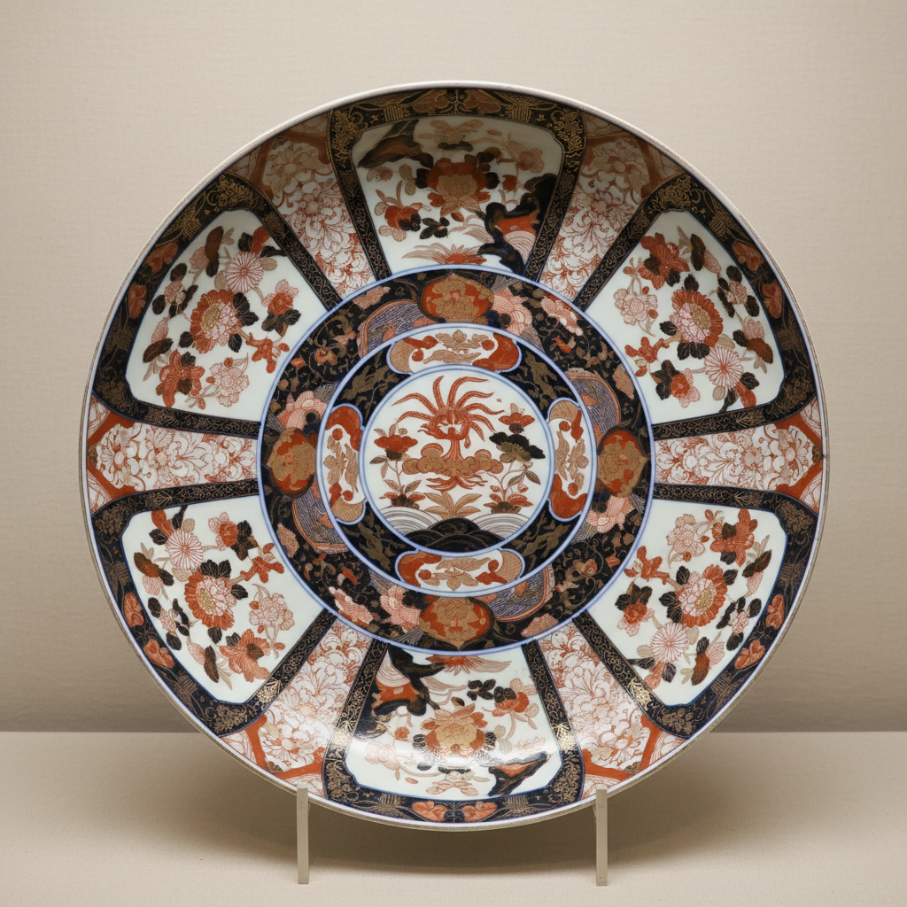

# Imari Art 伊万里艺术

> "Imari is Japan's porcelain ambassador — bold blue-and-white and polychrome wares shipped from the port of Imari in Kyushu to fill the cabinets of European palaces when Chinese exports faltered during the Ming-Qing transition, a style so successful that China itself began copying it, reversing centuries of ceramic influence in a single generation of trade." — Unknown

## 概述

伊万里艺术（Imari Art）是日本17-18世纪在佐贺县有田地区生产、从伊万里港出口的彩绘瓷器艺术。伊万里瓷以其华丽的红、蓝、金三色装饰著称——这种被称为"金襴手"的风格在欧洲极受欢迎。伊万里瓷的兴起与明清交替时期中国瓷器出口中断密切相关——荷兰东印度公司转向日本采购瓷器，使伊万里瓷迅速占领了欧洲市场。

伊万里艺术的核心要素包括：1）红蓝金——标志性的三色组合；2）有田生产——在有田地区生产；3）伊万里出口——从伊万里港出口；4）欧洲市场——主要面向欧洲市场；5）华丽装饰——华丽繁复的装饰；6）替代中国——替代中国瓷器的出口；7）影响深远——对欧洲陶瓷影响深远。

## 核心特征

| 特征 | 描述 |
|------|------|
| 红蓝金 | 标志性三色组合 |
| 有田生产 | 在有田地区生产 |
| 伊万里出口 | 从伊万里港出口 |
| 欧洲市场 | 面向欧洲市场 |
| 华丽装饰 | 华丽繁复装饰 |
| 影响深远 | 对欧洲陶瓷影响深远 |

## 视觉特征

- **红蓝金**：铁红、钴蓝、金色的组合
- **满工装饰**：密集的装饰图案
- **花卉纹样**：菊花、牡丹等花卉
- **几何分区**：几何形的分区构图
- **华丽感**：华丽富贵的视觉效果
- **大型器物**：大盘、大瓶等大型器

## 代表作品

| 作品 | 艺术家/文化 | 年代 | 意义 |
|------|-------------|------|------|
| *金襴手大盘* | 有田 | 17世纪 | 经典伊万里 |
| *伊万里花瓶* | 有田 | 17-18世纪 | 欧洲宫廷收藏 |
| *伊万里茶具* | 有田 | 18世纪 | 出口茶具 |
| *古伊万里* | 有田 | 17世纪初 | 早期伊万里 |
| *中国仿伊万里* | 景德镇 | 18世纪 | 中国仿制品 |

## 历史时间线

| 时期 | 事件 |
|------|------|
| 1616年 | 有田发现瓷石，开始烧瓷 |
| 1640年代 | 明清交替，中国出口中断 |
| 1650年代 | 荷兰东印度公司转向日本 |
| 17世纪末 | 伊万里瓷的鼎盛期 |
| 18世纪 | 中国恢复出口，伊万里衰落 |

## 中国语境

伊万里瓷与中国陶瓷有复杂的历史关系。日本瓷器的起源本身就与中国有关——有田瓷器的创始人李参平是壬辰倭乱期间被掳至日本的朝鲜陶工。伊万里瓷的兴起直接源于明清交替时期中国瓷器出口的中断——当荷兰东印度公司无法从中国获得瓷器时，转向了日本。有趣的是，当中国在康熙时期恢复瓷器出口后，景德镇反过来模仿伊万里的风格生产"中国伊万里"——这种角色逆转在陶瓷史上极为罕见。伊万里瓷的红蓝金配色方案对欧洲陶瓷产生了深远影响——英国的皇家伍斯特、德国的迈森等欧洲名窑都曾模仿伊万里风格。

## AI生成概念图

## 与其他风格的关系

- **Kakiemon** → 柿右卫门
- **Arita Ware** → 有田烧
- **Kraak Porcelain** → 克拉克瓷
- **Chinese Export** → 中国外销瓷
- **Meissen** → 迈森瓷器
- **Nabeshima** → �的岛烧

---

*浮光艺志 | Chronicle of Artistry*
