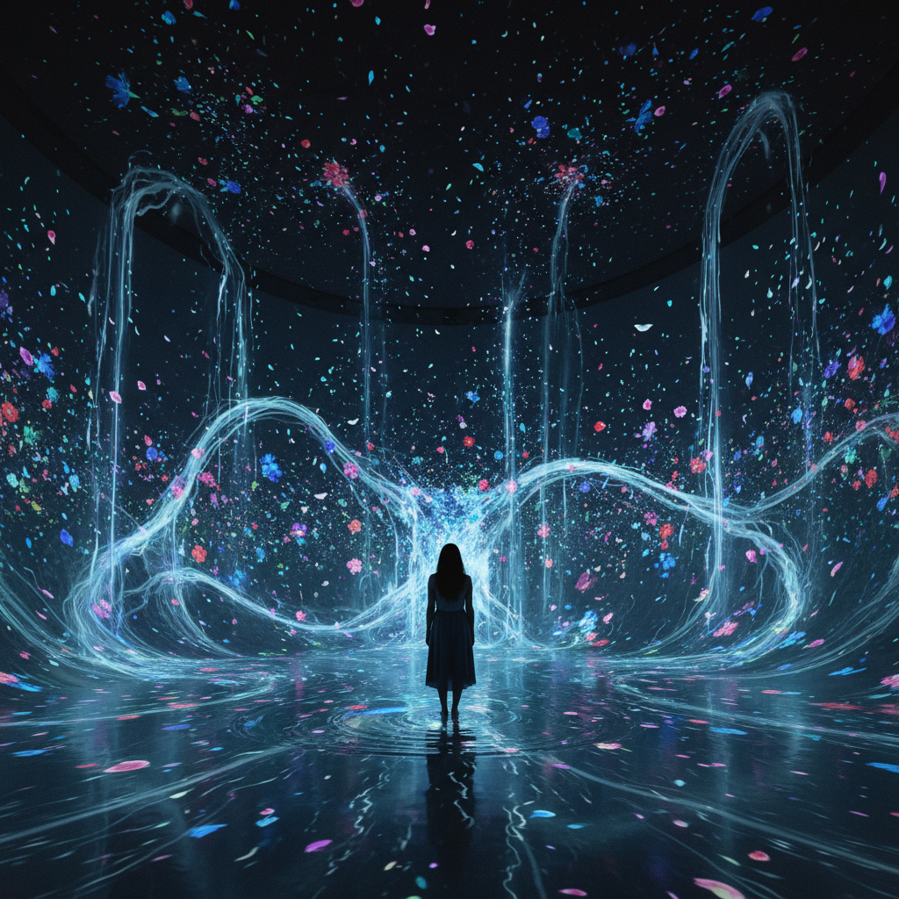

# Immersive Art 沉浸式艺术

> "I want the viewer to be inside the painting." — Yayoi Kusama

## 概述

沉浸式艺术（Immersive Art）是一种将观众完全包围在艺术体验中的创作形式，消除观看者与作品之间的距离。观众不再站在作品前面观看，而是走进作品内部，成为作品的一部分。

从草间弥生的无限镜屋到teamLab的数字瀑布，从Meow Wolf的奇幻空间到Van Gogh沉浸式展览，沉浸式艺术已成为21世纪最受欢迎的艺术体验形式之一。

## 核心特征

| 特征 | 描述 |
|------|------|
| 全包围 | 360度环绕观众的视觉/声音环境 |
| 身体参与 | 观众的身体在空间中移动和互动 |
| 多感官 | 视觉、听觉、触觉、嗅觉的综合刺激 |
| 消除边界 | 作品与空间、观众与作品的边界消失 |
| 技术驱动 | 投影、LED、传感器、VR等技术支撑 |
| 体验经济 | 与社交媒体和体验消费深度结合 |

## 视觉特征

- **空间**：黑暗的、封闭的、无边界感的
- **光**：投影、LED、镜面反射——光是核心媒介
- **尺度**：建筑尺度——整个房间或建筑
- **动态**：持续变化、流动、响应
- **镜面**：无限延伸的视觉幻觉
- **色彩**：饱和的、变化的、梦幻的

## 代表作品

| 作品 | 艺术家/团队 | 年代 | 意义 |
|------|------------|------|------|
| *Infinity Mirror Rooms* | Yayoi Kusama | 1965+ | 无限镜屋——沉浸式艺术的先驱 |
| *The Weather Project* | Olafur Eliasson | 2003 | Tate Modern的人造太阳 |
| *Borderless* | teamLab | 2018 | 东京的数字艺术博物馆 |
| *Rain Room* | Random International | 2012 | 走过雨中却不会淋湿 |
| *Meow Wolf* | Collective | 2016+ | 奇幻叙事的沉浸式空间 |
| *Van Gogh: The Immersive Experience* | Various | 2020+ | 名画的数字化沉浸展 |

## 历史时间线

| 时期 | 事件 |
|------|------|
| 1960s | Kusama的无限镜屋、Happening的环境性 |
| 1970s | James Turrell的光空间——Ganzfeld |
| 1990s | CAVE系统——早期VR沉浸环境 |
| 2003 | Eliasson的*Weather Project*——大众化里程碑 |
| 2010s | teamLab、Random International——数字沉浸爆发 |
| 2016 | Meow Wolf开业——沉浸式娱乐 |
| 2020 | Van Gogh沉浸展全球巡回——商业化高峰 |
| 2020s | VR/AR/MR——元宇宙时代的沉浸式艺术 |

## 子类型

| 子类型 | 特征 |
|--------|------|
| 光空间 | Turrell、Eliasson——光作为沉浸媒介 |
| 数字沉浸 | teamLab——投影和传感器的互动空间 |
| 镜面沉浸 | Kusama——镜面反射的无限空间 |
| 叙事沉浸 | Meow Wolf——故事驱动的探索空间 |
| VR沉浸 | 虚拟现实中的艺术体验 |
| 商业沉浸 | Van Gogh展——名画的数字化体验 |

## 中国语境

沉浸式艺术在中国极为流行。teamLab在北京、上海、深圳的常设展吸引了大量观众。中国本土的沉浸式艺术团队（如黑弓Blackbow）创作了大量作品。故宫、敦煌等文化IP的沉浸式数字展览将传统文化与新技术结合。中国的商业地产和文旅项目大量采用沉浸式艺术作为吸引客流的手段。中国观众对"打卡"文化的热情使沉浸式艺术在社交媒体上获得了巨大传播。

## 争议与遗产

- **争议**：沉浸式展览是艺术还是娱乐？是深度体验还是"打卡"消费？
- **商业化**：Van Gogh沉浸展的泛滥——艺术的迪士尼化？
- **原创性**：许多沉浸式展只是名画的投影放大——这算创作吗？
- **遗产**：永久改变了公众对艺术体验的期待
- **当代回响**：元宇宙、XR艺术、空间计算、AI生成环境

## AI生成概念图

## 与其他风格的关系

- **Light Art** → 光艺术是沉浸式艺术的直接先驱
- **Installation Art** → 装置艺术的空间性为沉浸式奠定基础
- **Happening** → 偶发艺术的参与性是沉浸式的精神先驱
- **New Media Art** → 新媒体艺术提供了技术基础
- **Net Art** → 网络艺术的互动性延伸到物理空间
- **Kinetic Art** → 动态艺术的运动和变化是沉浸式的要素

---

*浮光艺志 | Chronicle of Artistry*
