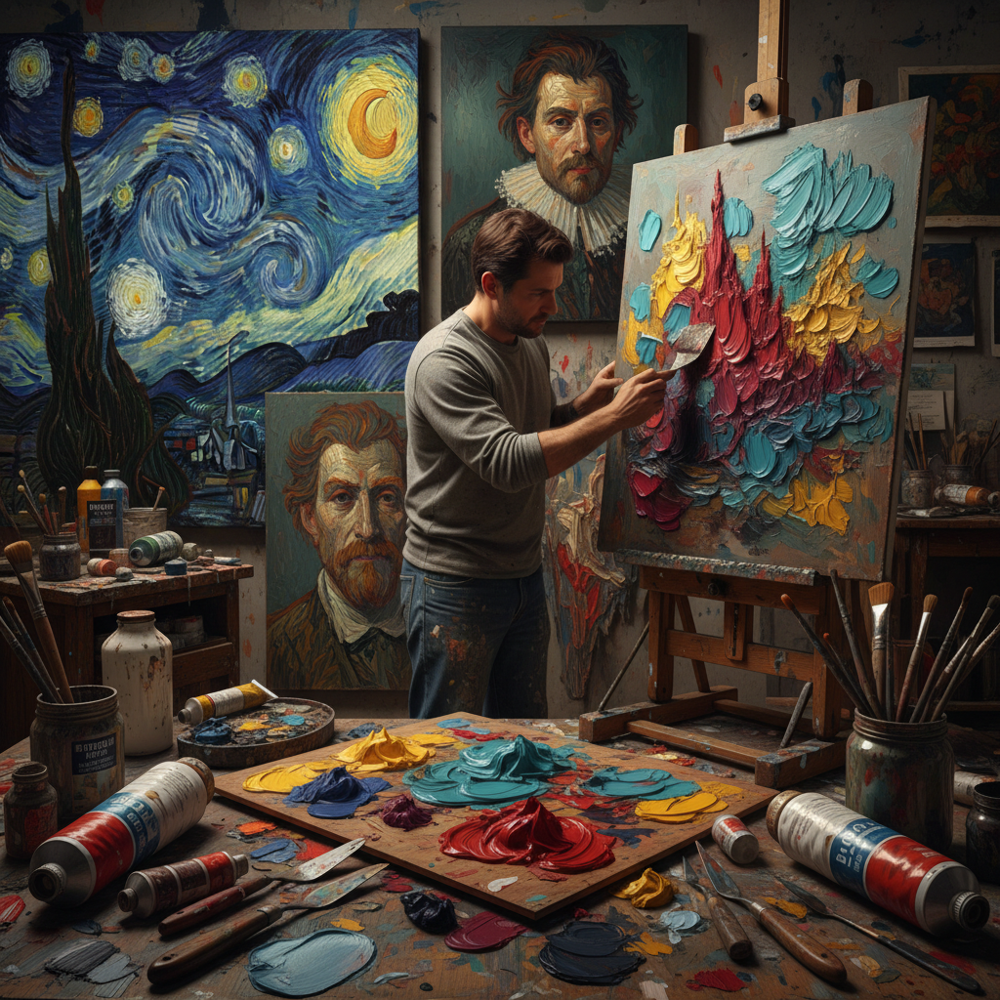

# Impasto Painting 厚涂画法

> "Impasto is paint liberated from illusion — pigment applied so thickly it becomes a physical presence on the canvas, each brushstroke or knife mark casting its own real shadow, the surface becoming a landscape of ridges and valleys that transforms painting from a window into a wall, from an image into an object, celebrating the material reality of paint itself as much as whatever it depicts." — Unknown

## 概述

厚涂画法（Impasto），来自意大利语"impastare"（揉面/涂抹），是一种将颜料以极厚的层次涂抹在画布或面板上的绘画技法——颜料的厚度足以使笔触或画刀的痕迹清晰可见，甚至从画面表面凸起形成三维的纹理。Impasto使绘画从纯粹的视觉艺术变成了兼具触觉维度的艺术——画面不再是平坦的幻觉窗口，而是有物理深度的物体。

Impasto在巴洛克时期的伦勃朗作品中就已经出现——他在高光区域使用厚重的颜料来增强光感。印象派画家（如莫奈）广泛使用impasto来捕捉光线的振动。梵高将impasto发展到极致——他的旋转笔触成为了作品的标志性特征。当代画家如弗兰克·奥尔巴赫（Frank Auerbach）将impasto推向了雕塑般的极端厚度。

## 核心特征

| 特征 | 描述 |
|------|------|
| 厚涂 | 极厚的颜料层 |
| 纹理 | 可见的笔触纹理 |
| 立体 | 画面的物理凸起 |
| 表现力 | 强烈的表现力 |
| 材料感 | 颜料的材料存在感 |
| 光影 | 真实的光影效果 |

## 视觉特征

- **厚重**：厚重的颜料质感
- **笔触**：清晰可见的笔触
- **立体**：画面的物理立体感
- **光影**：笔触投射的真实阴影
- **能量**：充满能量的表面
- **触觉**：引发触觉联想

## 代表作品

| 作品 | 艺术家 | 年代 | 意义 |
|------|--------|------|------|
| *The Starry Night* | Vincent van Gogh | 1889 | 梵高的厚涂旋转笔触 |
| *Self-portraits* | Rembrandt | 17世纪 | 伦勃朗的厚涂高光 |
| *Water Lilies* | Claude Monet | 1900年代 | 莫奈的厚涂光感 |
| *Head of E.O.W.* | Frank Auerbach | 当代 | 奥尔巴赫的极端厚涂 |
| *Abstract Expressionist works* | Willem de Kooning | 20世纪 | 德库宁的厚涂抽象 |

## 历史时间线

| 时期 | 事件 |
|------|------|
| 巴洛克 | 伦勃朗的厚涂高光 |
| 印象派 | 印象派的厚涂光感 |
| 后印象派 | 梵高的标志性厚涂 |
| 表现主义 | 表现主义的厚涂表现力 |
| 当代 | 厚涂的极端化发展 |

## 中国语境

厚涂画法在中国的油画创作中有广泛的应用。中国的许多油画家使用impasto技法——特别是在表现力和材料感方面。中国的美术院校油画专业教授impasto作为重要的技法之一。中国的一些当代艺术家将impasto推向极端——创造出雕塑般的画面效果。中国传统绘画中虽然没有直接对应的技法（中国画追求"薄"和"透"），但当代中国的实验水墨中也有探索材料厚度的尝试。

## AI生成概念图

## 与其他风格的关系

- **Expressionism** → 表现主义
- **Impressionism** → 印象派
- **Palette Knife Painting** → 画刀画
- **Texture Art** → 纹理艺术
- **Abstract Expressionism** → 抽象表现主义
- **Van Gogh** → 梵高风格

---

*浮光艺志 | Chronicle of Artistry*
