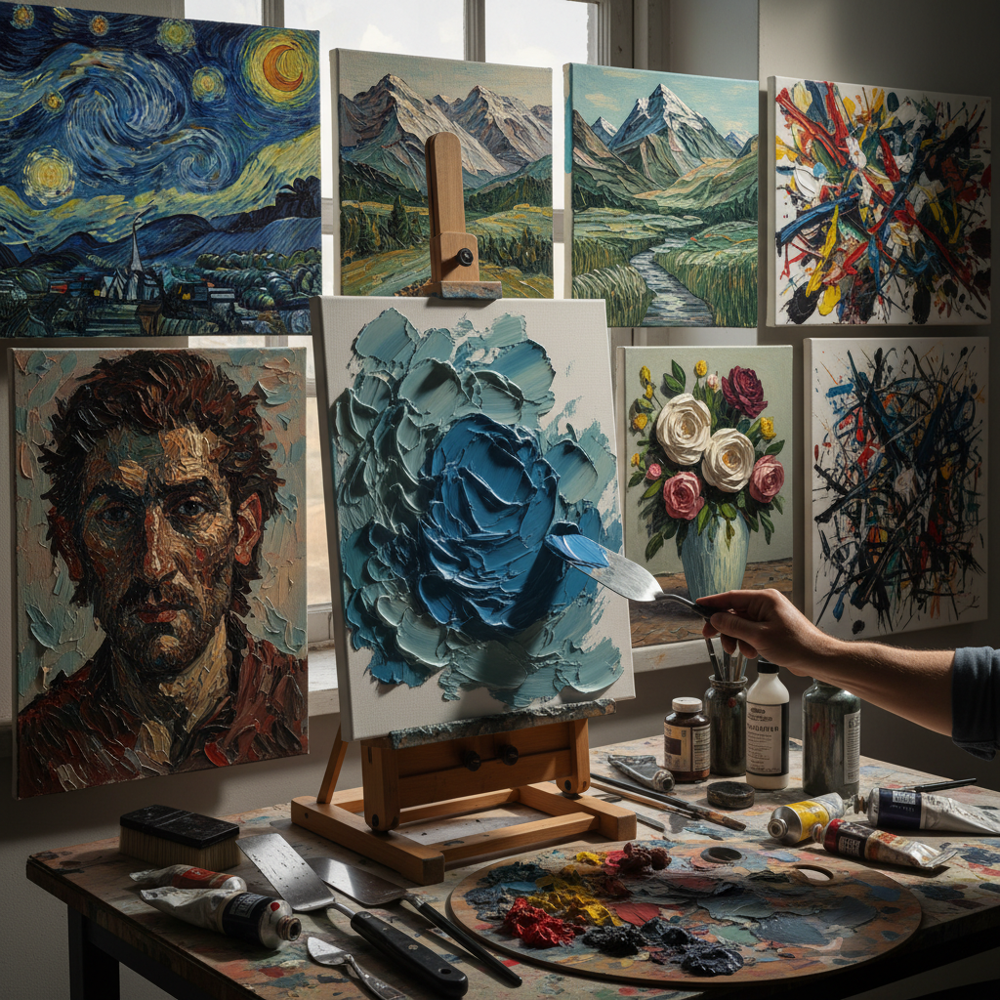

# Impasto Technique 厚涂技法

> "Impasto is painting as sculpture — pigment piled so thick upon the canvas that it casts its own shadows, transforming flat surface into tactile landscape where every brushstroke becomes a ridge and every palette knife mark a cliff face." — Unknown

## 概述

厚涂技法（Impasto Technique）是一种将颜料以极厚的层次涂抹在画布上的绘画技法——颜料的厚度足以产生明显的三维质感和笔触纹理。"Impasto"源自意大利语，意为"糊状物"或"面团"。厚涂法使画面从平面的二维图像变成具有浮雕感的三维物体——光线照射在厚重的颜料表面上产生真实的阴影和高光。

厚涂法可以使用画笔、调色刀（palette knife）或直接用手来施加颜料。其效果从微妙的笔触纹理到极端的颜料堆积不等。厚涂法的历史可追溯到提香和伦勃朗——他们在画面的高光部分使用厚涂来增强立体感。后来的梵高、莫奈将厚涂发展为整体性的表现手段。当代艺术家如弗兰克·奥尔巴赫（Frank Auerbach）将厚涂推向极致。

## 核心特征

| 特征 | 描述 |
|------|------|
| 厚重 | 极厚的颜料层 |
| 质感 | 三维的表面质感 |
| 笔触 | 可见的笔触纹理 |
| 力量 | 力量感和表现力 |
| 光影 | 真实的光影效果 |
| 触觉 | 触觉的艺术体验 |

## 视觉特征

- **厚重**：厚重的颜料堆积
- **纹理**：丰富的表面纹理
- **笔触**：大胆的笔触痕迹
- **光影**：颜料表面的真实光影
- **力量**：充满力量的表现
- **立体**：浮雕般的立体感

## 代表作品

| 作品 | 艺术家 | 年代 | 意义 |
|------|--------|------|------|
| *The Night Watch (highlights)* | Rembrandt | 1642 | 早期厚涂的经典 |
| *Starry Night* | Van Gogh | 1889 | 表现性厚涂 |
| *Water Lilies* | Monet | 1900s | 印象派厚涂 |
| *Head of E.O.W.* | Frank Auerbach | 1960s | 极端厚涂 |
| *Contemporary impasto* | Various | 当代 | 当代厚涂艺术 |

## 历史时间线

| 时期 | 事件 |
|------|------|
| 16世纪 | 提香的局部厚涂 |
| 17世纪 | 伦勃朗的高光厚涂 |
| 19世纪 | 印象派的整体厚涂 |
| 后印象派 | 梵高的表现性厚涂 |
| 20世纪 | 抽象表现主义的厚涂 |
| 当代 | 当代厚涂的多样化发展 |

## 中国语境

厚涂技法在中国的油画教育和创作中有广泛的应用。中国的油画家在创作中经常使用厚涂来增强画面的表现力和质感。中国的美术学院在油画技法课程中教授厚涂法。中国的一些当代油画家以厚涂风格著称。中国的油画市场中，厚涂风格的作品因其强烈的视觉冲击力和物质感而受到收藏家的青睐。

## AI生成概念图

## 与其他风格的关系

- **Palette Knife Painting** → 调色刀画
- **Expressionism** → 表现主义
- **Abstract Expressionism** → 抽象表现主义
- **Oil Painting** → 油画
- **Texture Art** → 肌理艺术
- **Action Painting** → 行动绘画

---

*浮光艺志 | Chronicle of Artistry*
