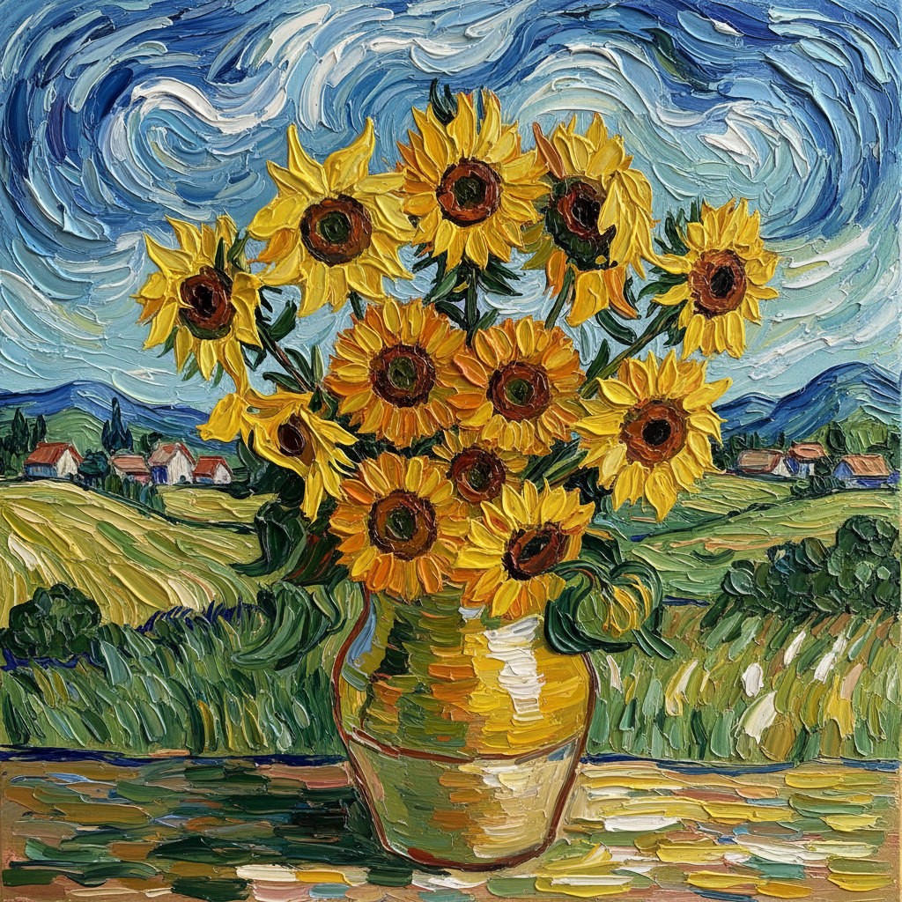

# Impasto 厚涂法

> "I want to touch the paint." — Frank Auerbach

## 概述

厚涂法（Impasto，意大利语"面团"之意）是将颜料以极厚的层次堆积在画布上的绘画技法，使画面产生明显的三维浮雕质感——笔触和刮刀痕迹清晰可见，颜料本身成为画面的物理存在。

从提香晚期的粗犷笔触到梵高旋转的星空，从德·库宁的狂暴刮刀到弗洛伊德的肉体堆积，厚涂法是表现力、物质性和画家身体能量的直接体现。

## 核心特征

| 特征 | 描述 |
|------|------|
| 厚重颜料 | 颜料层极厚，产生物理浮雕 |
| 可见笔触 | 笔触和刮刀痕迹清晰可见 |
| 物质性 | 颜料本身成为表现对象 |
| 光影效果 | 厚涂产生真实的光影（颜料的物理阴影） |
| 身体能量 | 画家的身体力量和手势直接可见 |
| 表现力 | 情感的直接物质化 |

## 视觉特征

- **表面**：粗糙的、有明显起伏的画面
- **笔触**：宽大有力的笔触或刮刀痕迹
- **光影**：颜料本身在侧光下产生真实阴影
- **色彩**：厚涂的颜料色彩更饱和、更有力
- **质感**：如浮雕般的三维表面
- **能量**：画家的动作和力量直接可见

## 代表人物

| 画家 | Impasto 特点 | 时期 |
|------|-------------|------|
| Titian (晚期) | 用手指和粗笔堆积颜料 | 威尼斯画派 |
| Rembrandt | 高光处的厚重白色颜料 | 荷兰黄金时代 |
| Vincent van Gogh | 旋转的厚涂笔触 | 后印象派 |
| Willem de Kooning | 狂暴的刮刀和笔触 | 抽象表现主义 |
| Frank Auerbach | 极端厚涂的肖像和风景 | 伦敦画派 |
| Lucian Freud | 肉体的厚重堆积 | 伦敦画派 |
| Anselm Kiefer | 混合材料的极端厚涂 | 新表现主义 |

## 工具与材料

| 工具 | 效果 |
|------|------|
| 画笔 | 有方向性的笔触痕迹 |
| 调色刀/刮刀 | 平滑或锐利的厚涂面 |
| 手指 | 直接的、原始的触感 |
| 挤管 | 直接从颜料管挤出 |
| 介质 | 增稠介质增加颜料体积 |

## 历史演变

1. **16世纪**：提香晚期开始大胆厚涂
2. **17世纪**：伦勃朗在高光处使用厚涂
3. **19世纪**：梵高将厚涂发展为核心表现手段
4. **20世纪**：抽象表现主义将厚涂推向极端
5. **当代**：厚涂作为物质性和身体性的表达

## 与其他技法的关系

- **Alla Prima** → 一次完成法常伴随厚涂
- **Glazing** → 完全相反——薄而透明 vs 厚而不透明
- **Palette Knife Painting** → 刮刀画是厚涂的主要手段
- **Abstract Expressionism** → 行动绘画的物质基础
- **Texture** → 厚涂是创造画面质感的核心手段

## 概念图

---

*浮光艺志 | Chronicle of Artistry*
