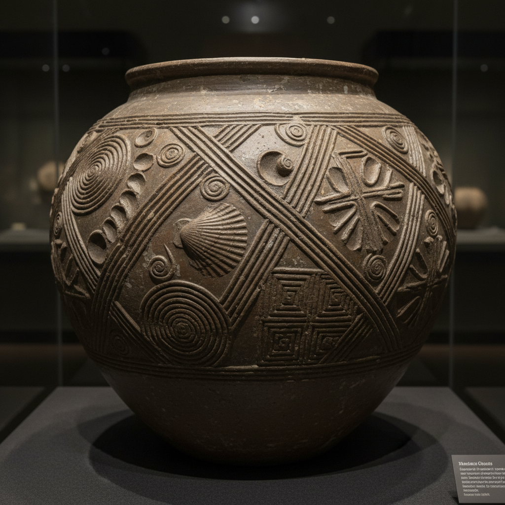

# Impressed Decoration Art 印纹装饰艺术

> "Impressed decoration is the oldest conversation between tool and clay — a shell pressed into wet earth, a cord wrapped around a paddle and struck against a pot's wall, a carved stamp rocked across a rim, each gesture leaving a permanent fossil of the moment hand met material, texture born from pressure alone, no pigment needed, the clay itself becoming both canvas and ink through the simple physics of displacement." — Unknown

## 概述

印纹装饰艺术（Impressed Decoration Art）是一种通过将各种工具、物体或模具压入湿润的陶土表面来创造纹理和图案的陶瓷装饰技法。印纹装饰是人类最古老的陶瓷装饰方式之一——从新石器时代的绳纹陶到当代陶艺家的创意压印，这一技法贯穿了整个陶瓷史。印纹装饰的魅力在于它的直接性：不需要颜料或釉料，仅通过物理压力就能在陶土上留下永久的纹理。

印纹装饰艺术的核心要素包括：1）压印工具——贝壳、绳索、木模、金属印章等；2）湿润陶土——在适当湿度下接受压印；3）物理压力——通过压、滚、拍等方式施加力量；4）纹理创造——在表面形成凹凸纹理；5）重复图案——通过重复压印形成规律图案；6）材料记忆——陶土记录下每一次接触；7）烧制固定——烧制后纹理永久保存。

## 核心特征

| 特征 | 描述 |
|------|------|
| 物理压印 | 通过压力在陶土上留下痕迹 |
| 工具多样 | 可使用任何有纹理的物体 |
| 古老传统 | 人类最早的装饰方式之一 |
| 触觉体验 | 创造可触摸的表面纹理 |
| 无需颜料 | 仅靠物理变形实现装饰 |
| 即时效果 | 压印即可见效果 |

## 视觉特征

- **凹凸纹理**：表面的凹凸起伏
- **规律重复**：重复压印的规律图案
- **工具痕迹**：清晰的工具印记
- **光影效果**：凹凸表面的光影变化
- **自然纹理**：贝壳、绳索等自然物的印记
- **手工质感**：手工压印的不规则美感

## 代表作品

| 作品 | 艺术家/文化 | 年代 | 意义 |
|------|-------------|------|------|
| *绳纹陶器* | 日本绳文文化 | 前14000年 | 最早的印纹装饰 |
| *印纹硬陶* | 中国商周 | 前1600-前256年 | 中国印纹陶传统 |
| *中世纪印花陶* | 欧洲 | 12-15世纪 | 欧洲印纹传统 |
| *当代印纹陶艺* | 各地陶艺家 | 当代 | 印纹的现代探索 |
| *工业压花瓷砖* | 各品牌 | 当代 | 工业应用 |

## 历史时间线

| 时期 | 事件 |
|------|------|
| 前14000年 | 日本绳文陶器的绳纹装饰 |
| 前5000年 | 中国仰韶文化的印纹陶 |
| 前1600年 | 中国商代印纹硬陶 |
| 中世纪 | 欧洲印花陶器的发展 |
| 当代 | 印纹装饰在当代陶艺中的复兴 |

## 中国语境

印纹装饰在中国陶瓷史上有极其重要的地位。中国的"印纹陶"是一个专门的考古学类别——从新石器时代到商周时期，中国南方广泛流行各种印纹硬陶。这些印纹包括绳纹、席纹、方格纹、回字纹、云雷纹等，是通过拍打或滚压的方式施加在陶器表面。中国的印纹陶不仅是装饰，也是制作工艺的一部分——拍打可以使器壁更加致密。中国当代陶艺家重新发现了印纹装饰的魅力，将传统印纹与现代设计结合，创造出既有历史深度又有当代感的作品。

## AI生成概念图

## 与其他风格的关系

- **Stamped Pottery** → 印花陶
- **Cord-Marked Pottery** → 绳纹陶
- **Texture Art** → 纹理艺术
- **Relief Decoration** → 浮雕装饰
- **Paddled Pottery** → 拍打陶
- **Neolithic Ceramics** → 新石器陶瓷

---

*浮光艺志 | Chronicle of Artistry*
