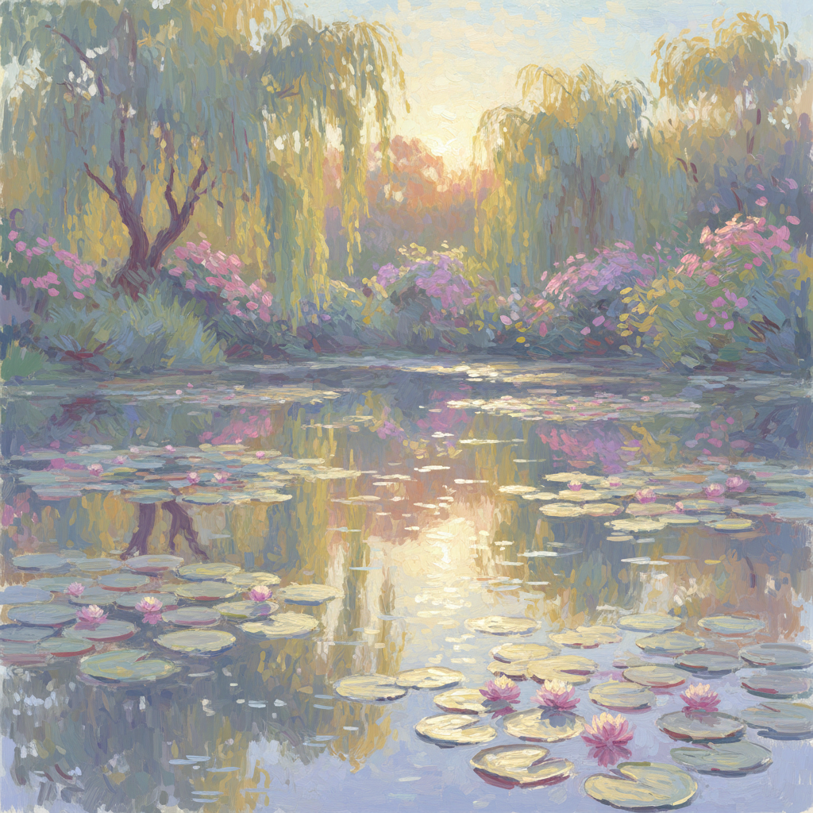

# Impressionism Digital 数字印象派



> **"光影笔触、色彩振动、瞬间捕捉——莫奈的睡莲在像素中重生。"**

## 概述

| 维度 | 描述 |
|------|------|
| 时期 | 1860s 原版 / 2010s 数字复兴 |
| 别名 | Digital Impressionism, Neo-Impressionism, Painterly Digital |
| 核心色彩 | 柔和的自然色——蓝紫、粉橙、绿金 |
| 关键元素 | 可见笔触、光影变化、色彩并置、瞬间感 |
| 代表人物 | Monet、Renoir → 当代数字画家 |
| 关联风格 | Cottagecore, Lo-Fi, Soft Girl, Auroracore |

---

## 历史脉络

### 从巴黎沙龙到 Procreate

| 年份 | 事件 |
|------|------|
| 1863 | Manet《草地上的午餐》——印象派前奏 |
| 1874 | 第一次印象派画展——"印象派"得名 |
| 1880s | 莫奈的睡莲系列开始 |
| 1886 | 后印象派（梵高、塞尚）发展 |
| 2010s | iPad/Procreate 让数字绘画民主化 |
| 2020s | AI 风格迁移让"印象派滤镜"人人可用 |

### 核心哲学

Impressionism 的精神是**"捕捉光的瞬间——不是物体本身，而是光照在物体上的样子"**：
- 光 > 形（"我画的不是干草堆——是光"）
- 瞬间 > 永恒
- 户外 > 画室
- 色彩并置 > 混合（让眼睛自己混色）
- "完美"不重要——"感觉"重要

---

## 视觉语法

### 色彩系统

```
规则：
  - 不用黑色（阴影用互补色）
  - 色彩并置而非混合
  - 冷暖对比
  - 高明度
  - 自然光的色彩

常见色调：
  蓝紫 — 阴影、水面
  粉橙 — 日出日落
  绿金 — 阳光下的植物
  白蓝 — 天空、云
  黄绿 — 草地、树叶

质感：
  可见笔触 — 核心特征
  厚涂 — 堆积的颜料
  模糊 — 运动、光线
  点彩 — 新印象派
```

### 标志性元素

| 类别 | 元素 |
|------|------|
| 题材 | 风景、水面、花园、日常生活 |
| 光线 | 自然光、反射、阴影的色彩 |
| 笔触 | 短促、可见、有方向性 |
| 构图 | 非传统裁切、日常视角 |
| 色彩 | 互补色并置、无黑色阴影 |
| 氛围 | 瞬间、流动、温暖、诗意 |

---

## 与千禧怀旧的关系

### 数字时代的印象派
- Procreate/Photoshop 笔刷 = 数字印象派工具
- AI 风格迁移 = "一键莫奈"
- Instagram 滤镜中的印象派色调
- "画意摄影"= 印象派的摄影版

### 与 Lo-Fi / Cottagecore 的交叉
- 柔和色调、自然题材、诗意氛围
- 印象派 = Cottagecore 的艺术史祖先
- Lo-Fi 封面的"画意"风格
- 共同点：温暖、柔和、逃离现实

---

## 中国语境

- 印象派在中国的巨大影响力
- 中国油画中的印象派传统
- "莫奈展"在中国的持续火爆
- 与中国水墨画"写意"精神的对话
- 数字绘画中的印象派风格

---

## 设计应用

| 场景 | 应用方式 |
|------|----------|
| 品牌 | 柔和色调+手绘质感+自然+诗意 |
| 空间 | 自然光+柔和色彩+花卉+画作 |
| 数字 | 笔触效果+柔和渐变+自然题材 |
| 摄影 | 柔焦+自然光+色彩+瞬间 |

---

## 相关风格

← [Surrealism 超现实主义](surrealism.md) | [Cottagecore 田园核](cottagecore.md) →

↑ [返回千禧怀旧目录](README.md) | [返回总目录](../README.md)
