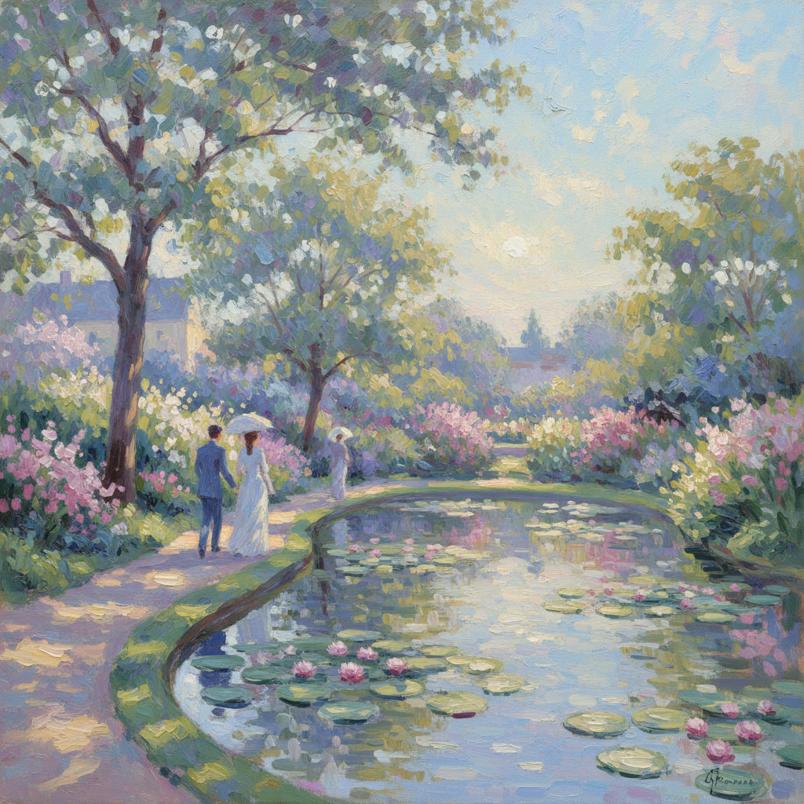

# Impressionism Painting 印象派绘画

> **时期：** 1860年代–1880年代  
> **关键词：** 光线捕捉、户外写生、瞬间印象、莫奈、色彩革命

## 概述

Impressionism（印象派）是19世纪60年代在巴黎诞生的绘画革命——画家们离开画室走向户外，用快速的笔触捕捉光线在瞬间的变化。莫奈的睡莲、雷诺阿的阳光人物、德加的芭蕾舞者——他们不再追求学院派的完美轮廓，而是记录眼睛在特定时刻、特定光线下真正看到的色彩印象。一幅画不再是永恒的真理，而是一个转瞬即逝的瞬间。

## 风格特征

- **可见笔触**：快速短促的色彩并置
- **户外光线**：自然光的真实色彩变化
- **瞬间性**：捕捉特定时刻的光影
- **色彩优先**：用色彩而非线条塑造形体
- **日常主题**：咖啡馆、花园、河流、街道

## 代表人物与作品

- 克劳德·莫奈《印象·日出》
- 皮埃尔-奥古斯特·雷诺阿《煎饼磨坊的舞会》
- 埃德加·德加 芭蕾舞者系列
- 卡米耶·毕沙罗 巴黎街景

## 概念图

