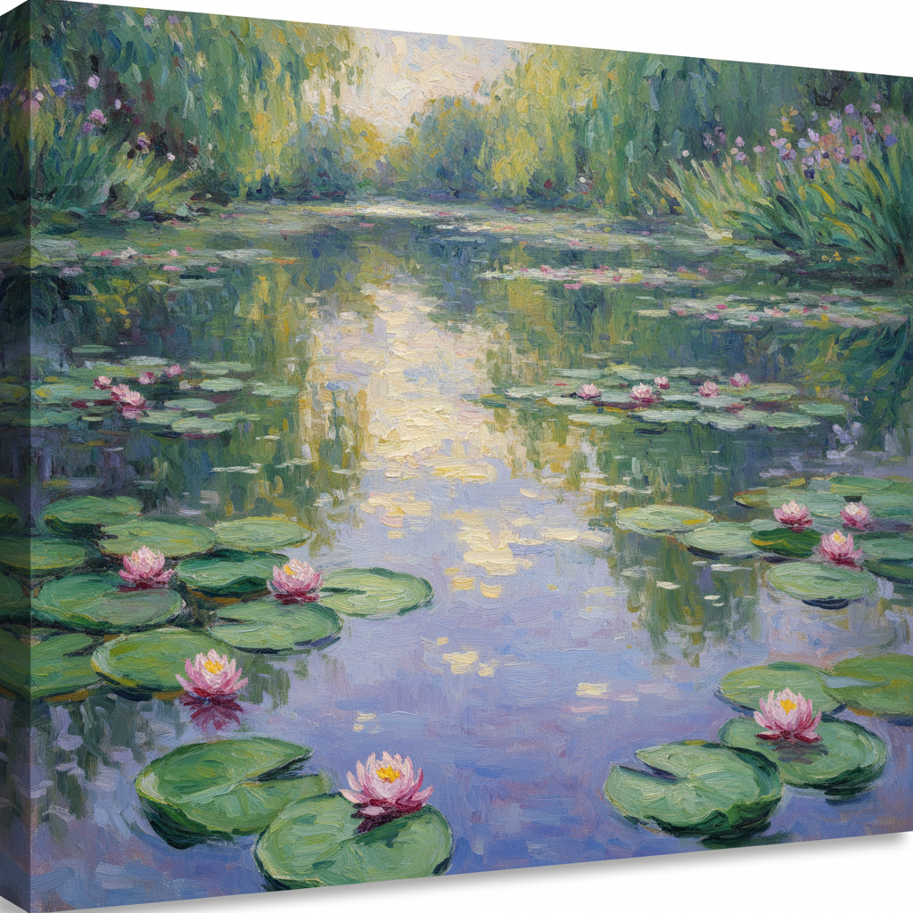

# Impressionism 印象派



> **"不画事物'是什么'——画事物'看起来像什么'——光与色彩的革命。"**

## 概述

| 维度 | 描述 |
|------|------|
| 时期 | 1860s–1880s/影响至今 |
| 别名 | Impressionism, 印象主义 |
| 核心色彩 | 光谱色、互补色并置、无黑色阴影、明亮色调 |
| 关键元素 | 可见笔触、光影变化、户外写生、瞬间捕捉、色彩分解 |
| 代表人物 | Claude Monet, Pierre-Auguste Renoir, Edgar Degas, Camille Pissarro |
| 关联风格 | Post-Impressionism, Pointillism, Plein Air, Ukiyo-e影响 |

---

## 历史脉络

| 年份 | 事件 |
|------|------|
| 1863 | 马奈《草地上的午餐》——引发争议 |
| 1872 | 莫奈《印象·日出》——"印象派"得名 |
| 1874 | 第一次印象派展览——独立于沙龙 |
| 1880s | 印象派被接受——从叛逆到经典 |
| 1886 | 最后一次印象派展览——后印象派开始 |
| 2020s | 印象派 = 全球最受欢迎的艺术风格 |

### 核心哲学

印象派的精神是**"画你看到的——而不是你知道的"**：
- 光 = 主角（"不是画物体——是画落在物体上的光"）
- 瞬间 = 真实（"世界每一秒都在变——画那一秒"）
- 户外 = 自由（"离开画室——去看真正的光"）
- 笔触 = 诚实（"不隐藏画笔的痕迹——那就是我看到的"）
- 莫奈: "我想画的是光本身"

---

## 视觉语法

### 色彩系统

```
核心原则：
  - 不用黑色画阴影（用互补色）
  - 色彩并置而非混合
  - 光谱色为主
  - 明亮、鲜活

常见色彩：
  钴蓝 (#0047AB) — 天空、水
  镉黄 (#FFF600) — 阳光
  翠绿 (#50C878) — 植物
  玫瑰红 (#FF007F) — 花、肤色

规则：
  - 互补色并置创造振动
  - 阴影用紫/蓝而非黑
  - 色彩在观者眼中混合
  - 明度优先于色相

质感：
  笔触 — 可见、短促、方向性
  光 — 闪烁、变化
  大气 — 模糊、朦胧
  水面 — 反射、碎片化
```

### 标志性元素

| 类别 | 元素 |
|------|------|
| 题材 | 风景、水面、花园、城市生活、人物 |
| 光影 | 自然光、时间变化、大气效果 |
| 笔触 | 短促、可见、方向性、碎片化 |
| 构图 | 日常视角、裁切、不对称 |
| 时间 | 瞬间、系列（同一场景不同时间） |
| 态度 | 观察、光、瞬间、自由、户外 |

---

## 与千禧怀旧的关系

### "最受欢迎的艺术风格"
- 印象派 = 全球美术馆最受欢迎的展览
- 莫奈的睡莲 = 最被复制的艺术图像之一
- "印象派的魅力在于——它让每个人都觉得'我也能感受到美'"
- AI生成中"impressionist style"是基础prompt

### 对当代视觉文化的影响
- 摄影中的"印象派"美学（散焦、光斑）
- Instagram滤镜中的印象派色调
- "印象派教会了我们：'模糊'也可以是美的"

---

## 中国语境

- 中国油画教育中印象派的核心地位
- 中国印象派画家群体
- 与中国写意画的精神对话
- 印象派展览在中国的持续热度

---

## 设计应用

| 场景 | 应用方式 |
|------|----------|
| 品牌 | 高端+艺术+自然+光+美 |
| 家居 | 装饰画+壁纸+面料+色彩 |
| 摄影 | 散焦+光斑+色彩+氛围 |
| 数字 | AI风格参考+滤镜+色彩方案 |

---

## 相关风格

← [Pre-Raphaelite 拉斐尔前派](pre-raphaelite.md) | [Post-Impressionism 后印象派](post-impressionism.md) →

↑ [返回千禧怀旧目录](README.md) | [返回总目录](../README.md)
