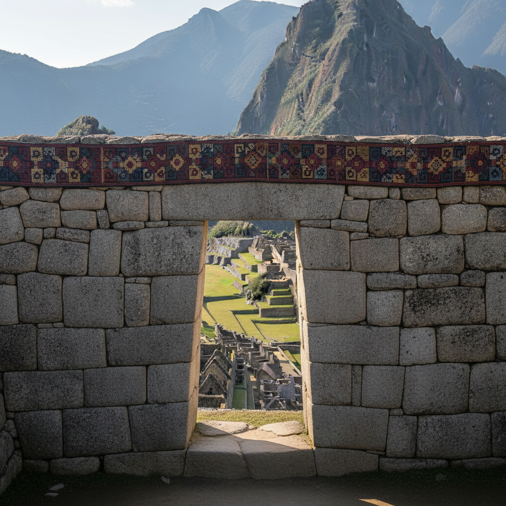

# 印加艺术 · Inca Art

> "我们用石头书写帝国的永恒，用织物编织太阳的光辉。" —— 印加传说

## 概述

印加艺术（Inca Art）是15世纪至16世纪南美洲印加帝国（塔万廷苏尤）发展出的独特视觉艺术体系。与玛雅和阿兹特克不同，印加人没有发展出书写系统或大规模的叙事性绘画，而是将艺术才华集中于建筑石工、纺织、金银工艺和陶器。印加艺术以其极致的几何精确性、材料的完美加工和帝国标准化的设计体系著称，体现了一个高度组织化文明的美学理想。

## 核心特征

| 特征 | 描述 |
|------|------|
| 时期 | 约1438年–1533年（帝国期） |
| 地域 | 秘鲁、玻利维亚、厄瓜多尔、智利北部 |
| 媒介 | 石工建筑、纺织、金银工艺、陶器、奇普（结绳） |
| 核心理念 | 以几何精确和材料完美表达帝国秩序 |
| 色彩 | 自然石色、纺织品的红黄黑白几何配色 |

## 视觉特征

- **精密石工**：巨石之间无需灰浆的完美契合
- **几何纺织**：tocapu图案——方格内的抽象几何符号
- **标准化设计**：陶器、建筑在帝国范围内高度统一
- **金银太阳崇拜**：以黄金代表太阳、白银代表月亮
- **梯田景观**：将自然地形改造为几何化的农业艺术

## 代表作品

| 作品 | 地点 | 年代 | 类型 |
|------|------|------|------|
| 马丘比丘 | 秘鲁库斯科 | 约1450 | 建筑/石工 |
| 萨克塞瓦曼城墙 | 秘鲁库斯科 | 15世纪 | 巨石建筑 |
| 太阳神庙（科里坎查） | 秘鲁库斯科 | 15世纪 | 神庙建筑 |
| Tocapu纺织品 | 帝国各地 | 15-16世纪 | 纺织 |
| 印加陶器（aryballus） | 帝国各地 | 15-16世纪 | 标准化陶器 |

## 发展时间线

| 时期 | 事件 |
|------|------|
| 约1200 | 印加人定居库斯科谷地 |
| 1438 | 帕查库特克开始帝国扩张 |
| 1450-1470 | 马丘比丘建造 |
| 1470-1530 | 帝国艺术标准化达到巅峰 |
| 1471-1493 | 图帕克·印加·尤潘基时期，帝国最大版图 |
| 1533 | 西班牙征服，印加帝国终结 |
| 当代 | 印加遗产在安第斯当代艺术中延续 |

## 中国语境

印加艺术与中国古代工程文明有深层的结构性相似。两者都以国家力量组织大规模建筑工程（长城与印加道路系统）；都发展出了精密的纺织传统（中国丝绸与印加tocapu）；都以标准化的器物设计服务帝国管理。印加结绳记事（奇普）与中国上古"结绳记事"的传说形成有趣的跨文化呼应。当代中秘文化交流中，两国古代文明的比较是重要议题。

## AI 概念图

*AI 生成概念图：印加艺术风格*

## 关联词条

- [[aztec-art]] - 阿兹特克艺术
- [[mayan-art]] - 玛雅艺术
- [[maori-art]] - 毛利艺术

---

*浮光艺志 · Chronicle of Artistry*
