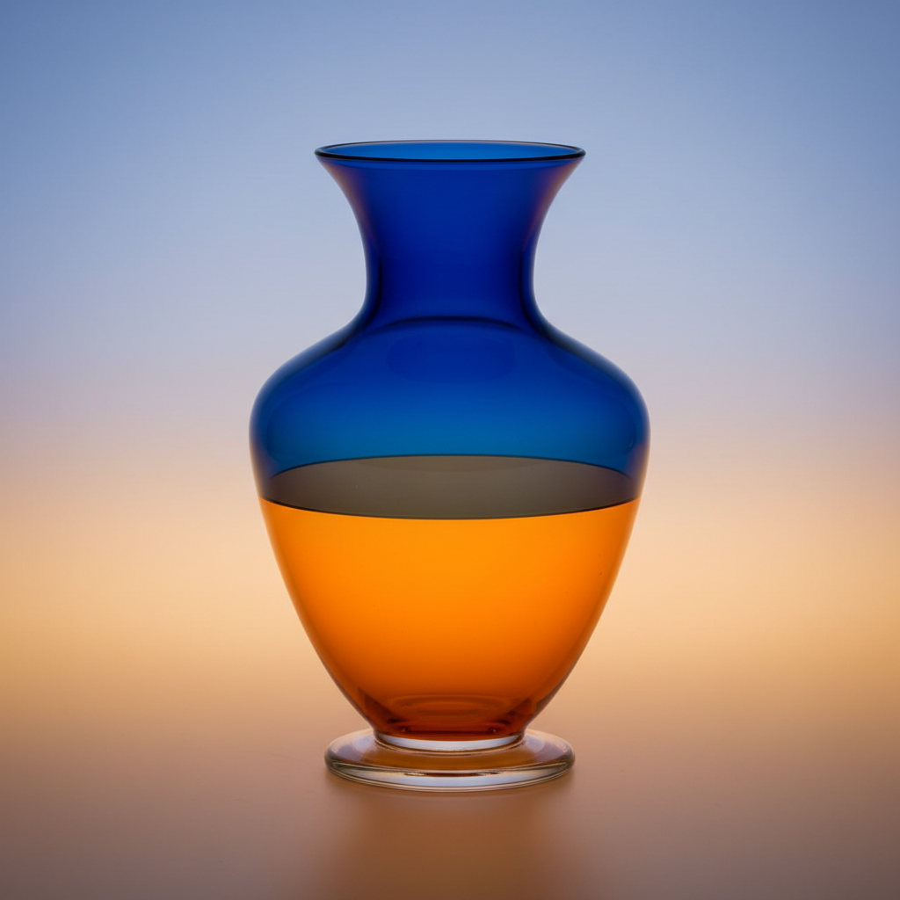

# Incalmo Art 接合玻璃艺术

> "Incalmo is the marriage of two bubbles — separately blown glass forms, each a different color or pattern, are cut while hot and joined rim to rim so precisely that the seam becomes invisible, creating vessels that shift from one world of color to another at a single horizontal line, as if two different skies had been stitched together at the horizon." — Unknown

## 概述

接合玻璃艺术（Incalmo Art）是一种将两个或多个分别吹制的玻璃泡在热态下精确接合的高难度技法——每个玻璃泡可以有不同的颜色、图案或质感，接合后形成一个完整的器物，在接合线处从一种颜色或图案过渡到另一种，创造出独特的视觉效果。Incalmo要求极高的技术精度，因为两个泡的直径必须完全匹配。

接合玻璃艺术的实践包括：1）分别吹制——分别吹制两个或多个玻璃泡；2）直径匹配——确保接合处直径完全一致；3）热态切割——在热态下切割开口；4）精确接合——将两个泡精确对接；5）融合——加热使接合处完全融合；6）多段接合——接合三个或更多段；7）当代接合——将传统技法与现代创作结合。

## 核心特征

| 特征 | 描述 |
|------|------|
| 接合 | 两个玻璃泡的接合 |
| 精确 | 极高的精度要求 |
| 双色 | 不同颜色的组合 |
| 水平线 | 清晰的水平分界线 |
| 难度 | 极高的技术难度 |
| 对比 | 色彩和图案的对比 |

## 视觉特征

- **分界**：清晰的水平分界线
- **双色**：两种不同颜色的组合
- **对比**：强烈的色彩对比
- **整体**：接合后的完整统一
- **精确**：看不见接缝的精确
- **大胆**：大胆的色彩组合

## 代表作品

| 作品 | 艺术家/文化 | 年代 | 意义 |
|------|-------------|------|------|
| *Murano incalmo vessels* | 意大利 | 16世纪起 | 穆拉诺接合玻璃器 |
| *Lino Tagliapietra incalmo* | 意大利 | 当代 | 塔利亚皮耶特拉接合作品 |
| *Richard Marquis incalmo* | 美国 | 当代 | 理查德·马奎斯接合作品 |
| *Dante Marioni incalmo* | 美国 | 当代 | 但丁·马里奥尼接合作品 |
| *Contemporary incalmo* | 国际 | 当代 | 当代接合玻璃 |

## 历史时间线

| 时期 | 事件 |
|------|------|
| 16世纪 | 接合技法在穆拉诺发展 |
| 17-18世纪 | 技法的延续 |
| 20世纪 | 工作室玻璃运动的传播 |
| 1970年代 | 美国玻璃艺术家学习接合 |
| 当代 | 全球玻璃艺术家的实践 |

## 中国语境

接合玻璃与中国的当代玻璃艺术有一定的关联。中国的套料玻璃——虽然技法不同但有类似的多色组合理念。中国当代的玻璃艺术教育中，incalmo作为高级吹制技法——在相关课程中教授。中国的玻璃艺术家——有一些学习和实践incalmo技法。中国的玻璃艺术展览中，incalmo作品——在国际交流展中展示。中国的工艺美术院校——邀请国际玻璃大师进行incalmo工作坊。

## AI生成概念图

## 与其他风格的关系

- **Filigrana** → 玻璃丝装饰
- **Zanfirico** → 赞菲里科
- **Murano Glass** → 穆拉诺玻璃
- **Studio Glass** → 工作室玻璃
- **Color Field** → 色域绘画
- **Blown Glass** → 吹制玻璃

---

*浮光艺志 | Chronicle of Artistry*
