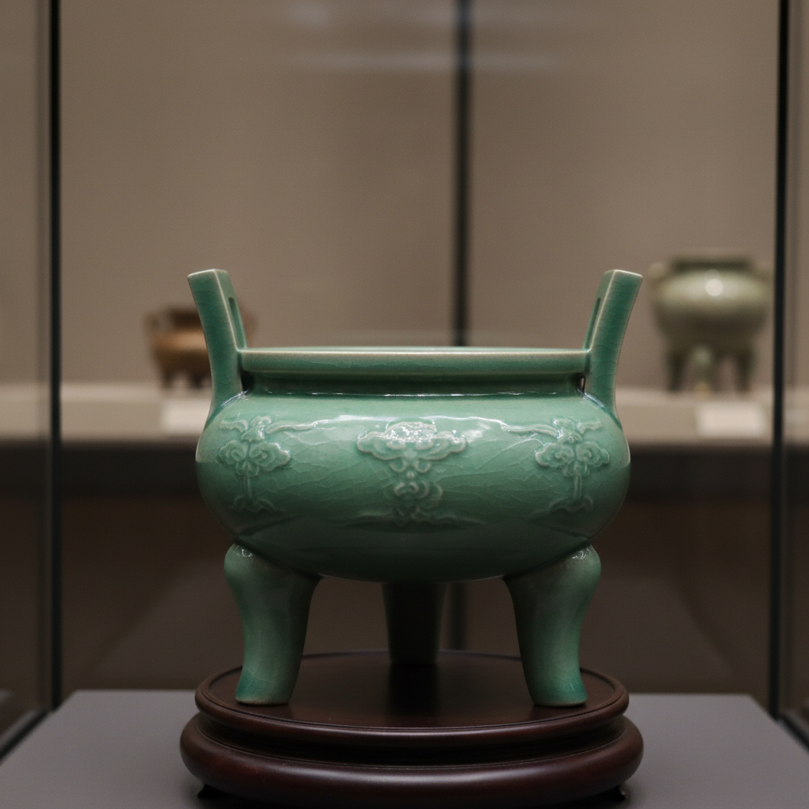

# Incense Burner Art 香炉艺术

> "The incense burner is ceramics in service of the invisible — a vessel designed not to hold liquid or food but to transform solid matter into fragrant smoke, its form shaped by the need to contain fire without burning, to release scent without releasing ash, to be beautiful enough to sit at the center of meditation or ceremony, a bridge between the material world of clay and the immaterial world of perfume." — Unknown

## 概述

香炉艺术（Incense Burner Art）是一种以焚香器具为核心的陶瓷艺术形式。香炉是东亚文化中最重要的礼器和文房用品之一——从宗教祭祀到文人雅趣，从宫廷仪式到日常生活，香炉承载着丰富的文化内涵。陶瓷香炉的设计需要兼顾功能（容纳香灰、散发香气、隔热安全）和美学（造型优雅、与环境协调），是陶瓷艺术中功能与审美高度统一的典范。

香炉艺术的核心要素包括：1）功能设计——容纳香灰、散发香气；2）隔热结构——防止底部过热；3）通风设计——允许空气流通助燃；4）造型美学——优雅的器形设计；5）文化象征——宗教和文化的象征意义；6）材质选择——耐热的陶瓷材质；7）装饰艺术——精美的表面装饰。

## 核心特征

| 特征 | 描述 |
|------|------|
| 功能与美 | 功能和审美的高度统一 |
| 文化载体 | 承载宗教和文化内涵 |
| 造型多样 | 从简约到繁复的造型 |
| 耐热材质 | 需要耐高温的材料 |
| 通风设计 | 精巧的通风结构 |
| 仪式感 | 焚香仪式的核心器具 |

## 视觉特征

- **三足造型**：传统的三足鼎式
- **镂空装饰**：精美的镂空图案
- **盖钮设计**：各种造型的盖钮
- **兽形造型**：动物造型的香炉
- **简约线条**：文人风格的简约造型
- **釉色沉稳**：沉稳典雅的釉色

## 代表作品

| 作品 | 艺术家/文化 | 年代 | 意义 |
|------|-------------|------|------|
| *汝窑三足香炉* | 中国汝窑 | 宋代 | 宋代香炉的极致 |
| *龙泉窑鬲式炉* | 中国龙泉 | 宋代 | 青瓷香炉经典 |
| *宣德炉* | 中国明代 | 15世纪 | 铜香炉的巅峰 |
| *日本香道具* | 日本 | 各时期 | 日本香道器具 |
| *当代香炉* | 各地陶艺家 | 当代 | 香炉的当代诠释 |

## 历史时间线

| 时期 | 事件 |
|------|------|
| 商周 | 中国最早的陶瓷香炉 |
| 汉代 | 博山炉等香炉形制确立 |
| 宋代 | 文人香炉美学的巅峰 |
| 明清 | 香炉形制的丰富发展 |
| 当代 | 香道复兴与香炉艺术 |

## 中国语境

香炉在中国文化中有极其重要的地位——从祭祀礼器到文房清供，从佛教法器到道教仪具。中国的陶瓷香炉传统极为丰富：宋代的汝窑、官窑、龙泉窑都烧制了大量精美的香炉；明代的宣德炉虽为铜器，但其造型深刻影响了陶瓷香炉的设计。中国文人对香炉有特殊的情感——"焚香读书""品茗焚香"是文人生活的重要组成。中国当代正在经历香道文化的复兴——越来越多的人开始品香、藏香，带动了当代香炉创作的繁荣。中国陶艺家将传统香炉造型与当代审美结合，创造出既有古意又有新意的作品。

## AI生成概念图

## 与其他风格的关系

- **Celadon** → 青瓷
- **Ritual Vessel** → 礼器
- **Scholar's Object** → 文房器
- **Buddhist Art** → 佛教艺术
- **Pierced Decoration** → 镂空装饰
- **Bronze Vessel** → 青铜器

---

*浮光艺志 | Chronicle of Artistry*
