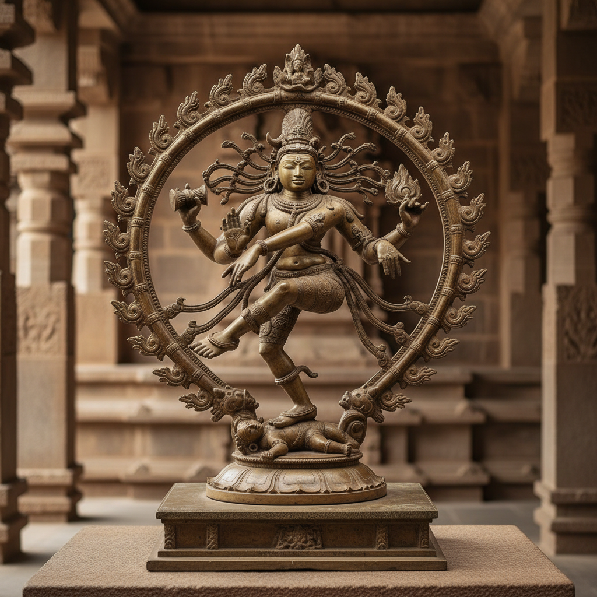

# 印度艺术 · Indian Art

> "艺术是通往神圣的桥梁，每一尊造像都是宇宙真理的显现。" —— 《毗湿奴法论》

## 概述

印度艺术（Indian Art）是南亚次大陆五千年来发展出的极其丰富的视觉艺术传统，涵盖印度教、佛教、耆那教和伊斯兰教等多元宗教文化。从印度河文明的印章雕刻到阿旃陀石窟壁画，从朱罗王朝的青铜舞王到拉贾斯坦的细密画，印度艺术以其精神性深度、叙事性丰富和装饰性华美著称。印度艺术通过佛教传播深刻影响了中国、日本、东南亚的视觉文化。

## 核心特征

| 特征 | 描述 |
|------|------|
| 时期 | 约前3000年–至今 |
| 地域 | 南亚次大陆（印度、巴基斯坦、斯里兰卡、尼泊尔） |
| 媒介 | 石雕、青铜、壁画、细密画、纺织、建筑 |
| 核心理念 | 以视觉形式表达宗教哲学与宇宙秩序 |
| 色彩 | 朱红、金色、群青、翠绿、藏红花黄 |

## 视觉特征

- **丰满的人体**：圆润饱满的身体表达生命力和丰饶
- **多臂多面**：神灵的多重手臂象征无限力量
- **S形体态（Tribhanga）**：三折式优美身姿
- **叙事性浮雕**：寺庙外墙密布的神话故事浮雕
- **曼陀罗构图**：以中心对称的宇宙图式组织画面

## 代表作品

| 作品 | 地点/时期 | 年代 | 类型 |
|------|-----------|------|------|
| 阿旃陀石窟壁画 | 马哈拉施特拉 | 前2世纪-6世纪 | 壁画 |
| 桑奇大塔浮雕 | 中央邦 | 前1世纪 | 石雕 |
| 朱罗青铜舞王湿婆 | 泰米尔纳德 | 11世纪 | 青铜 |
| 卡朱拉霍寺庙雕塑 | 中央邦 | 10-11世纪 | 建筑雕塑 |
| 拉贾斯坦细密画 | 拉贾斯坦 | 16-19世纪 | 细密画 |

## 发展时间线

| 时期 | 事件 |
|------|------|
| 前3000-1500 | 印度河文明，最早的印章和陶器 |
| 前3世纪 | 阿育王时期，佛教艺术兴起 |
| 1-3世纪 | 犍陀罗和马图拉，佛像创造 |
| 4-6世纪 | 笈多王朝，印度古典艺术黄金时代 |
| 7-13世纪 | 南印度朱罗王朝青铜艺术巅峰 |
| 16-19世纪 | 莫卧儿和拉杰普特细密画 |
| 当代 | 印度当代艺术在全球市场崛起 |

## 中国语境

印度艺术对中国的影响极为深远，主要通过佛教艺术传播。犍陀罗和马图拉的佛像样式经丝绸之路传入中国，直接影响了云冈、龙门石窟的造像风格。敦煌壁画中的飞天、本生故事画法源自阿旃陀传统。唐代佛教艺术的繁荣是中印艺术交流的巅峰。当代中印文化交流中，两国古代艺术的比较研究和联合展览日益增多。

## AI 概念图

*AI 生成概念图：印度艺术风格*

## 关联词条

- [[mughal-miniature-art]] - 莫卧儿细密画
- [[tibetan-art]] - 藏传佛教艺术
- [[persian-miniature-art]] - 波斯细密画

---

*浮光艺志 · Chronicle of Artistry*
