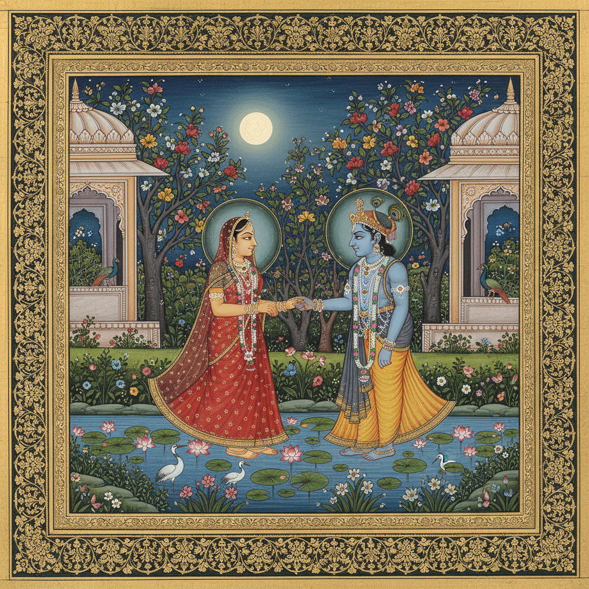

# Indian Miniature Painting 印度细密画

> **"音乐的绘画——将听觉的旋律转化为视觉的诗篇。"** —— 拉格马拉传统

## 概述

印度细密画（Indian Miniature Painting）是16至19世纪在印度次大陆繁荣发展的精致绘画传统，涵盖莫卧儿画派（Mughal）、拉杰普特画派（Rajput）、帕哈里画派（Pahari/Kangra）和德干画派（Deccan）等多个流派。这些小尺幅的精美画作以矿物颜料绘制在手工磨光的纸面上，题材从帝王功绩到神话爱情，从宫廷生活到音乐图解，构成了世界艺术史上独特的视觉叙事传统。

## 主要画派

### 莫卧儿画派 (Mughal, 1526–1858)
- **特征**：写实精细、宫廷雅致、透视技法
- **题材**：帝王肖像、宫廷场景、自然写生、历史事件
- **代表**：阿克巴时期的《阿克巴纳玛》插图
- **巅峰**：贾汉吉尔时期（对自然的精确观察）

### 拉杰普特画派 (Rajput, 16th–19th c.)
- **特征**：色彩强烈、写意抒情、装饰性强
- **题材**：黑天（Krishna）与牧女拉达的爱情、印度史诗
- **分支**：拉贾斯坦尼派（平原派）、帕哈里派（山区派）
- **独特题材**：《拉格马拉》——将音乐调式视觉化

### 帕哈里/康格拉画派 (Pahari/Kangra, 17th–19th c.)
- **特征**：线条纤细、色彩微妙、抒情优美
- **题材**：奎师那传说、自然风光与人物融为一体
- **代表**：Nainsukh 和 Manaku 家族的杰作
- **风格**：被誉为印度细密画的抒情巅峰

### 德干画派 (Deccan, 16th–17th c.)
- **特征**：构图复杂、色彩奢华、波斯影响
- **题材**：宫廷生活、诗歌插图
- **特色**：融合波斯、土耳其与本土元素

## 技法特征

- **画材**：手工特制画纸（vasli），用玛瑙或象牙磨石压平
- **颜料**：矿物颜色与有机质颜料，以粘合剂调制
- **工具**：单根松鼠毛制成的极细画笔
- **工序**：起草（师傅）→ 着色（徒弟）→ 精修（师傅）
- **金箔**：大量使用金色装饰边框和细节

## 视觉特征

- 小尺幅中的极致精细（通常10–30cm）
- 鲜艳饱和的矿物色彩
- 平面化构图与装饰性边框
- 人物的程式化造型（侧面像为主）
- 自然景观的诗意化处理
- 金色云纹分割时空场景

## 与其他风格的关系

| 风格 | 关系 |
|------|------|
| 波斯细密画 | 直接源流，莫卧儿画派的基础 |
| 中国工笔画 | 共享精细线描与矿物颜料传统 |
| 日本浮世绘 | 共享平面化构图与装饰性 |
| 拉斐尔前派 | 共享对细节的极致追求 |
| 当代插画 | 印度细密画的叙事性影响当代南亚插画 |

## 遗产

- 启发了20世纪印度艺术民族主义运动
- 阿姆丽塔·谢尔-吉尔融合细密画传统与现代构成
- 联合国教科文组织"世界记忆遗产"亚洲区候选
- 当代艺术家如 Shahzia Sikander 将细密画传统带入当代语境

## 概念图

---

*浮光艺志 | Chronicle of Artistry*
