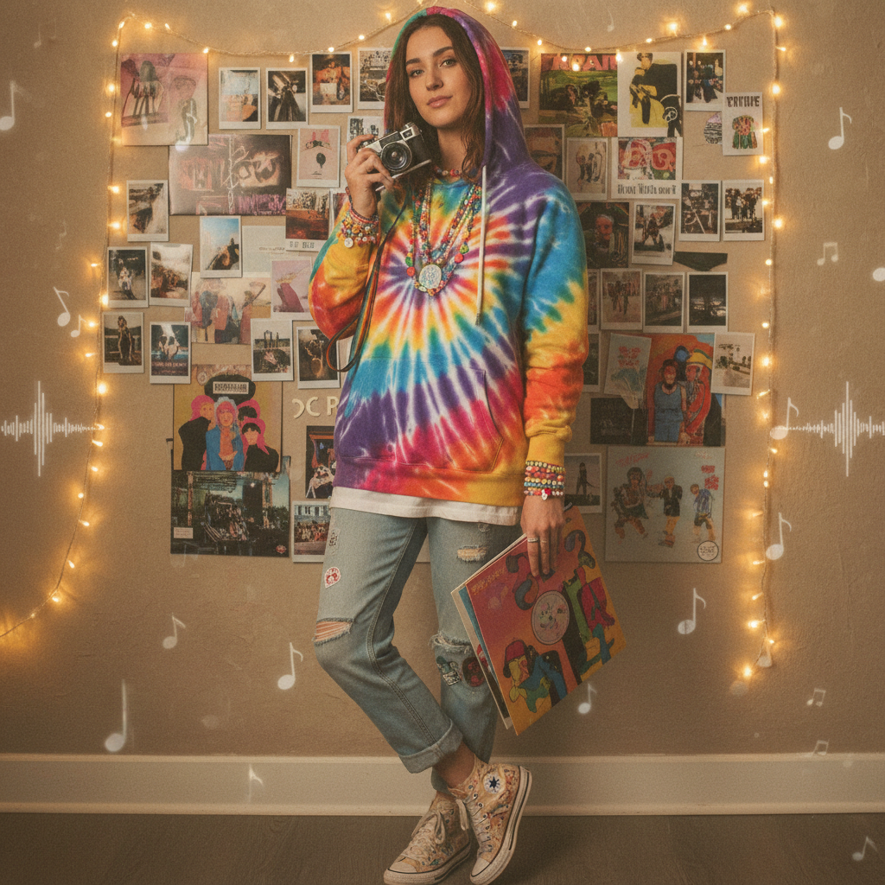
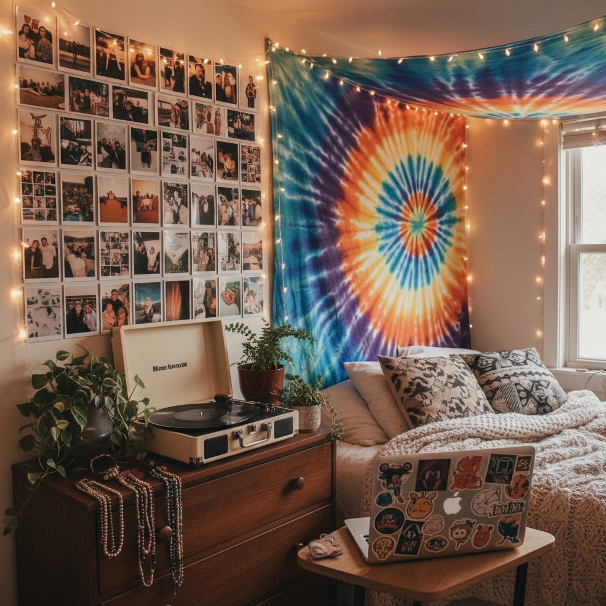

# Indie Kid 独立小孩





> **"彩色珠串、扎染卫衣和胶片相机——TikTok 世代对 2010s 独立文化的甜美重塑。"**

## 概述

| 维度 | 描述 |
|------|------|
| 时期 | 2020–至今 |
| 别名 | Indie Kid, TikTok Indie, Neo-Indie, Indie Aesthetic |
| 核心色彩 | 彩虹色珠串、扎染色、牛仔蓝、复古棕 |
| 关键元素 | 彩色珠串项链、扎染、胶片相机、黑胶唱片、帆布鞋 |
| 代表人物 | Conan Gray, Clairo, Beabadoobee, Girl in Red |
| 关联风格 | Twee, Kidcore, Pale Grunge, E-Girl (对立面) |

---

## 历史脉络

### 2020：TikTok 的独立音乐复兴

Indie Kid 美学在 2020 年从 TikTok 上出现，是 Z 世代对"独立音乐文化"的重新想象：

**与前辈的区别**：
- 2000s Indie：Arctic Monkeys、The Strokes → 酷、冷、不在乎
- 2010s Indie：Tame Impala、Mac DeMarco → 迷幻、懒散
- 2020s Indie Kid：Clairo、Beabadoobee → 甜美、彩色、可爱

Indie Kid 保留了"独立音乐"的标签，但去掉了传统独立文化的"酷"和"不在乎"，加入了更多色彩和可爱元素。

### 核心特征

Indie Kid 的独特之处在于它是**多种美学的混合体**：
- Kidcore 的彩色珠串和童趣
- Twee 的复古相机和独立书店
- Pale Grunge 的 Doc Martens 和band tee
- 但比以上任何一种都更**明亮、更乐观**

### 2021–至今：稳定存在

Indie Kid 没有像某些美学那样迅速消退，而是成为了 Z 世代的一种**稳定的身份选项**：
- 不像 E-Girl 那么极端
- 不像 Clean Girl 那么无聊
- 不像 Dark Academia 那么严肃
- 是一种"刚刚好"的个性表达

---

## 视觉语法

### 色彩系统

```
主色（温暖、复古、但明亮）：
  扎染色系 — 紫+粉+蓝的渐变
  复古棕 (#D2691E) — 灯芯绒、皮革
  牛仔蓝 (#4169E1) — 牛仔裤、牛仔夹克
  草绿 (#32CD32) — 自然、植物
  暖黄 (#FFD700) — 向日葵、笑脸

配饰色：
  彩虹珠串 — 多色混合
  白色 — 帆布鞋、T恤
  黑色 — band tee

质感：
  扎染 — 手工感
  灯芯绒 — 复古触感
  牛仔 — 经典
  针织 — 手工毛衣
```

### 标志性元素

| 类别 | 元素 |
|------|------|
| 配饰 | 彩色珠串项链/手链（最标志性）、蘑菇/花朵吊坠 |
| 上衣 | 扎染卫衣、band tee、灯芯绒衬衫、针织背心 |
| 下装 | 宽松牛仔裤、灯芯绒裤、百褶裙 |
| 鞋 | Converse、Vans、Doc Martens |
| 物品 | 胶片相机、黑胶唱片、贴纸、手工饰品 |
| 空间 | 照片墙、LED灯串、植物、唱片架 |
| 音乐 | Bedroom pop、Dream pop、Lo-fi indie |

---

## 与千禧怀旧的关系

Indie Kid 怀念的是**2000s–2010s 的独立音乐黄金时代**：
- MySpace 时代的独立乐队发现
- 独立唱片店的实体体验
- 胶片相机的"不完美"美学
- 在互联网还不那么算法化时，自己发现音乐的快乐

---

## 中国语境

- 小红书上的"文艺穿搭"
- 独立音乐节（草莓、迷笛）的穿搭文化
- 胶片相机在中国年轻人中的复兴
- 手工珠串/手链 DIY 热潮
- 与"小清新"文化的延续

---

## 设计应用

| 场景 | 应用方式 |
|------|----------|
| 品牌设计 | 手写字体+扎染色+复古插画 |
| 包装 | 牛皮纸+贴纸+手工感 |
| 摄影 | 胶片质感+自然光+彩色道具 |
| 社交媒体 | 拼贴风格+手绘元素+暖色滤镜 |

---

## 延伸阅读

- Aesthetics Wiki: [Indie Kid](https://aesthetics.fandom.com/wiki/Indie_Kid)
- TikTok #indiekid 标签分析
- Bedroom Pop 音乐与视觉美学的关系

---

## 相关风格

← [Twee 小清新独立](twee.md) | [Kidcore 童年核](kidcore.md) →

↑ [返回千禧怀旧目录](README.md) | [返回总目录](../README.md)
