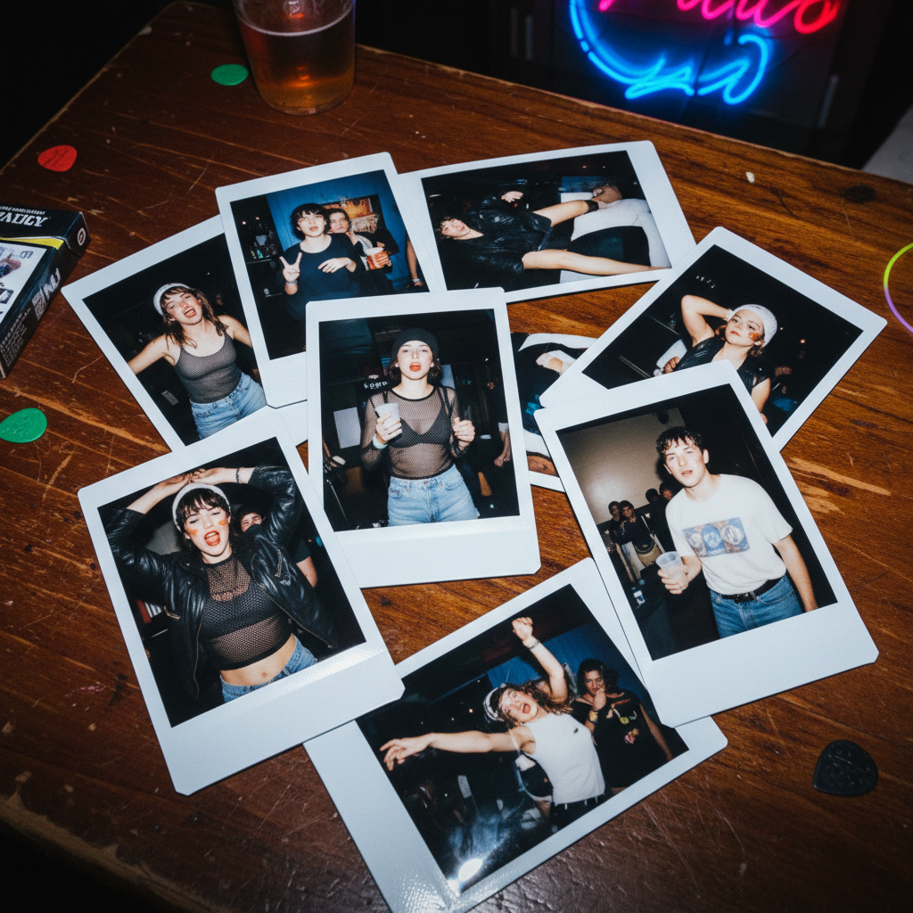

# Indie Sleaze 独立颓废



> **"闪光片、American Apparel、派对上的宝丽来——2007–2012年那段'不在乎'的黄金时代。"**

## 概述

| 维度 | 描述 |
|------|------|
| 时期 | 2007–2012 原始 / 2022–至今 复兴 |
| 别名 | Indie Sleaze, Hipster Era, Tumblr Party Era |
| 核心色彩 | 闪光金、黑色、红色、霓虹、过曝白 |
| 关键元素 | 闪光片、宝丽来、派对、American Apparel、混乱 |
| 代表人物 | The Cobrasnake、Cory Kennedy、MGMT、Skins |
| 关联风格 | Hipster, Nu-Rave, Grunge Revival, Y2K |

---

## 历史脉络

### 2007–2012：最后的"线下"派对时代

| 年份 | 事件 |
|------|------|
| 2007 | iPhone 发布，但社交媒体还没"毒化" |
| 2007–09 | The Cobrasnake 派对摄影定义视觉 |
| 2008 | American Apparel 的鼎盛期 |
| 2010 | Tumblr 成为美学中心 |
| 2012 | Instagram 崛起，"精致"取代"混乱" |
| 2022 | Indie Sleaze 复兴——怀念"不在乎"的时代 |

### 它代表什么？

| 元素 | 含义 |
|------|------|
| 闪光片 | 派对、不在乎、短暂的美 |
| 宝丽来 | 瞬间、不可编辑、真实 |
| 过曝闪光灯 | 业余、真实、不完美 |
| American Apparel | 简单但性感、DIY精神 |
| 混乱 | 年轻、自由、不需要"策展" |

### 核心哲学

Indie Sleaze 的精神是**"在Instagram之前，我们不需要'好看'"**：
- 照片可以模糊、过曝、构图糟糕——因为它是真实的
- 派对不需要"打卡"——只需要在场
- 时尚不需要"搭配"——只需要有趣
- 社交不需要"个人品牌"——只需要好玩
- 这是社交媒体"精致化"之前的最后一个时代

---

## 视觉语法

### 色彩系统

```
主色：
  闪光金 (#FFD700) — 派对、闪光片
  黑色 (#000000) — 夜晚、皮夹克
  红色 (#FF0000) — 口红、能量
  霓虹 (各色) — 派对灯光
  过曝白 (#FFFFFF) — 闪光灯

规则：
  - 高对比度（闪光灯效果）
  - 过曝是特色不是错误
  - 颗粒感（胶片/低光）
  - 色彩溢出
  - 不追求"好看"的构图

质感：
  闪光片 — 反射、碎片
  胶片 — 颗粒、色偏
  汗水 — 派对、身体
  烟雾 — 夜店、模糊
  宝丽来 — 即时、褪色
```

### 标志性元素

| 类别 | 元素 |
|------|------|
| 摄影 | 闪光灯直闪、过曝、模糊、宝丽来 |
| 时尚 | American Apparel、闪光片、皮夹克、紧身裤 |
| 场景 | 派对、后台、公寓、屋顶 |
| 配饰 | 大墨镜、头带、廉价珠宝 |
| 态度 | 不在乎、混乱、真实、年轻 |
| 音乐 | MGMT、The Strokes、Crystal Castles |

---

## 与千禧怀旧的关系

### "最后的纯真"
- 2007–2012 = 社交媒体存在但还没"有毒"
- 没有算法、没有"个人品牌"、没有"内容创作者"
- 照片是为了记录，不是为了"发布"
- 这是千禧一代的"青春期"——混乱但自由

### 2022 的复兴
- Z世代发现了这个时代的照片
- "为什么他们看起来这么自由？"
- 对 Instagram 精致文化的反叛
- "我想回到不需要修图的时代"

---

## 中国语境

- "独立颓废"/"Indie Sleaze"在小红书的讨论
- 与中国 2008–2012 的"非主流"时代的对比
- 豆瓣/人人网时代的派对文化
- 北京/上海独立音乐场景的视觉记忆
- 与"Y2K复古"的交叉

---

## 设计应用

| 场景 | 应用方式 |
|------|----------|
| 摄影 | 闪光灯直闪+过曝+胶片质感+不完美构图 |
| 品牌 | 手写字体+闪光片+派对感+不精致 |
| 时尚 | 混搭+闪光+皮革+不在乎的态度 |
| 数字 | 胶片滤镜+噪点+过曝+手写 |

---

## 相关风格

← [Grunge Revival 垃圾摇滚复兴](grunge-revival.md) | [Nu-Rave 新锐舞](nu-rave.md) →

↑ [返回千禧怀旧目录](README.md) | [返回总目录](../README.md)
