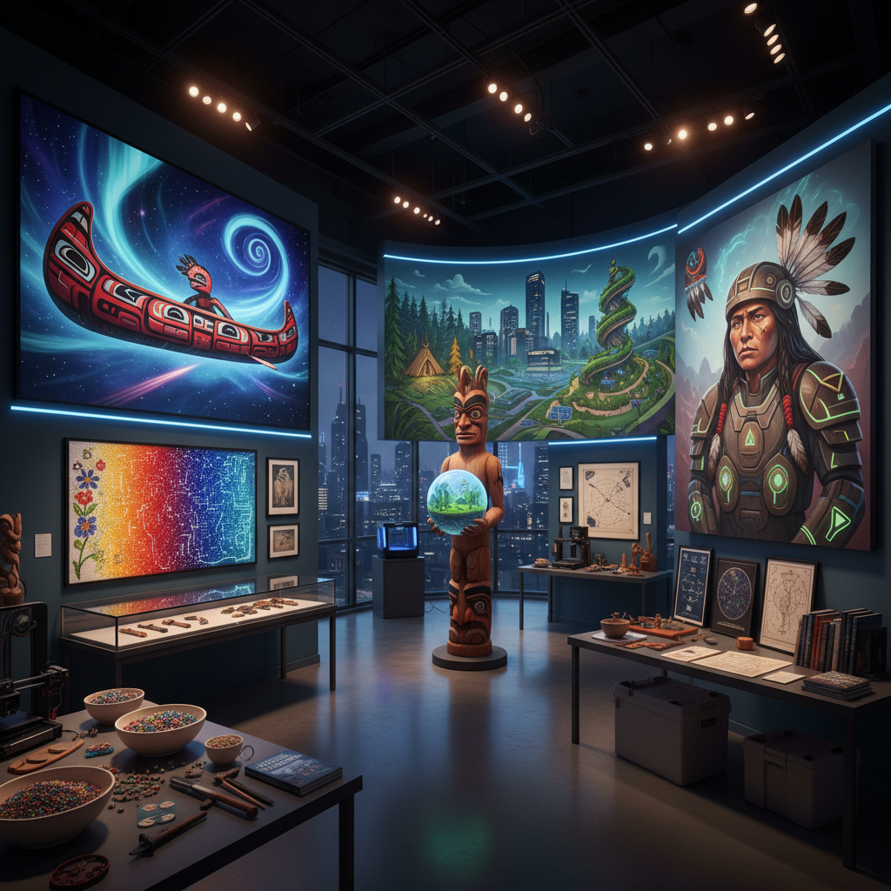

# Indigenous Futurism Art 原住民未来主义艺术

> "Indigenous Futurism imagines futures where Indigenous peoples not only survive but thrive — where traditional knowledge systems and technologies are not relics of the past but blueprints for tomorrow, where the starship is a canoe and the AI speaks in ancestral tongues, where colonialism is not the end of the story but a chapter that has been overcome, where beadwork patterns become circuit boards and dreamtime narratives become science fiction, a movement that refuses the colonial narrative that Indigenous cultures are frozen in an ethnographic past and instead asserts their rightful place in every possible future." — Unknown

## 概述

原住民未来主义（Indigenous Futurism）是2000年代以来发展起来的一个文化和艺术运动，由原住民艺术家、作家和思想家主导，想象原住民在未来世界中的存在和繁荣。这一概念由Anishinaabe学者Grace Dillon在2012年的选集《Walking the Clouds》中正式命名，但其实践可追溯到更早。

原住民未来主义拒绝将原住民文化固定在"过去"的殖民叙事中，主张原住民的知识体系、技术和世界观不仅与未来兼容，而且对解决当代危机（气候变化、生态崩溃、社会不平等）至关重要。在视觉艺术领域，原住民未来主义融合了传统图案、材料和叙事与科幻、数字技术和未来想象，创造出独特的视觉语言。代表艺术家包括Jeffrey Veregge、Skawennati、Kent Monkman等。

## 核心特征

| 特征 | 描述 |
|------|------|
| 未来 | 原住民的未来想象 |
| 传统 | 传统知识的延续 |
| 科幻 | 科幻与原住民叙事 |
| 主权 | 文化和技术主权 |
| 时间 | 非线性的时间观 |
| 生态 | 生态智慧的未来化 |

## 视觉特征

- **图案**：传统图案与科技元素融合
- **宇宙**：星空和宇宙旅行
- **动物**：图腾动物的未来化
- **珠饰**：珠饰图案作为电路
- **面具**：传统面具与科幻头盔
- **土地**：土地和星球的连接

## 代表作品

| 作品 | 艺术家 | 年代 | 意义 |
|------|--------|------|------|
| *TimeTraveller™* | Skawennati | 2008-13 | 虚拟世界中的原住民时间旅行 |
| *Salish Geek art* | Jeffrey Veregge | 2010年代 | 西北海岸风格的流行文化 |
| *Shame and Prejudice* | Kent Monkman | 2017 | 重写加拿大历史 |
| *Walking the Clouds* | Grace Dillon (ed.) | 2012 | 原住民科幻选集 |
| *Reservation Dogs* | Sterlin Harjo | 2021 | 原住民未来主义影视 |

## 历史时间线

| 时期 | 事件 |
|------|------|
| 1970年代 | 原住民科幻文学的早期作品 |
| 2000年代 | 原住民未来主义的视觉化 |
| 2012 | Grace Dillon命名运动 |
| 2010年代 | 全球原住民未来主义的扩展 |
| 当代 | 主流文化的认可 |

## 中国语境

原住民未来主义在中国的直接对应是对少数民族文化未来性的想象。中国有55个少数民族，每个民族都有独特的文化传统和知识体系。如何想象这些文化在未来世界中的存在和发展——而非将它们固定在"民族风情"的过去——是一个重要的文化问题。中国的一些少数民族艺术家和设计师正在探索类似的实践：将传统图案、材料和叙事与当代技术和未来想象结合。中国的科幻文学中也有越来越多的非汉族视角和多元文化想象。

## AI生成概念图

## 与其他风格的关系

- **Afrofuturism** → 非洲未来主义
- **Solarpunk** → 太阳朋克
- **Science Fiction Art** → 科幻艺术
- **Traditional Art** → 传统艺术
- **Decolonial Art** → 去殖民艺术
- **Eco Art** → 生态艺术

---

*浮光艺志 | Chronicle of Artistry*
