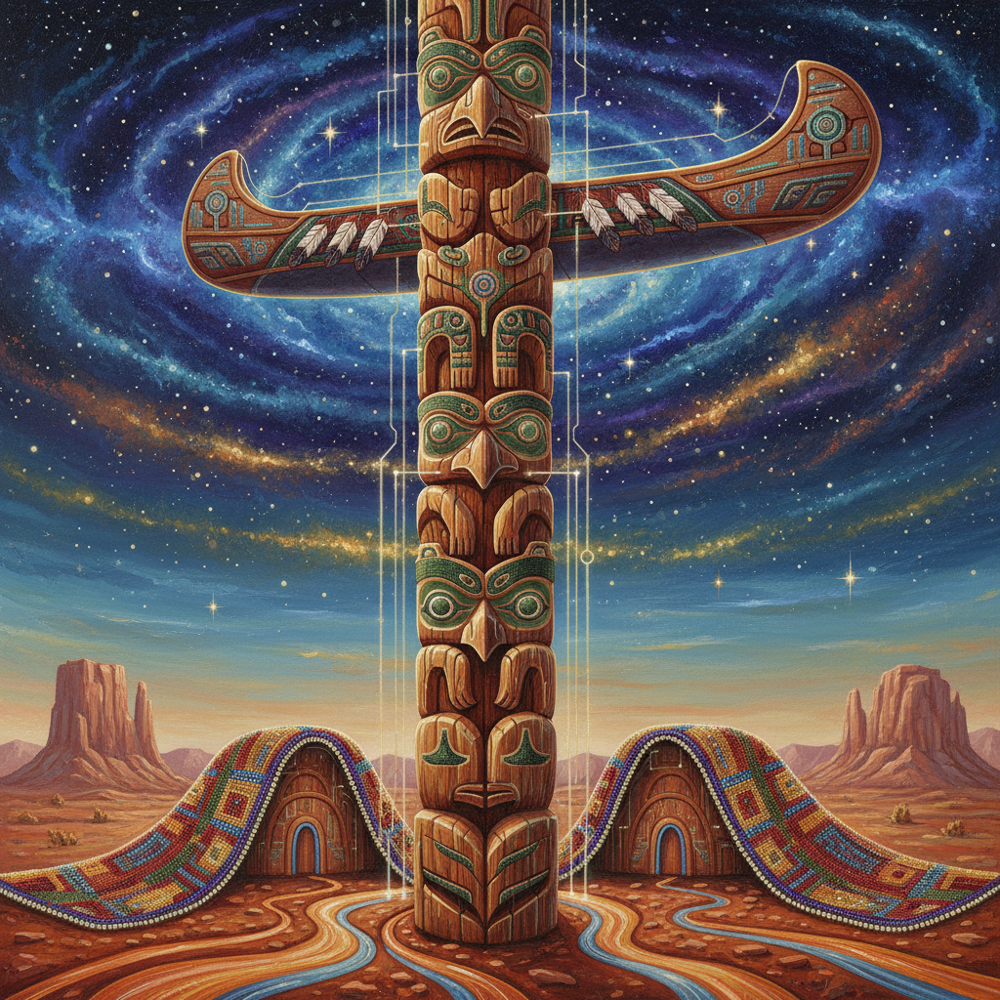

# Indigenous Futurism 原住民未来主义

> **时期：** 2010年代–至今  
> **关键词：** 原住民科幻、传统知识+未来想象、去殖民化、时间主权、祖先技术

## 概述

原住民未来主义（Indigenous Futurism）是原住民艺术家们用科幻、奇幻和推测性叙事来想象原住民主导的未来世界。它拒绝将原住民文化固定在"过去"——相反，它将传统知识体系视为先进技术，将祖先智慧与星际旅行、AI、基因工程等未来主题融合，创造出殖民叙事之外的时间线。

## 风格特征

- **时间非线性**：过去、现在、未来同时存在
- **传统+科技**：珠饰图案与电路板、图腾与太空船
- **去殖民叙事**：想象没有殖民的平行世界
- **土地连接**：即使在太空中也保持与土地的关系
- **口述传统**：故事讲述作为技术传承

## 代表人物与作品

- Lindsay Nixon 原住民未来主义理论
- Skawennati 虚拟世界machinima
- Jeffrey Veregge 原住民风格科幻插画
- Weshoyot Alvitre 原住民漫画

## 概念图

