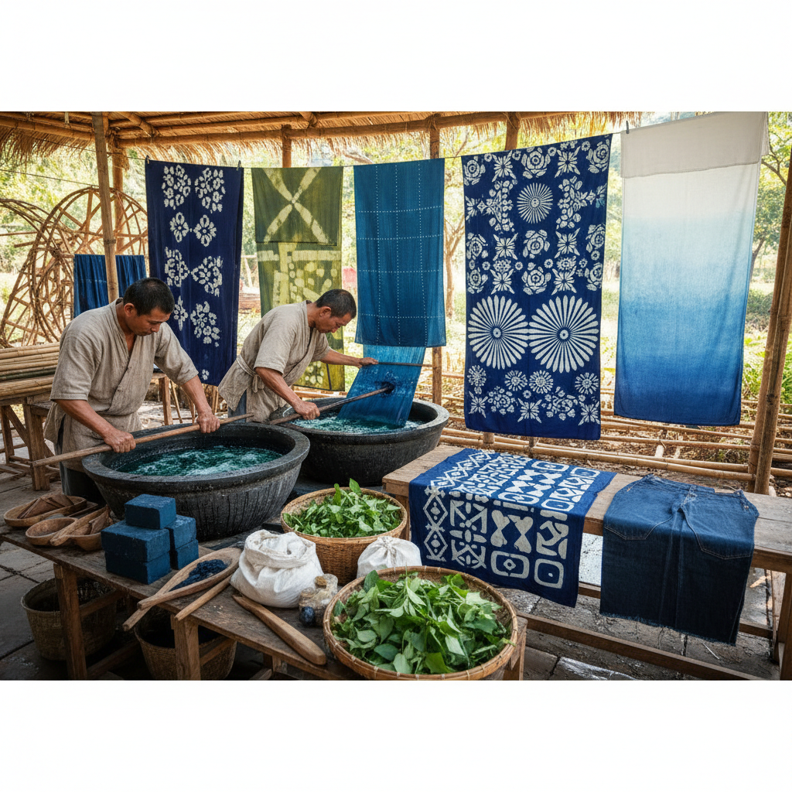

# Indigo Dyeing 靛蓝染色

> "Indigo is the color of civilization itself — extracted from plants on every continent, fermented in vats across millennia, it is the one dye that unites all textile traditions, from Japanese boro to West African adire to American denim." — Unknown

## 概述

靛蓝染色（Indigo Dyeing）是人类历史上最古老、最广泛使用的天然染色技法之一——使用从靛蓝植物（如蓼蓝、木蓝、菘蓝、大青等）中提取的靛蓝色素对织物进行染色。靛蓝染色的独特之处在于其化学过程：靛蓝色素不溶于水，必须通过发酵还原（建缸）将其转化为可溶的隐色体（leuco-indigo），织物浸入后取出接触空气，隐色体氧化回靛蓝，颜色从黄绿色变为蓝色——这个"氧化变蓝"的过程是靛蓝染色最神奇的特征。

靛蓝染色的另一个特点是：颜色附着在纤维表面而非渗入纤维内部，因此会随着使用和洗涤逐渐褪色——产生独特的"旧化"效果（如牛仔布的褪色）。靛蓝染色在全球各文化中都有悠久的传统——日本的藍染、中国的蓝印花布、西非的adire、印度的block print indigo等。

## 核心特征

| 特征 | 描述 |
|------|------|
| 天然 | 天然植物染料 |
| 发酵 | 需要发酵建缸 |
| 氧化 | 氧化变蓝的过程 |
| 层次 | 多次浸染加深 |
| 褪色 | 独特的褪色效果 |
| 全球 | 全球性的传统 |

## 视觉特征

- **蓝色**：深浅不一的蓝色
- **层次**：多次浸染的层次
- **褪色**：自然的褪色美感
- **对比**：蓝白的经典对比
- **质朴**：质朴的手工感
- **深邃**：深邃的蓝色

## 代表作品

| 作品 | 艺术家 | 年代 | 意义 |
|------|--------|------|------|
| *Japanese aizome textiles* | 日本工匠 | 传统 | 日本藍染传统 |
| *Chinese blue calico* | 中国工匠 | 传统 | 中国蓝印花布 |
| *West African adire* | 非洲工匠 | 传统 | 西非靛蓝染色 |
| *Denim/jeans* | Levi Strauss | 1873 | 牛仔布的靛蓝 |
| *Contemporary indigo art* | Various | 当代 | 当代靛蓝艺术 |

## 历史时间线

| 时期 | 事件 |
|------|------|
| 6000年前 | 最早的靛蓝染色证据（秘鲁） |
| 古代 | 全球各文化的靛蓝传统 |
| 中世纪 | 靛蓝贸易的全球化 |
| 19世纪 | 合成靛蓝的发明（1897年） |
| 20世纪 | 牛仔文化中的靛蓝 |
| 当代 | 天然靛蓝染色的艺术复兴 |

## 中国语境

靛蓝染色在中国有极其悠久和丰富的传统。中国是靛蓝植物（蓼蓝、菘蓝、马蓝等）的重要原产地之一。中国的蓝印花布是国家级非物质文化遗产——以南通蓝印花布最为著名。中国的贵州蜡染、云南扎染都使用靛蓝作为主要染料。中国的"青出于蓝而胜于蓝"这一成语就来源于靛蓝染色。中国的当代纺织艺术家和时尚设计师在创作中融合传统靛蓝染色技法。

## AI生成概念图

## 与其他风格的关系

- **Shibori** → 绞缬染色
- **Batik** → 蜡染
- **Natural Dyeing** → 天然染色
- **Blue and White** → 蓝白艺术
- **Textile Art** → 纺织艺术
- **Denim Culture** → 牛仔文化

---

*浮光艺志 | Chronicle of Artistry*
