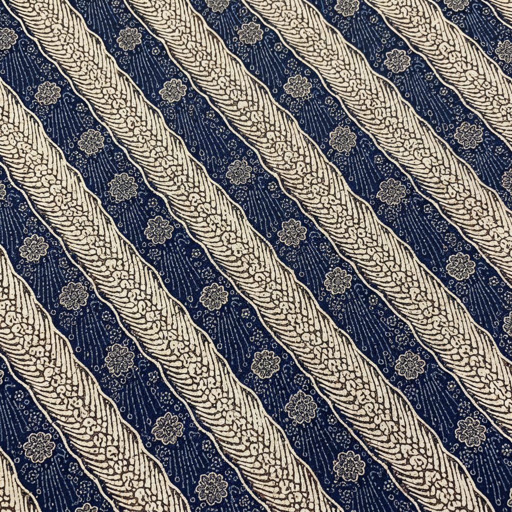

# Indonesian Batik 印尼蜡染 | Batik Indonesia

> **"一块布上的宇宙——每个图案都是一段祈祷。"**

## 概述

印尼蜡染（Batik Indonesia）是印度尼西亚最具代表性的传统纺织艺术，以热蜡防染技法在棉布或丝绸上创造精美图案。2009年被联合国教科文组织列入人类非物质文化遗产代表作名录。"Batik"一词源自爪哇语"amba"（宽布）和"titik"（点），意指在宽幅织物上点染图案。蜡染工艺可追溯至12世纪爪哇皇室，如今已成为印尼国家文化身份的核心象征，每年10月2日为"国家蜡染日"。

## 制作工艺

### 手绘蜡染 (Batik Tulis)
- 使用铜制尖嘴壶（Canting）蘸取熔融蜡液
- 一点点将蜡滴落在描绘好的线条上
- 单件传统作品最长需12个月完成
- 最精细、最昂贵的蜡染形式

### 印章蜡染 (Batik Cap)
- 19世纪中叶出现
- 使用刻有图案的铜印章蘸取蜡液按压
- 提高了效率，保持了手工质感
- 图案更规整统一

### 工序
1. 在白布上绘制图案线稿
2. 用Canting或铜章涂蜡（防染区域）
3. 浸入染料中染色
4. 用热水去除蜡层
5. 重复上蜡-染色-除蜡步骤（多色需多次）

## 经典图案

| 图案 | 含义 | 地区 |
|------|------|------|
| Parang（波浪刀形） | 保护与安全，原为皇室专用 | 日惹/梭罗 |
| Kawung（四瓣花） | 宇宙秩序，纯洁 | 中爪哇 |
| Mega Mendung（云纹） | 耐心与宽容 | 井里汶 |
| Sekar Jagad（世界之花） | 多样性与幸福，常用于婚礼 | 中爪哇 |
| Truntum（星花） | 忠诚的爱情 | 梭罗 |
| Sido Mukti（幸福） | 繁荣昌盛 | 日惹 |

## 视觉特征

- 黑、棕、靛蓝为传统主色调（植物染料）
- 精细的线条和密集的填充图案
- 对称与重复的几何构成
- 自然元素的程式化处理（花卉、鸟、云）
- 多文化融合：阿拉伯书法、中国凤凰、印度孔雀
- 正反面图案清晰（手绘蜡染的标志）

## 地域风格

| 地区 | 特征 |
|------|------|
| 日惹/梭罗 | 宫廷风格，棕白为主，严格规范 |
| 北海岸（Pekalongan） | 色彩鲜艳，中国和欧洲影响 |
| 井里汶 | 云纹（Mega Mendung），中国影响 |
| 马都拉 | 大胆红色，鸟类图案 |

## 与其他风格的关系

| 风格 | 关系 |
|------|------|
| 非洲蜡印花布 | 荷兰殖民者将蜡染技术从印尼带到非洲 |
| 日本绞染 Shibori | 共享防染原理，不同技法 |
| 中国蜡染（贵州） | 共享蜡防染技术，独立发展 |
| Art Nouveau | 19世纪末欧洲受蜡染图案影响 |
| 当代时装 | Iwan Tirta 等设计师将蜡染带入高级时装 |

## 概念图

---

*浮光艺志 | Chronicle of Artistry*
