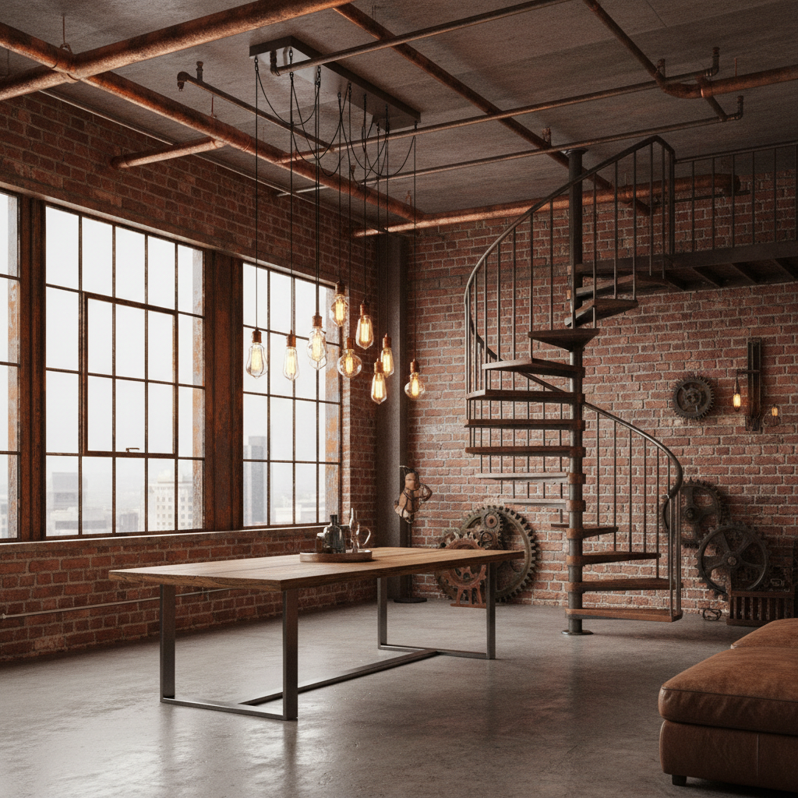

# Industrial 工业风



> **"裸露管道、红砖墙、铁艺楼梯——工厂废墟变成了最酷的loft。"**

## 概述

| 维度 | 描述 |
|------|------|
| 时期 | 1970s 起源 / 2010s 主流化 |
| 别名 | Industrial, Loft Style, Factory Aesthetic |
| 核心色彩 | 铁锈红、混凝土灰、黑色、砖红、铜色 |
| 关键元素 | 裸露管道、红砖墙、金属框架、水泥地面 |
| 代表人物 | Andy Warhol Factory、纽约SoHo Loft |
| 关联风格 | Brutalism, Minimalism, Steampunk, Urban |

---

## 历史脉络

### 从废弃工厂到设计语言

| 年份 | 事件 |
|------|------|
| 1960s | 纽约艺术家搬入废弃工厂（SoHo） |
| 1970s | Loft Living 概念形成 |
| 1990s | 工业风餐厅/咖啡馆出现 |
| 2010s | 成为室内设计主流风格 |
| 2020s | 与极简主义、侘寂融合 |

### 核心哲学

Industrial 的精神是**"不隐藏结构——展示它"**：
- 管道不需要藏在天花板里
- 砖墙不需要粉刷
- 水泥地面不需要铺地板
- 建筑的"骨骼"本身就是美
- 功能即装饰

---

## 视觉语法

### 色彩系统

```
主色：
  铁锈红 (#B7410E) — 生锈金属
  混凝土灰 (#808080) — 水泥、地面
  黑色 (#1A1A1A) — 铁艺、框架
  砖红 (#CB4154) — 红砖墙
  铜色 (#B87333) — 管道、灯具

辅色：
  深棕 (#3D2B1F) — 旧木
  暖白 (#F5F5DC) — 对比
  深绿 (#013220) — 植物点缀

质感：
  红砖 — 粗糙、温暖
  水泥 — 冷硬、原始
  铁 — 生锈、氧化
  旧木 — 回收、有故事
  玻璃 — 工厂窗户
```

### 标志性元素

| 类别 | 元素 |
|------|------|
| 墙面 | 裸露红砖、水泥墙、铁皮 |
| 天花 | 裸露管道、铁梁、吊扇 |
| 地面 | 水泥自流平、旧木地板 |
| 家具 | 铁艺桌椅、回收木桌、皮沙发 |
| 灯具 | Edison灯泡、铁艺吊灯、射灯 |
| 配饰 | 齿轮、铆钉、旧工具 |

---

## 与千禧怀旧的关系

### 城市更新的美学
- 千禧一代的"loft梦"
- 废弃工厂 → 创意园区 → 咖啡馆
- 工业风 = "我住在有故事的空间"
- 对"精装修"的反叛

---

## 中国语境

- "工业风"/"loft风"在中国的巨大市场
- 798艺术区、M50 = 中国工业风圣地
- 创意园区改造浪潮
- 工业风咖啡馆/餐厅遍布一二线城市

---

## 设计应用

| 场景 | 应用方式 |
|------|----------|
| 空间 | 裸露砖墙+管道+水泥+铁艺 |
| 品牌 | 粗糙质感+黑色+金属+手工感 |
| 餐饮 | 铁艺+Edison灯+回收木+水泥 |
| 数字 | 深色+粗糙纹理+工业字体 |

---

## 相关风格

← [Brutalism 粗野主义](brutalism.md) | [Steampunk 蒸汽朋克](steampunk.md) →

↑ [返回千禧怀旧目录](README.md) | [返回总目录](../README.md)
